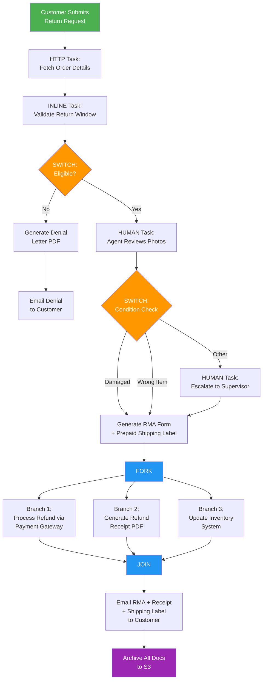
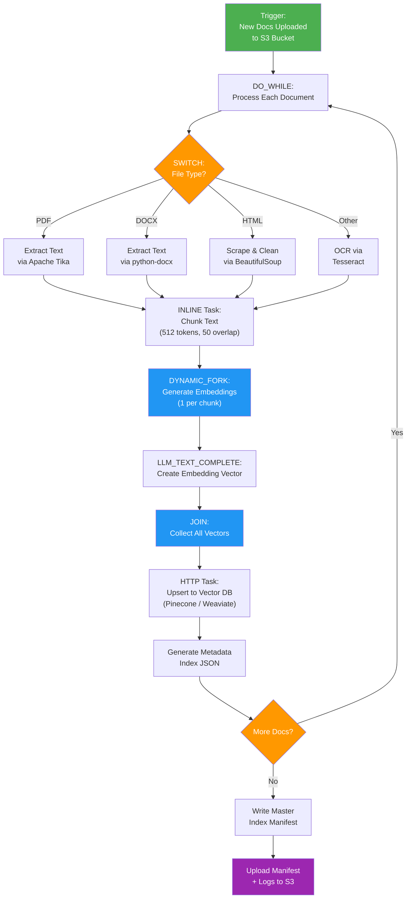
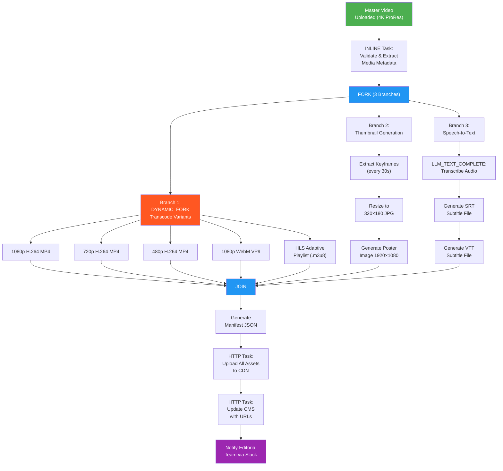
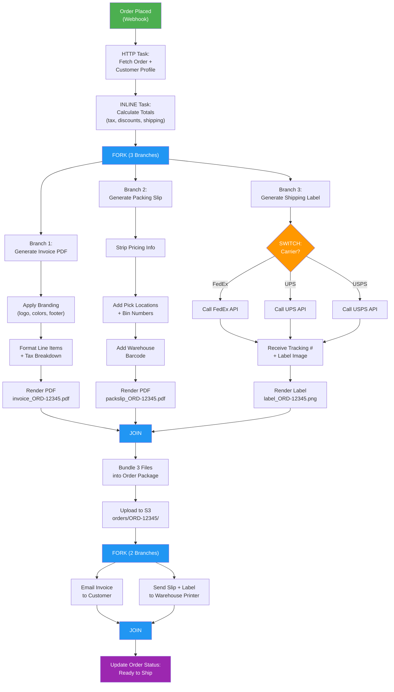
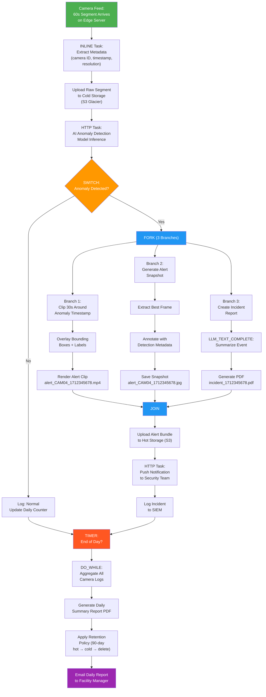

# Conductor OSS — File Management Use Cases

Five real-world scenarios where Conductor orchestrates file creation, processing, and delivery across workflow stages.

---

## 1. Returns & Refund Document Processing

A customer initiates a product return. Conductor orchestrates the intake of return photos/documents, validates eligibility, generates an RMA (Return Merchandise Authorization) form, and produces the final refund receipt — all as a single traceable workflow.

### Workflow

### Files Produced

| Stage | File | Format |
|-------|------|--------|
| RMA Generation | `rma_RET-9001.pdf` | PDF |
| Shipping Label | `label_RET-9001.png` | 4×6 ZPL/PNG |
| Refund Receipt | `receipt_RET-9001.pdf` | PDF |
| Denial Letter | `denial_RET-9001.pdf` | PDF (if ineligible) |

### Conductor Primitives

SWITCH, HUMAN, FORK/JOIN, HTTP, INLINE, SUB_WORKFLOW

---

## 2. AI-Powered Knowledge Base Builder (RAG Pipeline)

An organization ingests documents (PDFs, Word files, web pages) into an AI-ready knowledge base. Conductor orchestrates crawling, extraction, chunking, embedding generation, and vector store indexing — enabling retrieval-augmented generation (RAG) for chatbots and search.

### Workflow

### Files Produced

| Stage | File | Format |
|-------|------|--------|
| Extracted Text | `extracted_{doc_id}.txt` | Plain text |
| Chunk Manifest | `chunks_{doc_id}.jsonl` | JSONL |
| Embedding Vectors | `embeddings_{doc_id}.npy` | NumPy binary |
| Metadata Index | `index_{doc_id}.json` | JSON |
| Master Manifest | `kb_manifest_{run_id}.json` | JSON |
| Pipeline Log | `pipeline_log_{run_id}.txt` | Text |

### Conductor Primitives

DO_WHILE, SWITCH, DYNAMIC_FORK, LLM_TEXT_COMPLETE, HTTP, INLINE

---

## 3. Multi-Format Media Transcoding & Publishing

A media company uploads a master video file. Conductor fans out transcoding jobs to produce multiple resolutions and formats, generates thumbnails, extracts subtitles via speech-to-text, and publishes everything to a CDN — all in parallel where possible.

### Workflow

### Files Produced

| Stage | File | Format |
|-------|------|--------|
| Transcoded Videos | `video_{res}.mp4`, `video_1080p.webm` | MP4, WebM |
| HLS Playlist | `stream.m3u8` + segment `.ts` files | HLS |
| Thumbnails | `thumb_{timestamp}.jpg` | JPEG |
| Poster Image | `poster.jpg` | JPEG 1920×1080 |
| Subtitles | `subs_en.srt`, `subs_en.vtt` | SRT, VTT |
| Manifest | `publish_manifest.json` | JSON |

### Conductor Primitives

FORK/JOIN, DYNAMIC_FORK, LLM_TEXT_COMPLETE, HTTP, INLINE

---

## 4. Order Invoice, Packing Slip & Shipping Label Generation

An e-commerce order triggers Conductor to fetch order data, then fan out in parallel to generate three documents — a customer-facing invoice, a warehouse packing slip (no pricing), and a carrier shipping label — before bundling and distributing them.

### Workflow

### Files Produced

| Stage | File | Format |
|-------|------|--------|
| Invoice | `invoice_ORD-12345.pdf` | PDF |
| Packing Slip | `packslip_ORD-12345.pdf` | PDF |
| Shipping Label | `label_ORD-12345.png` | 4×6 ZPL/PNG |

### Conductor Primitives

FORK/JOIN, SWITCH, HTTP, INLINE, SUB_WORKFLOW

---

## 5. Enterprise Video Surveillance Archival & Alert Pipeline

A network of security cameras streams footage to edge servers. Conductor orchestrates the pipeline: ingest video segments, run AI-based anomaly detection, generate alert clips with annotations, archive raw footage with retention policies, and produce daily summary reports.

### Workflow

### Files Produced

| Stage | File | Format |
|-------|------|--------|
| Raw Segment | `raw_CAM04_1712345678.mp4` | MP4 (60s) |
| Alert Clip | `alert_CAM04_1712345678.mp4` | MP4 (30s, annotated) |
| Alert Snapshot | `alert_CAM04_1712345678.jpg` | JPEG (annotated) |
| Incident Report | `incident_1712345678.pdf` | PDF |
| Daily Summary | `daily_report_2026-04-08.pdf` | PDF |

### Conductor Primitives

FORK/JOIN, SWITCH, DO_WHILE, TIMER, LLM_TEXT_COMPLETE, HTTP, INLINE

---

*Generated for Conductor OSS file management use case exploration.*
