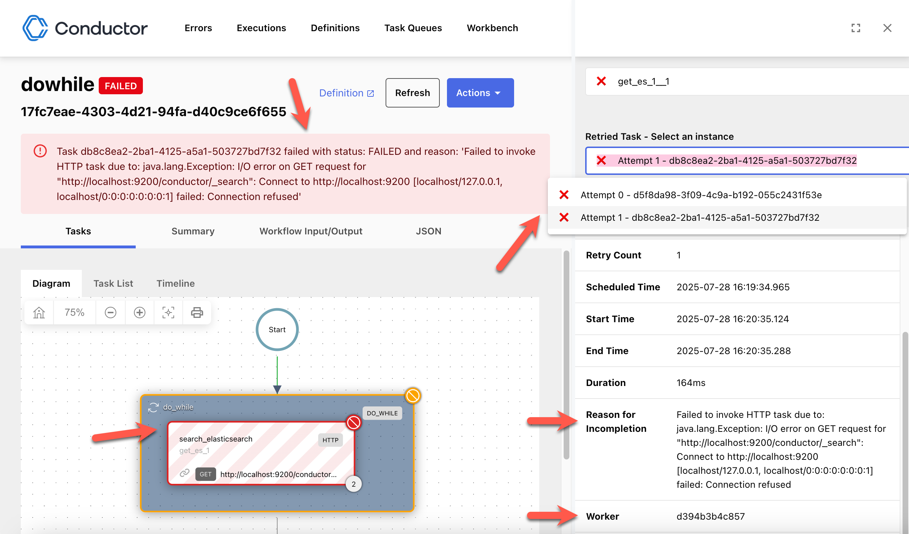

# Debugging Workflows

The [workflow execution views](viewing-workflow-executions.md) in the Conductor UI are useful for debugging workflow issues. Learn how to debug failed executions and rerun them. 

## Debug procedure

When you view the workflow execution details, the cause of the workflow failure will be stated at the top. Go to the **Tasks > Diagram** tab to quickly identify the failed task, which is marked in red. You can select the failed task to investigate the details of the failure.

The following tab views or fields in the task details are useful for debugging:

| Field or Tab Name                                      | Description                                                                                                                   |
|-------------------------------------------------|-------------------------------------------------------------------------------------------------------------------------------|
| _Reason for Incompletion_ in **Task Detail** > **Summary**  | Contains the exception message thrown by the task worker.                    |
| _Worker_ in **Task Detail** > **Summary**                   | Contains the worker instance ID where the failure occurred. Useful for digging up detailed logs, if it has not already captured by Conductor.                    |
| **Task Detail** > **Input**                           | Useful for verifying if the task inputs were correctly computed and provided to the task.                       |
| **Task Detail** > **Output**                        | Useful for verifying what the task produced as output.                         |
| **Task Detail** > **Logs**                         | Contains the task logs, if supplied by the task worker.                                                        |
| **Task Detail** > **Retried Task - Select an instance** | (If the task has been retried multiple times) Contains all retry attempts in a dropdown list. Each list item contains the task details for a particular attempt.                                 |

## Recovering from failure

Once you have resolved the underlying issue for the execution failure, you can manually restart or retry the failed workflow execution using the Conductor UI or APIs.

Here are the recovery options:

| Recovery Action     | Description                |
|---------------------|----------------------------|
| Restart with Current Definitions | Restart the workflow from the beginning using the same workflow definition that was used in the original execution. This option is useful if the workflow definition has changed and you want to run the execution instance using the original definition.            |
| Restart with Latest Definitions | Restart the workflow from the beginning using the latest workflow definition. This option is useful if changes were made to the workflow definition and you want to run the execution instance with the latest definition. | 
| Retry - From failed task | Retry the workflow from the failed task.           | 

!!! Note
    You can set tasks to be retried automatically in case of transient failures. Refer to [Task Definition](../../../documentation/configuration/taskdef.md) for more information.

### Using Conductor UI

**To recover from failure**:

1. In the workflow execution details page, select **Actions** in the top right corner.
2. Select one of the following options:
    - Restart with Current Definitions
    - Restart with Latest Definitions
    - Retry - From failed task

### Using APIs

You can restart workflow executions using the Restart Workflow API (`POST api/workflow/{workflowId}/restart`) or the Bulk Restart Workflow API (`POST api/workflow/bulk/restart`).

Likewise, you can retry workflow executions from the last failed task using the Retry Workflow API (`POST api/workflow/{workflowId}/retry`) or the Bulk Retry Workflow API (`POST api/workflow/bulk/retry`)