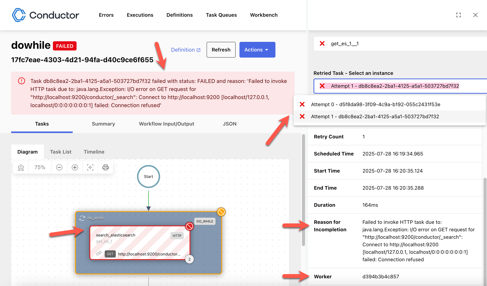

# Debugging Workflows

The [workflow execution views](viewing-workflow-executions.md) in the Conductor UI are useful for debugging workflow issues. Learn how to debug failed executions and rerun them. 

## Debug procedure

Start with the persisted execution:

```bash
conductor workflow get-execution <workflow-id> -c
```

Identify the `FAILED`, `TIMED_OUT`, or terminal task and record its `reasonForIncompletion`, input, output, worker ID, and retry count. Fix the underlying worker, dependency, credentials, or definition before changing execution state.

When you view the workflow execution details, the cause of the workflow failure will be stated at the top. Go to the **Tasks > Diagram** tab to quickly identify the failed task, which is marked in red. You can select the failed task to investigate the details of the failure.

The following tab views or fields in the task details are useful for debugging:

| Field or Tab Name                                      | Description                                                                                                                   |
|-------------------------------------------------|-------------------------------------------------------------------------------------------------------------------------------|
| _Reason for Incompletion_ in **Task Detail** > **Summary**  | The worker's error message, or the engine's message when the task timed out or was terminated. See [Understanding reasonForIncompletion](#understanding-reasonforincompletion). |
| _Worker_ in **Task Detail** > **Summary**                   | Contains the worker instance ID where the failure occurred. Useful for digging up detailed logs, if it has not already captured by Conductor.                    |
| **Task Detail** > **Input**                           | Useful for verifying if the task inputs were correctly computed and provided to the task.                       |
| **Task Detail** > **Output**                        | Useful for verifying what the task produced as output.                         |
| **Task Detail** > **Logs**                         | Contains the task logs, if supplied by the task worker.                                                        |
| **Task Detail** > **Retried Task - Select an instance** | (If the task has been retried multiple times) Contains all retry attempts in a dropdown list. Each list item contains the task details for a particular attempt.                                 |




## Understanding reasonForIncompletion

`reasonForIncompletion` is a free-text field on both task and workflow executions. It is empty while an execution is healthy and is filled in when the execution stops without succeeding. The UI shows it as **Reason for Incompletion** in the task summary and at the top of the workflow execution view, and search results (`WorkflowSummary`, `TaskSummary`) include it.

### Who writes it

| Writer | What it contains |
|---|---|
| Your worker | Whatever the worker sets in `TaskResult.reasonForIncompletion` when it returns `FAILED` or `FAILED_WITH_TERMINAL_ERROR`. The SDKs set it to the exception message when a worker throws. |
| Event handler `fail_task` action | The action's `reasonForIncompletion` value; empty if the action does not set one. |
| System tasks | Their own error text. For example the HTTP task records the response body on a non-2xx response, `No response from the remote service`, `Missing HTTP URI.  See documentation for HttpTask for required input parameters`, or `Failed to invoke HTTP task due to: <exception>`. |
| The engine | Timeouts, terminations, and definition errors, using the templates below. |

### Engine-generated messages

| Situation | Message |
|---|---|
| Task exceeded `timeoutSeconds` | `Task timed out after {elapsed} seconds. Timeout configured as {timeoutSeconds} seconds. Timeout policy configured to {timeoutPolicy}` |
| Task not polled within `pollTimeoutSeconds` | `Task poll timed out after {elapsed} seconds. Poll timeout configured as {pollTimeoutSeconds} seconds. Timeout policy configured to {timeoutPolicy}` |
| Worker stopped updating the task (`responseTimeoutSeconds`) | `responseTimeout: {responseTimeoutSeconds} exceeded for the taskId: {taskId} with Task Definition: {taskDefName}` |
| Retries exhausted the total budget (`totalTimeoutSeconds`) | `Task {taskDefName}/{taskId} exceeded total timeout of {totalTimeoutSeconds} seconds (elapsed {elapsed} seconds across all attempts including retry delays). Timeout policy: {timeoutPolicy}` |
| Workflow exceeded its `timeoutSeconds` | `Workflow timed out after {elapsed} seconds. Timeout configured as {timeoutSeconds} seconds. Timeout policy configured to {timeoutPolicy}` |
| A task failure fails the workflow | On the workflow: `Task {taskId} failed with status: {status} and reason: '{task reasonForIncompletion}'`. A failed `JOIN` carries the concatenated reasons of its failed forked tasks. |
| Sub-workflow ended unsuccessfully | On the `SUB_WORKFLOW` task: `Sub workflow {subWorkflowId} failure reason: {sub-workflow reasonForIncompletion}` |
| `TERMINATE` task | The task's `terminationReason` input, or `Workflow is {terminationStatus} by TERMINATE task: {taskId}` when none is given. Set even when `terminationStatus` is `COMPLETED`. |
| Terminate API | The `reason` query parameter of `DELETE /api/workflow/{workflowId}`. |
| Task definition missing | `Invalid task specified. Cannot find task by name {name} in the task definitions` |

Timeout fields are described in [Task Lifecycle](../../architecture/tasklifecycle.md#timeout-scenarios).

### Lifecycle and limits

* Retry, restart, and rerun clear the workflow's reason and start the new task attempt with an empty reason. The original attempt keeps its reason; open it from **Retried Task** in the task details.
* On tasks the value is capped at 500 characters; longer messages are cut. Workflow-level reasons are not capped.
* The field is stored with the execution and returned by `GET /api/workflow/{workflowId}`, `GET /api/tasks/{taskId}`, and the search APIs.

## Recovering from failure

Once you have resolved the underlying issue for the execution failure, you can manually restart or retry the failed workflow execution using the Conductor UI or APIs.

Here are the recovery options:

| Recovery Action     | Description                |
|---------------------|----------------------------|
| Restart with Current Definitions | Restart the workflow from the beginning using the same workflow definition that was used in the original execution. This option is useful if the workflow definition has changed and you want to run the execution instance using the original definition.            |
| Restart with Latest Definitions | Restart the workflow from the beginning using the latest workflow definition. This option is useful if changes were made to the workflow definition and you want to run the execution instance with the latest definition. |
| Rerun from a specific task | Re-execute the workflow from a specific task, reusing the outputs of all prior tasks. This option is useful when a task in the middle of the workflow failed and you want to fix and re-run it without re-executing everything before it. |
| Retry - From failed task | Retry the workflow from the last failed task.           |

CLI equivalents:

```bash
conductor workflow retry <workflow-id>
conductor workflow restart <workflow-id>
conductor workflow rerun <workflow-id> --task-id <task-id>
```

After recovery, run `conductor workflow status <workflow-id>` and verify that the expected task is running or the workflow reached the intended terminal status.

!!! Note
    You can set tasks to be retried automatically in case of transient failures. Refer to [Task Definition](../../../documentation/configuration/taskdef.md) for more information.

### Using Conductor UI

**To recover from failure**:

1. In the workflow execution details page, select **Actions** in the top right corner.
2. Select one of the following options:
    - Restart with Current Definitions
    - Restart with Latest Definitions
    - Rerun from a specific task
    - Retry - From failed task

### Using APIs

You can restart workflow executions using the Restart Workflow API (`POST api/workflow/{workflowId}/restart`) or the Bulk Restart Workflow API (`POST api/workflow/bulk/restart`).

You can rerun a workflow from a specific task using the Rerun Workflow API (`POST api/workflow/{workflowId}/rerun`) with a request body specifying the `reRunFromTaskId`.

Likewise, you can retry workflow executions from the last failed task using the Retry Workflow API (`POST api/workflow/{workflowId}/retry`) or the Bulk Retry Workflow API (`POST api/workflow/bulk/retry`).

All three recovery operations — restart, rerun, and retry — work on workflows in any terminal state (COMPLETED, FAILED, TIMED_OUT, TERMINATED) and are available indefinitely. Conductor preserves the full execution history, so you can replay any workflow even months after the original run.

## Limitations and next step

Recovery can repeat side effects. Retry or rerun only when completed external operations are idempotent or have an explicit compensation policy. Continue with [Reliability and error handling](handling-errors.md) to make transient recovery automatic.
