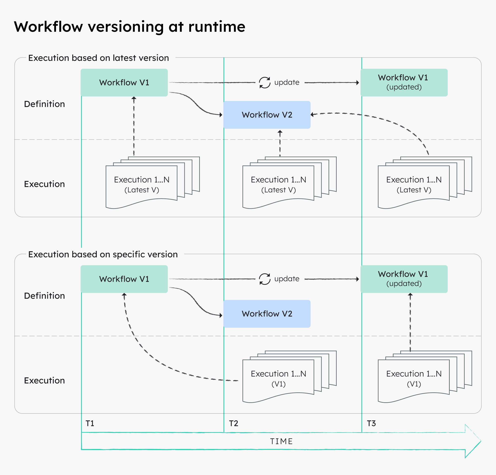
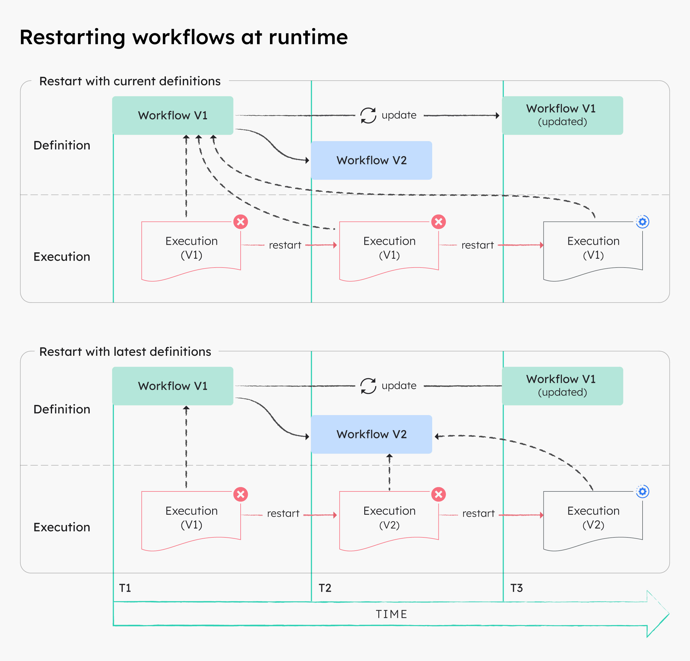

# Versioning Workflows

Conductor allows you to safely run different workflow versions without disrupting ongoing or scheduled workflow executions in production. 

Refer to [Updating workflows](creating-workflows.md#updating-workflows) for more information on modifying a workflow and saving it as a new version.

## When to version workflows

Workflow versioning is useful for various scenarios, like gradually upgrading a process, or rolling out different workflow versions to different user bases.

### Example

For example, a new version of your core workflow will add a capability that is required for _customerA_.  However, _customerB_ will not be ready to implement this code for another 6 months.

With workflow versioning, you can begin transitioning traffic onto version 2 for _customerA_, while _customerB_ remains on version 1. 6 months later, _customerB_ can begin transitioning traffic to version 2 as well.

## Runtime behavior with multiple workflow versions

At runtime, all Conductor workflows will reference a snapshot of the workflow definition at the start of its invocation. In other words, all changes to a workflow definition are decoupled from all of its ongoing workflow executions.

Here is an illustration of workflow versions at runtime, when you run workflows based on the latest version, versus when you run workflows based on a specific version.

In the illustration above, the workflow with version V1 is executed at timestamp T1 and thus uses the workflow definition at that time.

At T2, a new workflow version V2 is created.  From that point on, any newly-triggered executions using the latest version will run based on V2, even if V1 gets updated later on at T3.

At T3, even when the V1 workflow definition is updated, all existing V1 executions will continue based on the definition at timestamp T1. From that point on, any newly-triggered executions using version V1 will run based on the V1 definition at timestamp T3.

### Runtime behavior during restarts 

Likewise, by default all workflow restarts, workflow retries, and task reruns will be executed based on the snapshot of the workflow definition at the start of the _first_ execution attempt. If required, you can choose to restart workflows with the latest definitions.

Here is an illustration of workflow versions at runtime, when you restart workflows using the current definitions versus using the latest definitions.

In the illustration above, if a V1 execution is restarted with the current definitions after a new version V2 has been created, the restarted execution will still run based on the V1 definition at T1. This applies even if the same execution is restarted after the V1 definition itself has been updated at T3.

At T2, if a V1 execution is restarted with the latest definitions, the V1 execution will restart using the V2 definition instead. This also applies even if the same execution is restarted after the V1 definition itself has been updated at T3.

## Upgrading running workflows

Since any changes to a workflow definition will not impact its ongoing executions, running workflows need to be explicitly upgraded if required.

Using the Conductor UI or APIs, you can upgrade a running workflow by terminating the execution and restarting it with the latest definition.

### Using Conductor UI

**To upgrade a running workflow**:

1. In **[Executions](http://localhost:8127/executions)**, select an ongoing workflow to upgrade.
2. In the top right, select **Actions** > **Terminate**.
3. Once terminated, select **Actions** > **Restart with Latest Definitions**.

### Using Conductor APIs

The API approach allows you to upgrade running workflows in bulk. Use the Bulk Terminate API (`POST /api/workflow/bulk/terminate`) to specify a list of ongoing workflows. Then, use the Bulk Restart API (`POST /api/workflow/bulk/restart`) to restart the terminated workflows.