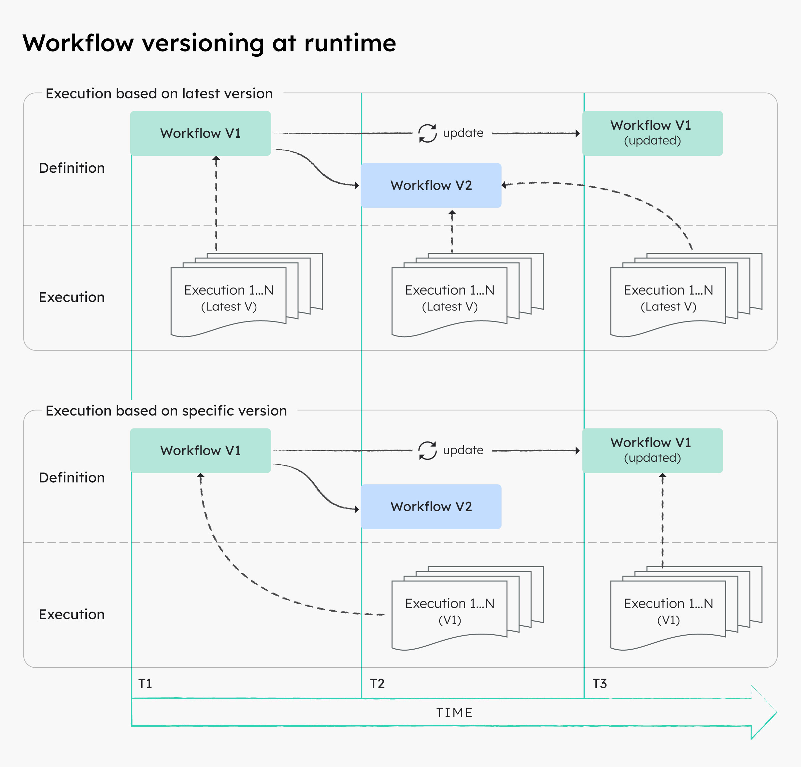
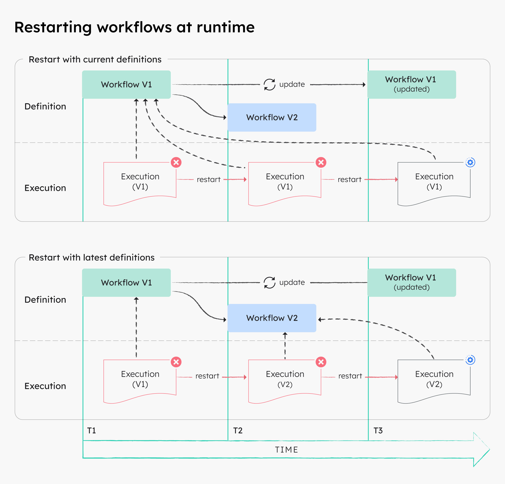

# Managing Workflow Versions

Every workflow definition carries a `version` number, and Conductor can run multiple versions of the same workflow side by side. This page covers when to create a new version, how versions behave at runtime, and how to roll one out without disrupting ongoing executions.

## When to version workflows

Create a new version when inputs, outputs, task order, or failure behavior change in a way callers can observe. See [Update and version safely](creating-workflows.md#updating-workflows) for the registration mechanics.

Versioning is also useful for gradual rollouts. For example, suppose a new version of your core workflow adds a capability that _customerA_ requires, but _customerB_ will not be ready to adopt for another 6 months. With versioning, you can move _customerA_'s traffic to version 2 now while _customerB_ stays on version 1, and migrate _customerB_ later.

## Runtime behavior with multiple workflow versions

At runtime, every execution references a snapshot of the workflow definition taken when it started. Changes to a definition never affect executions that are already running.

Here is an illustration of workflow versions at runtime, when you run workflows based on the latest version, versus when you run workflows based on a specific version.



In the illustration above:

- At T1, an execution starts on version V1, so it uses the V1 definition as it exists at T1.
- At T2, version V2 is registered. New executions that start on the latest version now use V2.
- At T3, the V1 definition itself is updated in place. The execution from T1 keeps running on its T1 snapshot, while any new execution pinned to V1 uses the updated T3 definition.

### Runtime behavior during restarts

By default, restarts, retries, and task reruns also use the snapshot from the start of the first execution attempt. If required, you can instead restart a workflow with the latest definitions.

Here is an illustration of workflow versions at runtime, when you restart workflows using the current definitions versus using the latest definitions.



In the illustration above:

- Restarting the V1 execution with **current definitions** re-runs it on its original T1 snapshot, even after V2 exists and even after V1 is updated at T3.
- Restarting the V1 execution with **latest definitions** re-runs it on the newest registered version, V2.

## Rollout procedure

1. Register the new version instead of overwriting the version production callers use: increment the `version` field in the definition and register it.

    ```bash
    conductor workflow create workflow.json
    ```

2. Validate and mock-test it, then run a real canary execution with the version pinned:

    ```bash
    conductor workflow start -w <workflow-name> --version 2 -i '{"orderId": "test-1"}'
    ```

3. Move callers, schedules, and parent-workflow references deliberately to the new version.
4. Compare completion, failure, latency, and outputs between the two versions.
5. Keep the previous version registered until callers have migrated and its executions no longer need restart or replay support.

Success means new callers start the intended version while existing executions continue against their recorded definition snapshot.

## Upgrading running workflows

Since definition changes never affect ongoing executions, a running workflow must be explicitly upgraded if required. The upgrade is a terminate followed by a restart on the latest definitions.

!!! warning
    Terminating and restarting can repeat side effects. Prefer allowing running executions to finish on their snapshot unless the workflow is idempotent or compensation is defined.

### Using Conductor UI

**To upgrade a running workflow:**

1. In the left navigation, open **Executions** and select **Workflow**, then select the ongoing execution to upgrade.
2. In the top right, select **Actions** and then **Terminate**.
3. Once terminated, select **Actions** and then **Restart with latest definitions**.

### Using Conductor APIs

The API approach upgrades running workflows in bulk. Terminate the executions with the Bulk Terminate API, then restart them with the Bulk Restart API, passing `useLatestDefinitions=true`:

```bash
curl -X POST 'http://localhost:8080/api/workflow/bulk/terminate' \
  -H 'Content-Type: application/json' \
  -d '["<workflow-id-1>", "<workflow-id-2>"]'

curl -X POST 'http://localhost:8080/api/workflow/bulk/restart?useLatestDefinitions=true' \
  -H 'Content-Type: application/json' \
  -d '["<workflow-id-1>", "<workflow-id-2>"]'
```

Without `useLatestDefinitions=true`, a restart uses each execution's original definition snapshot and no upgrade happens.

## Limitations and next step

Omitting a version at start time selects the latest registered version, which trades rollout control for convenience. Pin versions in schedules and parent workflows when deterministic deployment matters. Next, rehearse [debugging and recovery](debugging-workflows.md) for both the current and previous version.
