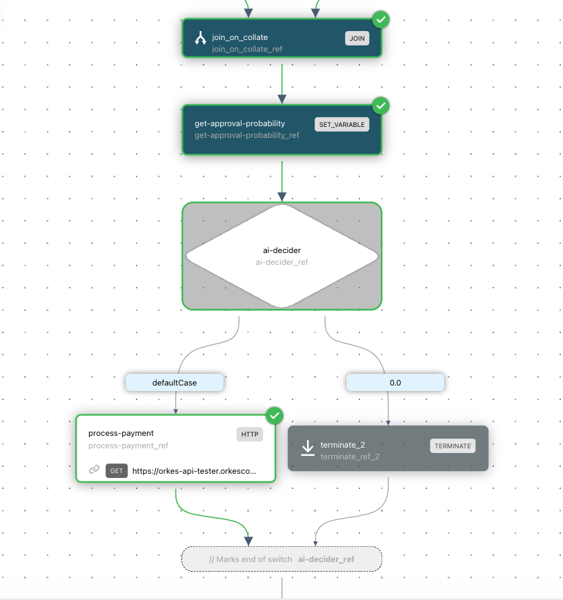

# Viewing Workflow Executions

The Conductor UI provides a convenient interface for viewing workflow executions as visual diagrams. You can view workflow executions:

- In **[Executions](http://localhost:8127/executions)**, after [searching for workflows](searching-workflows.md).
- In **[Workbench](http://localhost:8127/workbench)** > **Execution History**

**To view a workflow execution:**

In **[Executions](http://localhost:8127/executions)** or **[Workbench](http://localhost:8127/workbench)**, select the Workflow ID hyperlink.

## Workflow execution details

The following tabs are available for each workflow execution:

| Tab Name                   | Description                                               |
|----------------------------|-------------------------------------------------------------------------------------------------------------------|
| **Tasks** > **Diagram**    | Visual diagram of the workflow and its tasks.                                                    |
| **Tasks** > **Task List**  | List of the task executions in this workflow, including details like the task name, task ID, status, and so on.   |
| **Tasks** > **Timeline**   | Timeline showcasing the duration and sequence of each task in the workflow.                                     |
| **Summary**                | Summary view of the workflow execution, which includes the workflow ID, status, duration, and so on.             |
| **Workflow Input/Output**  | View of the JSON payload for the workflow inputs, outputs, and variables.                                            |
| **JSON**                   | View of the full workflow execution JSON, including all tasks, inputs, outputs, and so on.        |

### Workflow diagram view

In **Tasks** > **Diagram**, you can view the workflow's exact execution path. The executed paths are shown in green and while other alternative paths are greyed out.

Each task status will also be clearly marked, highlighting any task errors.

### Task execution details

You can also view a task's execution details by selecting a task from the following tabs: 

- **Tasks** > **Diagram** 
- **Tasks** > **Task List**
- **Tasks** > **Timeline** 

This action opens a left-side panel that contains the following tabs:

| Tab Name        | Description                                                                 |
|------------|-----------------------------------------------------------------------------------------------------------------------------------------------------|
| **Summary**     |  Summary view of the task execution, which includes the task execution ID, status, duration, and so                                      |
| **Input**       | View of the JSON payload for the task inputs.           |
| **Output**      | View of the JSON payload for the task outputs.          |
| **Logs**        | View of the log messages logged by the task, if any.                                                                        |
| **JSON**        | View of the full task execution JSON, including retry count, start time, worker ID, and so on.                                                 |
| **Definition**  | View of the task configuration used when executing the task.                                                                       |