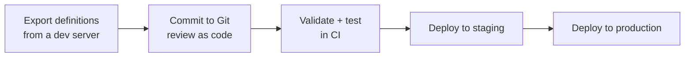

# CI/CD Integration

Workflow definitions, task definitions, and event handlers are data. Nothing stops you editing them in the UI of a production server, but then production is the only place they exist, there is no review, and no way back. The alternative is to keep them in Git and let a pipeline put them on each server.

The shape of that pipeline is always the same:



## Export definitions

Pull the current definitions out of a server you have been iterating on. Either the CLI or the API works; the CLI is easier to read in a script.

```shell
conductor workflow get-all > definitions/workflows.json
conductor task get-all     > definitions/taskdefs.json
```

The equivalent REST calls, if you would rather not depend on the CLI in CI:

```shell
curl -s "$CONDUCTOR_SERVER_URL/metadata/workflow" > definitions/workflows.json
curl -s "$CONDUCTOR_SERVER_URL/metadata/taskdefs" > definitions/taskdefs.json
curl -s "$CONDUCTOR_SERVER_URL/event"             > definitions/eventhandlers.json
```

For a single definition rather than everything:

```shell
conductor workflow get order_fulfillment 3
conductor task get charge_payment
```

```shell
curl -s "$CONDUCTOR_SERVER_URL/metadata/workflow/order_fulfillment?version=3"
curl -s "$CONDUCTOR_SERVER_URL/metadata/taskdefs/charge_payment"
```

Commit one file per definition rather than a single blob. A 400-line `workflows.json` produces unreadable diffs, and you cannot promote one workflow without promoting all of them.

## Validate in CI

Before anything is deployed, ask a server to check the definition. `POST /metadata/workflow/validate` runs the same checks as registration but stores nothing:

```shell
curl -s -X POST "$CONDUCTOR_SERVER_URL/metadata/workflow/validate" \
  -H 'Content-Type: application/json' \
  -d @definitions/workflows/order_fulfillment.json
```

A valid definition returns `200` with an empty body. An invalid one returns `400` and names the field:

```json
{
  "status": 400,
  "message": "Validation failed, check below errors for detail.",
  "validationErrors": [
    {
      "path": "validateWorkflowDef.arg0",
      "message": "taskReferenceName: same should be unique across tasks for a given workflowDefinition: dup_wf"
    }
  ]
}
```

It catches structural problems — a missing `name`, an empty `tasks` list, duplicate `taskReferenceName` values. It does **not** check that referenced task definitions exist or that `${...}` expressions resolve, so a definition can validate and still fail at runtime. Treat it as a cheap first gate, not a substitute for running the workflow.

Beyond validation, the things worth testing in CI are the ones that only break at runtime: each `SWITCH` branch, the failure path of anything with a `failureWorkflow`, and worker idempotency. See [Debugging Workflows](Workflows/debugging-workflows.md) for narrowing down a failure once you have one.

## Deploy

Two verbs, and their behaviour differs in a way that matters for a pipeline.

| Endpoint | Body | Behaviour |
|---|---|---|
| `POST /metadata/workflow` | one `WorkflowDef` | Creates. `409` if that name and version already exist, unless `?overwrite=true`. |
| `PUT /metadata/workflow` | **list** of `WorkflowDef` | Creates or updates each one. Idempotent. |
| `POST /metadata/taskdefs` | **list** of `TaskDef` | Creates. |
| `PUT /metadata/taskdefs` | one `TaskDef` | Creates or updates. |

Use `PUT` in a pipeline. It is idempotent, so re-running a deploy after a partial failure is safe, and it does not need an `overwrite` flag:

```shell
# Task definitions first — a workflow referencing an unregistered task
# registers fine but fails when it runs.
for f in definitions/taskdefs/*.json; do
  curl -sf -X PUT "$CONDUCTOR_SERVER_URL/metadata/taskdefs" \
    -H 'Content-Type: application/json' -d @"$f"
done

# Then workflows. Note the array wrapper.
for f in definitions/workflows/*.json; do
  curl -sf -X PUT "$CONDUCTOR_SERVER_URL/metadata/workflow" \
    -H 'Content-Type: application/json' \
    -d "[$(cat "$f")]"
done
```

`curl -sf` matters: without `-f`, curl exits `0` on a `4xx` and a broken deploy looks green.

## Authentication

OSS Conductor ships with no authentication, so the calls above need no credentials — which also means anything that can reach the server can rewrite your definitions. Put the server on a private network and keep the pipeline inside it.

Orkes Conductor requires a token. Exchange an application key for one, then send it as `X-Authorization`:

```shell
TOKEN=$(curl -s -X POST "$CONDUCTOR_SERVER_URL/token" \
  -H 'Content-Type: application/json' \
  -d "{\"keyId\":\"$CONDUCTOR_AUTH_KEY\",\"keySecret\":\"$CONDUCTOR_AUTH_SECRET\"}" \
  | python3 -c 'import sys,json;print(json.load(sys.stdin)["token"])')

curl -sf -X PUT "$CONDUCTOR_SERVER_URL/metadata/workflow" \
  -H "X-Authorization: $TOKEN" \
  -H 'Content-Type: application/json' -d @workflows.json
```

<!-- TODO: verify the /token exchange against a live Orkes server; OSS has no such endpoint -->

## Versions, ordering, and rollback

**Version instead of editing.** A running execution keeps using the definition version it started with. Registering version `4` leaves in-flight executions of version `3` alone, so a new version is a safe deploy and an in-place edit of the current version is not. See [Managing Workflow Versions](Workflows/versioning-workflows.md).

**Deploy in the order that keeps both sides compatible.** Whichever side you deploy first must work against the other side's old code:

| Change | Deploy first |
|---|---|
| New workflow version needing new worker behaviour | Workers — they must handle the new definition before it exists |
| Worker reading a new input field the definition now supplies | Metadata |
| Neither depends on the other | Either |

**Rollback is a deploy of the previous artifact.** Because definitions are files in Git, rolling back means re-`PUT`ing the previous commit's JSON and redeploying the previous worker image tag. Write both down as part of the release, and prefer re-registering the prior version over deleting the new one — `DELETE /metadata/workflow/{name}/{version}` removes the definition but not the executions that reference it.

## Related pages

- [Managing Workflow Versions](Workflows/versioning-workflows.md)
- [Metadata API reference](../../documentation/api/metadata.md)
- [Event Handlers](../../documentation/configuration/eventhandlers.md)
- [Best Practices](../bestpractices.md)
