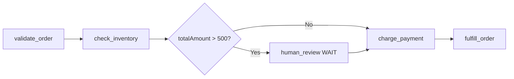

# Build with AI agents

Conductor Skills teaches your AI coding agent to create, run, monitor, and manage Conductor workflows. Instead of writing JSON definitions and CLI commands by hand, describe what you want in natural language and your agent builds it for you — complete workflows, workers, error handling, and monitoring.

Works with Claude Code, Cursor, GitHub Copilot, Gemini CLI, Codex, Windsurf, Cline, Amazon Q, Aider, Roo Code, Amp, and OpenCode.


## Install

One command installs for all detected agents on your system:

=== "macOS / Linux"

    ```bash
    curl -sSL https://conductor-oss.github.io/conductor-skills/install.sh | bash -s -- --all
    ```

=== "Windows (PowerShell)"

    ```powershell
    irm https://conductor-oss.github.io/conductor-skills/install.ps1 -OutFile install.ps1; .\install.ps1 -All
    ```

To install for a specific agent only:

```bash
curl -sSL https://conductor-oss.github.io/conductor-skills/install.sh | bash -s -- --agent claude
```


## Connect to your server

After installing, tell your agent where your Conductor server is:

> *"Connect to my Conductor server at http://localhost:8080/api"*

Or set the environment variable directly:

```bash
export CONDUCTOR_SERVER_URL=http://localhost:8080/api
```


## What your agent can do

Once installed, your AI agent can:

| Capability | What you say | What happens |
|---|---|---|
| **Create workflows** | *"Create a workflow that calls the GitHub API and sends a Slack notification"* | Agent generates the full workflow definition with HTTP tasks, input expressions, and output parameters |
| **Run workflows** | *"Run my-workflow with input userId 123"* | Agent starts the execution and returns the execution ID |
| **Monitor executions** | *"Show me all failed workflows from the last hour"* | Agent searches executions by status, time, or correlation ID |
| **Debug failures** | *"What went wrong with execution abc-123?"* | Agent retrieves the execution, identifies the failed task, and shows the error |
| **Retry and recover** | *"Retry all failed executions of order-processing"* | Agent batch-retries failed executions |
| **Manage lifecycle** | *"Pause execution xyz-456"* | Agent pauses, resumes, terminates, or restarts workflows |
| **Signal tasks** | *"Approve the payment wait task in execution abc-123"* | Agent signals WAIT or HUMAN tasks to advance the workflow |
| **Write workers** | *"Write a Python worker that validates email addresses"* | Agent generates worker code using the appropriate SDK |
| **Visualize** | *"Show me a diagram of the order-processing workflow"* | Agent renders a Mermaid diagram of the workflow |


## Walkthrough: build an order processing system

This walkthrough shows how to build a complete application using Conductor as the backend — entirely through natural language prompts to your AI agent.

### Step 1: Create the workflow

> *"Create an order processing workflow with these steps: validate the order, check inventory, charge payment, and fulfill the order. If payment fails, compensate by releasing the inventory hold. Add a WAIT task before payment so a human can review high-value orders."*

Your agent creates the workflow definition:

```json
{
  "name": "order_processing",
  "description": "Process customer orders with inventory check, payment, and fulfillment",
  "version": 1,
  "schemaVersion": 2,
  "inputParameters": ["orderId", "customerId", "items", "totalAmount"],
  "tasks": [
    {
      "name": "validate_order",
      "taskReferenceName": "validate",
      "type": "HTTP",
      "inputParameters": {
        "http_request": {
          "uri": "https://api.example.com/orders/${workflow.input.orderId}/validate",
          "method": "POST",
          "body": { "items": "${workflow.input.items}" }
        }
      }
    },
    {
      "name": "check_inventory",
      "taskReferenceName": "inventory",
      "type": "HTTP",
      "inputParameters": {
        "http_request": {
          "uri": "https://api.example.com/inventory/hold",
          "method": "POST",
          "body": { "items": "${workflow.input.items}" }
        }
      }
    },
    {
      "name": "review_gate",
      "taskReferenceName": "review_gate",
      "type": "SWITCH",
      "evaluatorType": "javascript",
      "expression": "$.workflow.input.totalAmount > 500 ? 'needs_review' : 'auto_approve'",
      "decisionCases": {
        "needs_review": [
          {
            "name": "human_review",
            "taskReferenceName": "review",
            "type": "WAIT",
            "inputParameters": {
              "orderId": "${workflow.input.orderId}",
              "amount": "${workflow.input.totalAmount}"
            }
          }
        ]
      },
      "defaultCase": []
    },
    {
      "name": "charge_payment",
      "taskReferenceName": "payment",
      "type": "HTTP",
      "inputParameters": {
        "http_request": {
          "uri": "https://api.example.com/payments/charge",
          "method": "POST",
          "body": {
            "customerId": "${workflow.input.customerId}",
            "amount": "${workflow.input.totalAmount}",
            "holdId": "${inventory.output.response.body.holdId}"
          }
        }
      }
    },
    {
      "name": "fulfill_order",
      "taskReferenceName": "fulfillment",
      "type": "HTTP",
      "inputParameters": {
        "http_request": {
          "uri": "https://api.example.com/fulfillment/ship",
          "method": "POST",
          "body": {
            "orderId": "${workflow.input.orderId}",
            "items": "${workflow.input.items}",
            "paymentId": "${payment.output.response.body.paymentId}"
          }
        }
      }
    }
  ],
  "failureWorkflow": "order_processing_compensation",
  "outputParameters": {
    "orderId": "${workflow.input.orderId}",
    "paymentId": "${payment.output.response.body.paymentId}",
    "trackingNumber": "${fulfillment.output.response.body.trackingNumber}"
  }
}
```

The agent registers the workflow automatically.

### Step 2: Create the compensation workflow

> *"Create the compensation workflow for order_processing. It should release the inventory hold and refund the payment if it was charged."*

Your agent creates `order_processing_compensation` with the reverse operations.

### Step 3: Write a custom worker

> *"Write a Python worker that validates orders by checking that all items exist and quantities are positive"*

Your agent generates the worker code using the Conductor Python SDK:

```python
from conductor.client.worker.worker_task import worker_task

@worker_task(task_definition_name="validate_order")
def validate_order(task):
    items = task.input_data.get("items", [])

    for item in items:
        if not item.get("productId"):
            return {"valid": False, "reason": f"Missing productId"}
        if item.get("quantity", 0) <= 0:
            return {"valid": False, "reason": f"Invalid quantity for {item['productId']}"}

    return {"valid": True, "itemCount": len(items)}
```

### Step 4: Run the workflow

> *"Run order_processing with orderId ORD-001, customerId CUST-42, items [{productId: SKU-100, quantity: 2}], totalAmount 750"*

```
Workflow started.
- Execution ID: f8a2b3c4-d5e6-7890-abcd-ef1234567890
- Status: RUNNING
- The order total ($750) exceeds $500, so it's waiting for human review.
```

### Step 5: Approve the review

> *"Approve the review task in execution f8a2b3c4"*

```
Task signaled: review → COMPLETED
Workflow is now executing charge_payment.
```

### Step 6: Monitor and debug

> *"Show me all failed order_processing executions from today"*

```
Found 2 failed executions:
1. exec-abc — Failed at charge_payment (HTTP 402: Insufficient funds)
2. exec-def — Failed at check_inventory (HTTP 409: Item SKU-200 out of stock)
```

> *"Retry exec-abc"*

```
Execution exec-abc retried. Status: RUNNING.
```

### Step 7: Visualize

> *"Show me a diagram of order_processing"*

Your agent renders:




## Supported agents

| Agent | Install flag | Global install | Project install |
|---|---|---|---|
| [Claude Code](https://docs.anthropic.com/en/docs/claude-code) | `claude` | Native skill | — |
| [Codex CLI](https://github.com/openai/codex) | `codex` | `~/.codex/AGENTS.md` | `AGENTS.md` |
| [Gemini CLI](https://github.com/google-gemini/gemini-cli) | `gemini` | `~/.gemini/GEMINI.md` | `GEMINI.md` |
| [Cursor](https://cursor.com) | `cursor` | `~/.cursor/skills/` | `.cursor/rules/` |
| [Windsurf](https://codeium.com/windsurf) | `windsurf` | `~/.codeium/windsurf/` | `.windsurfrules` |
| [GitHub Copilot](https://github.com/features/copilot) | `copilot` | — | `.github/copilot-instructions.md` |
| [Cline](https://github.com/cline/cline) | `cline` | — | `.clinerules` |
| [Amazon Q](https://aws.amazon.com/q/developer/) | `amazonq` | — | `.amazonq/rules/` |
| [Aider](https://aider.chat) | `aider` | `~/.conductor-skills/` | `.conductor-skills/` |
| [Roo Code](https://github.com/RooVetGit/Roo-Code) | `roo` | `~/.roo/rules/` | `.roo/rules/` |
| [Amp](https://ampcode.com) | `amp` | `~/.config/AGENTS.md` | `.amp/instructions.md` |
| [OpenCode](https://opencode.ai) | `opencode` | `~/.config/opencode/skills/` | `AGENTS.md` |


## Upgrade

```bash
curl -sSL https://conductor-oss.github.io/conductor-skills/install.sh | bash -s -- --all --upgrade
```


## Next steps

- **[conductor-skills repository](https://github.com/conductor-oss/conductor-skills)** &mdash; Full documentation, more examples, and source code.
- **[Quickstart](../../quickstart/index.md)** &mdash; Get a Conductor server running to use with your agent.
- **[AI & Agents](../ai/index.md)** &mdash; Build durable AI agent workflows on Conductor.
- **[Client SDKs](../../documentation/clientsdks/index.md)** &mdash; Language SDKs for writing workers and programmatic access.
