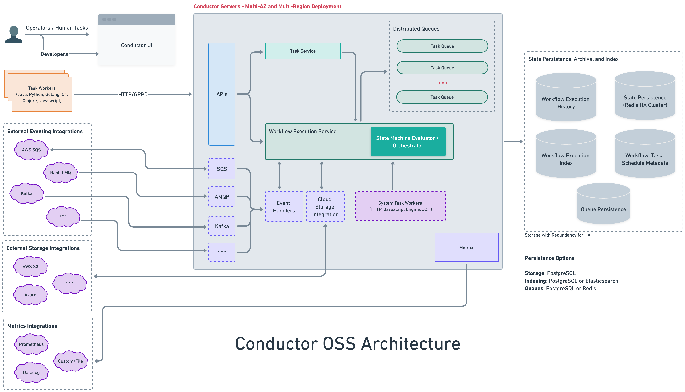

# Self-hosted deployment guide

Conductor is a self-hosted, open source workflow engine that you deploy on your own infrastructure. This production deployment guide covers everything you need to run Conductor at scale: architecture, backend configuration, horizontal scaling, workflow monitoring, and tuning.

## Architecture overview

A Conductor deployment consists of these components:



**What each component does:**

| Component | Role |
|:--|:--|
| **API Server** | Exposes REST and gRPC endpoints for workflow and task operations. |
| **Decider** | The core state machine. Evaluates workflow state and schedules the next set of tasks. |
| **Sweeper** | Background process that polls for running workflows and triggers the decider to evaluate them. Required for progress on long-running workflows. |
| **System Task Workers** | Execute built-in task types (HTTP, Event, Wait, Inline, JSON_JQ, etc.) within the server JVM. |
| **Event Processor** | Listens to configured event buses and triggers workflows or completes tasks based on incoming events. |
| **Database** | Persists workflow definitions, execution state, task state, and poll data. |
| **Queue** | Manages task scheduling — pending tasks, delayed tasks, and the sweeper's own work queue. |
| **Index** | Powers workflow and task search in the UI and via the search API. |
| **Lock** | Distributed lock that prevents concurrent decider evaluations of the same workflow. **Required in production.** |

---

## Quick start with Docker Compose

For local development and evaluation:

```shell
git clone https://github.com/conductor-oss/conductor
cd conductor
docker compose -f docker/docker-compose.yaml up
```

This starts Conductor with Redis (database + queue), Elasticsearch (indexing), and the server with UI on port **8080**.

| URL | Description |
|:----|:---|
| `http://localhost:8080` | Conductor UI |
| `http://localhost:8080/swagger-ui/index.html` | REST API docs |
| `http://localhost:8080/api/` | API base URL |

Pre-built compose files for other backend combinations:

| Compose file | Database | Queue | Index |
|:--|:--|:--|:--|
| `docker-compose.yaml` | Redis | Redis | Elasticsearch 7 |
| `docker-compose-es8.yaml` | Redis | Redis | Elasticsearch 8 |
| `docker-compose-postgres.yaml` | PostgreSQL | PostgreSQL | PostgreSQL |
| `docker-compose-postgres-es7.yaml` | PostgreSQL | PostgreSQL | Elasticsearch 7 |
| `docker-compose-mysql.yaml` | MySQL | Redis | Elasticsearch 7 |
| `docker-compose-redis-os2.yaml` | Redis | Redis | OpenSearch 2 |
| `docker-compose-redis-os3.yaml` | Redis | Redis | OpenSearch 3 |

```shell
# Example: PostgreSQL for everything
docker compose -f docker/docker-compose-postgres.yaml up

# Example: Redis + Elasticsearch 8
docker compose -f docker/docker-compose-es8.yaml up

# Example: Redis + OpenSearch 3
docker compose -f docker/docker-compose-redis-os3.yaml up
```

For Elasticsearch 8, set `conductor.indexing.type=elasticsearch8` and use
`config-redis-es8.properties` or an equivalent custom config.

---

## Production configuration

All configuration is done via Spring Boot properties in `application.properties` or environment variables. Properties can also be mounted as a Docker volume.

### Database

The database stores workflow definitions, execution state, task state, and event handler definitions.

```properties
conductor.db.type=postgres
```

**Supported database backends:**

| Backend | Property value | When to use | Notes |
|:--|:--|:--|:--|
| PostgreSQL | `postgres` | **Recommended for production.** ACID, battle-tested, supports indexing too. | Requires `spring.datasource.*` config. |
| MySQL | `mysql` | Production alternative if your team already runs MySQL. | Requires `spring.datasource.*` config. Needs separate queue backend (Redis). |
| Redis | `redis_standalone` | Fast, simple. Good for moderate scale. | Requires `conductor.redis.*` config. |
| Cassandra | `cassandra` | High write throughput, multi-region. | Requires `conductor.cassandra.*` config. |
| SQLite | `sqlite` | **Local development only.** Single-file, zero config. | Default. Not for production. |

#### PostgreSQL

```properties
conductor.db.type=postgres
conductor.external-payload-storage.type=postgres

spring.datasource.url=jdbc:postgresql://db-host:5432/conductor
spring.datasource.username=conductor
spring.datasource.password=<password>

# Optional tuning
conductor.postgres.deadlockRetryMax=3
conductor.postgres.taskDefCacheRefreshInterval=60s
conductor.postgres.asyncMaxPoolSize=12
conductor.postgres.asyncWorkerQueueSize=100
```

#### MySQL

```properties
conductor.db.type=mysql

spring.datasource.url=jdbc:mysql://db-host:3306/conductor
spring.datasource.username=conductor
spring.datasource.password=<password>

# Optional tuning
conductor.mysql.deadlockRetryMax=3
conductor.mysql.taskDefCacheRefreshInterval=60s
```

#### Redis

```properties
conductor.db.type=redis_standalone

# Format: host:port:rack (semicolon-separated for multiple hosts)
conductor.redis.hosts=redis-host:6379:us-east-1c
conductor.redis.workflowNamespacePrefix=conductor
conductor.redis.queueNamespacePrefix=conductor_queues
conductor.redis.taskDefCacheRefreshInterval=1s

# Connection pool
conductor.redis.maxIdleConnections=8
conductor.redis.minIdleConnections=5

# SSL
conductor.redis.ssl=false

# Auth (password is taken from the first host entry: host:port:rack:password)
# Or set conductor.redis.username and conductor.redis.password directly
```

---

### Queue

The queue backend manages task scheduling — it tracks which tasks are pending, delayed, or ready for execution. The sweeper and system task workers all depend on it.

```properties
conductor.queue.type=postgres
```

**Supported queue backends:**

| Backend | Property value | When to use |
|:--|:--|:--|
| PostgreSQL | `postgres` | Use when database is also PostgreSQL. Simplest stack. |
| Redis | `redis_standalone` | Use when database is Redis or MySQL. Fast, low-latency. |
| SQLite | `sqlite` | Local development only. |

!!! tip "Match your queue backend to your database"
    PostgreSQL database + PostgreSQL queue is the simplest production stack — one fewer dependency. If you use MySQL for the database, pair it with Redis for the queue.

---

### Indexing

The indexing backend powers workflow and task search in the UI and via the `/api/workflow/search` and `/api/tasks/search` endpoints.

```properties
conductor.indexing.enabled=true
conductor.indexing.type=postgres
```

**Supported indexing backends:**

| Backend | Property value | When to use | Notes |
|:--|:--|:--|:--|
| PostgreSQL | `postgres` | Simplest stack when database is also PostgreSQL. | Set `conductor.elasticsearch.version=0` to disable ES client. |
| Elasticsearch 7 | `elasticsearch` | Best search performance at scale. Full-text search. | Set `conductor.elasticsearch.version=7`. |
| Elasticsearch 8 | `elasticsearch8` | Use when running the ES8 persistence module. | Set `conductor.elasticsearch.version=8`. |
| OpenSearch 2 | `opensearch2` | Open-source ES alternative. | Compatible with ES 7 queries. |
| OpenSearch 3 | `opensearch3` | Latest OpenSearch. | |
| SQLite | `sqlite` | Local development only. | |
| Disabled | N/A | Set `conductor.indexing.enabled=false`. UI search won't work. | |

#### PostgreSQL indexing

```properties
conductor.indexing.enabled=true
conductor.indexing.type=postgres
# Disable Elasticsearch client
conductor.elasticsearch.version=0
```

#### Elasticsearch 7

```properties
conductor.indexing.enabled=true
conductor.elasticsearch.url=http://es-host:9200
conductor.elasticsearch.version=7
conductor.elasticsearch.indexName=conductor
conductor.elasticsearch.clusterHealthColor=yellow

# Performance tuning
conductor.elasticsearch.indexBatchSize=1
conductor.elasticsearch.asyncMaxPoolSize=12
conductor.elasticsearch.asyncWorkerQueueSize=100
conductor.elasticsearch.asyncBufferFlushTimeout=10s
conductor.elasticsearch.indexShardCount=5
conductor.elasticsearch.indexReplicasCount=1

# Auth (if using security)
conductor.elasticsearch.username=elastic
conductor.elasticsearch.password=<password>
```

#### Elasticsearch 8

```properties
conductor.indexing.enabled=true
conductor.indexing.type=elasticsearch8
conductor.elasticsearch.url=http://es-host:9200
conductor.elasticsearch.version=8
conductor.elasticsearch.indexName=conductor
conductor.elasticsearch.clusterHealthColor=yellow
```

#### OpenSearch

```properties
conductor.indexing.enabled=true
conductor.indexing.type=opensearch2   # or opensearch3
conductor.opensearch.url=http://os-host:9200
conductor.opensearch.indexPrefix=conductor
conductor.opensearch.clusterHealthColor=yellow
conductor.opensearch.indexReplicasCount=0
```

#### Async indexing

For high-throughput deployments, enable async indexing to decouple the indexing path from the workflow execution path:

```properties
conductor.app.asyncIndexingEnabled=true
conductor.app.asyncUpdateShortRunningWorkflowDuration=30s
conductor.app.asyncUpdateDelay=60s
```

#### Indexing toggles

Control what gets indexed:

```properties
conductor.app.taskIndexingEnabled=true
conductor.app.taskExecLogIndexingEnabled=true
conductor.app.eventMessageIndexingEnabled=true
conductor.app.eventExecutionIndexingEnabled=true
```

---

### Locking

!!! warning "Required for production"
    Distributed locking prevents race conditions when multiple server instances evaluate the same workflow concurrently. **Always enable locking in production with a distributed lock provider** (Redis or Zookeeper).

```properties
conductor.workflow-execution-lock.type=redis
conductor.app.workflowExecutionLockEnabled=true
```

**Supported lock providers:**

| Provider | Property value | When to use |
|:--|:--|:--|
| Redis | `redis` | **Recommended.** Use when Redis is already in the stack. |
| Zookeeper | `zookeeper` | Use when Zookeeper is available (e.g. Kafka deployments). |
| Local | `local_only` | Single-instance development only. **Not safe for multi-instance.** |

#### Redis lock

```properties
conductor.workflow-execution-lock.type=redis
conductor.app.workflowExecutionLockEnabled=true
conductor.app.lockLeaseTime=60000      # lock held for max 60s
conductor.app.lockTimeToTry=500        # wait up to 500ms to acquire

conductor.redis-lock.serverType=SINGLE              # SINGLE, CLUSTER, or SENTINEL
conductor.redis-lock.serverAddress=redis://redis-host:6379
# conductor.redis-lock.serverPassword=<password>
# conductor.redis-lock.serverMasterName=master     # for Sentinel
# conductor.redis-lock.namespace=conductor          # key prefix
conductor.redis-lock.ignoreLockingExceptions=false
```

> **Sentinel with multiple endpoints:** When using `SENTINEL` server type, you can provide
> multiple sentinel addresses separated by semicolons for improved high availability:
> ```properties
> conductor.redis-lock.serverType=SENTINEL
> conductor.redis-lock.serverAddress=redis://sentinel-0:26379;redis://sentinel-1:26379
> conductor.redis-lock.serverMasterName=mymaster
> ```
> This ensures the lock client can discover the master even if one sentinel node is down.

#### Zookeeper lock

```properties
conductor.workflow-execution-lock.type=zookeeper
conductor.app.workflowExecutionLockEnabled=true
conductor.app.lockLeaseTime=60000
conductor.app.lockTimeToTry=500

conductor.zookeeper-lock.connectionString=zk1:2181,zk2:2181,zk3:2181
# conductor.zookeeper-lock.sessionTimeoutMs=60000
# conductor.zookeeper-lock.connectionTimeoutMs=15000
# conductor.zookeeper-lock.namespace=conductor
```

---

### Sweeper

The sweeper is a background process that monitors running workflows. It polls the queue for workflows that need evaluation and triggers the decider. Without the sweeper, long-running workflows will not make progress.

The sweeper runs automatically as part of the Conductor server. Tune the thread count based on your workflow volume:

```properties
# Number of sweeper threads (default: availableProcessors * 2)
conductor.app.sweeperThreadCount=8

# How long to wait when polling the sweep queue (default: 2000ms)
conductor.app.sweeperWorkflowPollTimeout=2000

# Batch size per sweep poll (default: 2)
conductor.app.sweeper.sweepBatchSize=2

# Queue pop timeout in ms (default: 100)
conductor.app.sweeper.queuePopTimeout=100
```

!!! tip "Sweeper sizing"
    Start with `sweeperThreadCount = 2 * CPU cores`. If you see workflows stuck in RUNNING state, increase it. If CPU usage is high on idle, decrease it.

---

### System task workers

System task workers execute built-in task types (HTTP, Event, Wait, Inline, JSON_JQ_TRANSFORM, etc.) inside the Conductor server JVM. They poll internal queues for scheduled system tasks and execute them.

```properties
# Number of system task worker threads (default: availableProcessors * 2)
conductor.app.systemTaskWorkerThreadCount=20

# Max number of tasks to poll at once (default: same as thread count)
conductor.app.systemTaskMaxPollCount=20

# Poll interval (default: 50ms)
conductor.app.systemTaskWorkerPollInterval=50ms

# Callback duration — how often to re-check async system tasks (default: 30s)
conductor.app.systemTaskWorkerCallbackDuration=30s

# Queue pop timeout (default: 100ms)
conductor.app.systemTaskQueuePopTimeout=100ms
```

#### Running system task workers separately

In large deployments, you may want to run system task workers on dedicated instances, separate from the API server. Use the **execution namespace** to isolate which instance handles system tasks:

```properties
# On API-only instances — set a namespace that no system task worker listens on
conductor.app.systemTaskWorkerExecutionNamespace=api-only
conductor.app.systemTaskWorkerThreadCount=0

# On dedicated system task worker instances — match the namespace
conductor.app.systemTaskWorkerExecutionNamespace=worker-pool-1
conductor.app.systemTaskWorkerThreadCount=40
conductor.app.systemTaskMaxPollCount=40
```

#### Isolated system task workers

For task domain isolation (routing specific tasks to specific worker groups):

```properties
# Threads per isolation group (default: 1)
conductor.app.isolatedSystemTaskWorkerThreadCount=4
```

#### Postpone threshold

When a system task has been polled many times without completing (e.g. a Join waiting for branches), Conductor progressively delays re-evaluation to avoid busy-polling:

```properties
# After this many polls, begin exponential backoff (default: 200)
conductor.app.systemTaskPostponeThreshold=200
```

---

### Event processing

The event processor listens to configured event buses and triggers workflows or completes tasks based on incoming events.

```properties
# Thread count for event processing (default: 2)
conductor.app.eventProcessorThreadCount=4

# Event queue polling
conductor.app.eventQueueSchedulerPollThreadCount=4  # default: CPU cores
conductor.app.eventQueuePollInterval=100ms
conductor.app.eventQueuePollCount=10
conductor.app.eventQueueLongPollTimeout=1000ms
```

See the [Event-driven recipes](../cookbook/event-driven.md) for configuring Kafka, NATS, AMQP, and SQS event queues.

---

### Payload size limits

Conductor enforces payload size limits to prevent oversized data from degrading performance. When a payload exceeds the threshold, it is automatically stored in external payload storage (S3, PostgreSQL, or Azure Blob).

```properties
# Workflow input/output — threshold to move to external storage (default: 5120 KB)
conductor.app.workflowInputPayloadSizeThreshold=5120KB
conductor.app.workflowOutputPayloadSizeThreshold=5120KB

# Workflow input/output — hard limit, fails the workflow (default: 10240 KB)
conductor.app.maxWorkflowInputPayloadSizeThreshold=10240KB
conductor.app.maxWorkflowOutputPayloadSizeThreshold=10240KB

# Task input/output — threshold to move to external storage (default: 3072 KB)
conductor.app.taskInputPayloadSizeThreshold=3072KB
conductor.app.taskOutputPayloadSizeThreshold=3072KB

# Task input/output — hard limit, fails the task (default: 10240 KB)
conductor.app.maxTaskInputPayloadSizeThreshold=10240KB
conductor.app.maxTaskOutputPayloadSizeThreshold=10240KB

# Workflow variables — hard limit (default: 256 KB)
conductor.app.maxWorkflowVariablesPayloadSizeThreshold=256KB
```

For external payload storage configuration, see [External Payload Storage](../../documentation/advanced/externalpayloadstorage.md).

---

### Workflow monitoring and observability

Conductor exposes Prometheus-compatible metrics out of the box for workflow monitoring and observability:

```properties
conductor.metrics-prometheus.enabled=true
management.endpoints.web.exposure.include=health,info,prometheus
management.metrics.web.server.request.autotime.percentiles=0.50,0.75,0.90,0.95,0.99
management.endpoint.health.show-details=always
```

Scrape `http://<conductor-host>:8080/actuator/prometheus` with Prometheus.

For details on available metrics, see [Server Metrics](../../documentation/metrics/server.md) and [Client Metrics](../../documentation/metrics/client.md).

---

## Recommended production configurations

### PostgreSQL stack (simplest)

One database for everything — fewest moving parts.

```properties
# Database
conductor.db.type=postgres
conductor.queue.type=postgres
conductor.external-payload-storage.type=postgres
spring.datasource.url=jdbc:postgresql://db-host:5432/conductor
spring.datasource.username=conductor
spring.datasource.password=<password>

# Indexing (use PostgreSQL, no Elasticsearch needed)
conductor.indexing.enabled=true
conductor.indexing.type=postgres
conductor.elasticsearch.version=0

# Locking (use Redis — lightweight, fast)
conductor.workflow-execution-lock.type=redis
conductor.app.workflowExecutionLockEnabled=true
conductor.redis-lock.serverAddress=redis://redis-host:6379

# Sweeper
conductor.app.sweeperThreadCount=8

# System task workers
conductor.app.systemTaskWorkerThreadCount=20
conductor.app.systemTaskMaxPollCount=20

# Metrics
conductor.metrics-prometheus.enabled=true
management.endpoints.web.exposure.include=health,info,prometheus
```

### Redis + Elasticsearch stack (high throughput)

Best search performance and lowest latency for queue operations.

```properties
# Database + Queue
conductor.db.type=redis_standalone
conductor.queue.type=redis_standalone
conductor.redis.hosts=redis-host:6379:us-east-1c
conductor.redis.workflowNamespacePrefix=conductor
conductor.redis.queueNamespacePrefix=conductor_queues

# Indexing
conductor.indexing.enabled=true
conductor.elasticsearch.url=http://es-host:9200
conductor.elasticsearch.version=7
conductor.elasticsearch.indexName=conductor
conductor.elasticsearch.clusterHealthColor=yellow
conductor.app.asyncIndexingEnabled=true

# Locking
conductor.workflow-execution-lock.type=redis
conductor.app.workflowExecutionLockEnabled=true
conductor.redis-lock.serverAddress=redis://redis-host:6379

# Sweeper
conductor.app.sweeperThreadCount=16

# System task workers
conductor.app.systemTaskWorkerThreadCount=40
conductor.app.systemTaskMaxPollCount=40

# Metrics
conductor.metrics-prometheus.enabled=true
management.endpoints.web.exposure.include=health,info,prometheus
```

---

## Running with Docker

### Using Docker Compose

```shell
git clone https://github.com/conductor-oss/conductor
cd conductor
docker compose -f docker/docker-compose.yaml up
```

To use a different backend, swap the compose file:

```shell
docker compose -f docker/docker-compose-postgres.yaml up
```

### Using the standalone image

```shell
docker run -p 8080:8080 conductoross/conductor:latest
```

### Custom configuration via volume mount

Mount your own properties file to override the defaults without rebuilding the image:

```shell
docker run -p 8080:8080 \
  -v /path/to/my-config.properties:/app/config/config.properties \
  conductoross/conductor:latest
```

### Accessing Conductor

| URL | Description |
|:----|:---|
| `http://localhost:8080` | Conductor UI |
| `http://localhost:8080/swagger-ui/index.html` | REST API docs |

### Shutting down

```shell
# Ctrl+C to stop, then:
docker compose down
```

---

## Multi-instance deployment and horizontal scaling

For high availability and horizontal scaling, run multiple Conductor server instances behind a load balancer. All instances share the same database, queue, index, and lock backends. This architecture enables workflow engine scalability to millions of concurrent executions.

**Requirements:**

- **Distributed locking must be enabled** (`redis` or `zookeeper`). Without it, concurrent decider evaluations on the same workflow will cause race conditions.
- All instances must point to the same database, queue, and indexing backends.
- The load balancer should use round-robin or least-connections routing.

**Optional: separate API and worker instances:**

```
┌──────────────────┐     ┌──────────────────┐
│  API Instance 1  │     │  API Instance 2  │   ← handle REST/gRPC, low system task threads
│  (systemTask=0)  │     │  (systemTask=0)  │
└────────┬─────────┘     └────────┬─────────┘
         │                        │
    ┌────┴────────────────────────┴────┐
    │         Load Balancer            │
    └────┬────────────────────────┬────┘
         │                        │
┌────────┴──────────┐     ┌───────┴───────────┐
│  Worker Instance  │     │  Worker Instance  │  ← high system task threads, sweeper
│  (systemTask=40)  │     │  (systemTask=40)  │
└───────────────────┘     └───────────────────┘
```

---

## Troubleshooting

| Issue | Fix |
|:--|:--|
| Out of memory or slow performance | Check JVM heap usage and adjust `-Xms` / `-Xmx` as necessary. Monitor with `jstat` or the `/actuator/health` endpoint. |
| Elasticsearch stuck in yellow health | Set `conductor.elasticsearch.clusterHealthColor=yellow` or add more ES nodes for green. |
| Workflows stuck in RUNNING | Check sweeper is running and `sweeperThreadCount > 0`. Check lock provider is reachable. |
| System tasks not executing | Verify `systemTaskWorkerThreadCount > 0` and the queue backend is reachable. |
| Config changes not taking effect | Properties are baked into the Docker image at build time. Mount a volume instead of rebuilding. |
