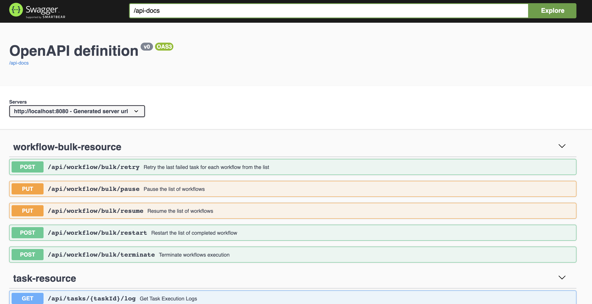

# Running Conductor Using Docker

Learn how to set up Conductor on your local machine using Docker and configure the backend options. 

## Running Conductor using Docker Compose

This is the recommended method for setting up Conductor. The Docker Compose will bring up the following:

- Conductor API Server
- Conductor UI
- Elasticsearch (for searching workflows)

!!! info "Prerequisites"
    - [Docker Desktop](https://docs.docker.com/get-started/get-docker/)
    - Java (JDK) v17 or later
    - [Node v14](https://nodejs.org) for the UI to build
    - Recommended host with enough CPU and RAM to run multiple Docker containers (at least 16GB RAM)


**To run Conductor using Docker:**

1. Clone the Conductor repository.

    ```shell
    $ git clone https://github.com/conductor-oss/conductor
    ```

2. Run Docker Compose.

    ```shell
    $ cd conductor
    conductor $ docker compose -f docker/docker-compose.yaml up
    ```

Once up and running, you will see the following containers in your Docker Desktop dashboard:

- Elasticsearch
- Redis
- Conductor server (contains both the backend and UI)

If you encounter any issues running Conductor from Docker, refer to [Troubleshooting](#troubleshooting) below.

### Accessing Conductor

To access the Conductor UI, go to [http://localhost:8127](http://localhost:8127).


To access the REST API Swagger documentation, go to [http://localhost:8080/swagger-ui/index.html](http://localhost:8080/swagger-ui/index.html)




### Exiting Conductor

**To shut down Conductor:**

1. From the terminal, exit Docker Compose using **Ctrl** + **c** keys.
2. Run `docker-compose down` to make sure that the images are stopped.


## Default database specifications

By default, `docker-compose.yaml` uses `config-redis.properties`. The default databases used when you run Conductor with Docker Compose are:

* **Elasticsearch**—Default indexing backend for the UI.
* **Redis**—Default persistence store for workflow state and queue management.

However, the choice of backend is quite flexible and can be changed:

| Default       | Alternatives                 |
|---------------|------------------------------| 
| Elasticsearch | <ul><li>Opensearch</li></ul> |
| Redis         | <ul><li>Postgres</li><li>MySQL</li><li>Cassandra</li></ul> |

## Alternative persistence stores

A selection of `docker-compose-*.yaml` and `config-*.properties` files are provided to demonstrate the use of alternative persistence stores.

| File                           | Containers                                                                              |
|--------------------------------|-----------------------------------------------------------------------------------------|
| [docker-compose.yaml](https://github.com/conductor-oss/conductor/blob/main/docker/docker-compose.yaml)                          | <ul><li>Redis</li><li>Elasticsearch v7</li><li>Conductor server (includes UI)</li></ul>           |
| [docker-compose-postgres.yaml](https://github.com/conductor-oss/conductor/blob/main/docker/docker-compose-postgres.yaml)   | <ul><li>Postgres</li><li>Conductor server (includes UI)</li></ul>  |
| [docker-compose-postgres-es7.yaml](https://github.com/conductor-oss/conductor/blob/main/docker/docker-compose-postgres-es7.yaml)       | <ul><li>Postgres</li><li>Elasticsearch v7</li><li>Conductor server (includes UI)</li></ul>   |
| [docker-compose-mysql.yaml](https://github.com/conductor-oss/conductor/blob/main/docker/docker-compose-mysql.yaml)       | <ul><li>MySQL</li><li>Redis</li><li>Elasticsearch v7</li><li>Conductor server (includes UI)</li></ul>   |
| [docker-compose-redis-os.yaml](https://github.com/conductor-oss/conductor/blob/main/docker/docker-compose-redis-os.yaml)    | <ul><li>Redis</li><li>Opensearch</li><li>Conductor server (includes UI)</li></ul>   |
  
### Running Conductor with alternative persistence stores

To run Conductor with a different configuration, simply use the appropriate `docker-compose*.yaml` file.

For example, run the following command to start the server instance backed by a PostgreSQL database:

``` shell
conductor $ docker compose -f docker/docker-compose-postgres.yaml up
```


### Configuring Elasticsearch

By default, Conductor comes packaged with Elasticsearch for the UI's indexing backend. While Elasticsearch is optional, disabling it will disable the search functionality in the UI.

#### Disabling Elasticsearch

**To disable Elasticsearch:**

1. Set `conductor.indexing.enabled=false` in config-*.properties files.
2. Comment out all the configuration code related to Elasticsearch. For example: `conductor.elasticsearch.url=http://es:9200`.


#### Re-enabling Elasticsearch

**To re-enable Elasticsearch:**

1. Set `conductor.indexing.enabled=true` in `config-*.properties` files.
2. Uncomment or add in the configuration code related to Elasticsearch. For example: `conductor.elasticsearch.url=http://es:9200`.

### Configuring Opensearch

**To use Opensearch**:

1. Comment out the Elasticsearch import in [`server/build.gradle`](https://github.com/conductor-oss/conductor/blob/main/server/build.gradle#L44-L46).
2. Uncomment the Opensearch import in [`server/build.gradle`](https://github.com/conductor-oss/conductor/blob/main/server/build.gradle#L44-L46).


## Standalone images

You can also build and run the Conductor server and UI as standalone images.

### Running the standalone server image

**To run the server image:**

1. Build the `conductor:server` image from the `docker` directory.
    
    ```
    conductor $ cd docker
    docker $ docker build -t conductor:server -f server/Dockerfile ../
    ```

2. Run the server image in a container named `conductor_server`.

    ```
    docker $ docker run -p 8080:8080 -d --name conductor_server conductor:server
    ```

3. Log in to the running container.

     ```
     docker $  docker exec -it conductor_server /bin/sh
     ```


The API documentation should now be accessible at [http://localhost:8080/swagger-ui/index.html](http://localhost:8080/swagger-ui/index.html).


### Running the standalone UI image

!!! note
    - In order for the UI to do anything useful the Conductor server must already be running on port 8080, either in a Docker container (as above), or running directly in the local JRE.
    - Significant parts of the UI will also not be functional without Elastisearch.
    
    Using the `docker-compose` approach alleviates these considerations.

**To run the UI image:**

1. Build the `conductor:ui` image from the `docker` directory.

    ```
    docker build -t conductor:ui -f ui/Dockerfile ../
    ```

2. Run the UI image in a container named `conductor_ui`.

    ```
    docker run -p 8127:5000 -d --name conductor_ui conductor:ui
    ```

The UI should now be accessible at [http://localhost:8127](http://localhost:8127).


## Troubleshooting 
To troubleshoot a failed start, check the server logs located at `/app/logs` (default directory in dockerfile).

```
docker logs <container-name>
```

Here are some common issues when using Docker images and ways to resolve them:

| Issue             | Fix                                |
| ----------------- | -----------------------------------|
| Not enough memory | You need at least 16 GB of memory to run everything. You can modify the Docker Compose to skip using Elasticsearch if you have no option to run this with your memory options. <br/><br/> Refer to [Disabling Elasticsearch](#disabling-elasticsearch) for more information. |
| Elasticsearch fails to come up in arm64-based CPU machines | Elasticsearch v6.8.x does not have an arm64-based Docker image. Make sure you are using Elasticsearch v7 and later.|
| Server times out at start up because Elasticsearch remains in Yellow health | By default, the Conductor server requires Elasticsearch to be in Green state so that it can run when indexing is enabled. To work around this, use one of the following solutions: <ul><li>Set the following property `conductor.elasticsearch.clusterHealthColor=yellow` in `config-*.properties` files.</li> <li>Spin up another cluster (more than one node) to prevent the timeout</li></ul> Refer to the [GitHub issue](https://github.com/Netflix/conductor/issues/2262). |
| Changes in `config-*.properties` files are not taking effect |  The configuration files are copied into the Docker image when it is built. For the changes to take effect, you must rebuild the image. <br/><br/> For best practices, you can mount the configuration files as a Docker volume instead to reflect the new changes automatically without rebuilding. |
| Unable to access the Conductor server on port 8080 | It may takes some time for Conductor server to start. Wait before trying again, and if it is still not loading, check the server log for errors. |
