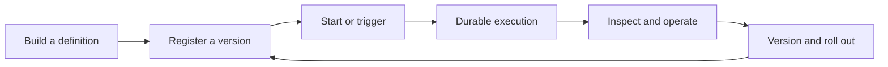

# Workflows

A Conductor **workflow definition** is a versioned blueprint: it names the tasks, maps inputs and outputs, and declares control flow. A **workflow execution** is one durable run of that blueprint with its own ID, input, task state, output, and history. Editing a definition does not edit the recorded history of an execution; operators inspect and recover executions, while developers evolve definitions through versions.

Conductor persists progress between tasks. That makes workflows useful when work spans services, retries, human decisions, timers, or infrastructure restarts. It also means the task boundary is an operational contract: inputs must be resolvable, failures need a policy, and externally executed tasks need a worker that is actually polling.

-   **Build**

    Define the contract, select system tasks or workers, wire data, validate the schema, and register a version. Start with [Create or update workflows](../how-tos/Workflows/creating-workflows.md).

-   **Run**

    Start an execution, capture its workflow ID, and inspect task input, output, and status. Start with [Start workflows](../how-tos/Workflows/starting-workflows.md).

-   **Trigger**

    Choose whether an application, schedule, event, parent workflow, or external signal owns the next transition. Start with [Choose a trigger](../how-tos/Workflows/choosing-a-trigger.md).

-   **Operate**

    Add timeouts and retries, search executions, debug failures, recover safely, and roll out new versions. Follow the [best practices](../bestpractices.md).

## Choose how work runs

Most workflow steps should use a built-in system task. Use a `SIMPLE` task when code must execute in your service or no built-in task represents the operation.

| Requirement | Choose | What operates it |
|---|---|---|
| Call HTTP, wait, branch, fork, transform JSON, publish an event, or start another workflow | Built-in system task | Conductor server |
| Execute domain logic, access a private library, or call a proprietary system | `SIMPLE` task | Your worker process |
| Run a child and wait for its result | `SUB_WORKFLOW` | Conductor server |
| Start a child and continue immediately | `START_WORKFLOW` | Conductor server |

A `SIMPLE` task needs both a registered task definition and a worker polling the exact task type. Without them, the task remains queued and the workflow does not advance. The [task chooser](../how-tos/Tasks/choosing-tasks.md) covers the complete built-in catalog; the [first-worker quickstart](../../quickstart/first-worker.md) covers the external-worker path.

## Choose how execution starts or resumes

| Requirement | Mechanism | Use when |
|---|---|---|
| A service or user starts work now | Direct API, CLI, or SDK start | The caller already owns the request and input |
| Work starts at a time or cadence | Schedule | Cron and timezone define when to create a new execution |
| A message starts or advances work | Event handler | A broker or Conductor event is the source of truth |
| One workflow invokes another | `SUB_WORKFLOW` or `START_WORKFLOW` | The parent owns composition explicitly |
| Existing work pauses for an external decision | `WAIT`, `HUMAN`, or `asyncComplete` plus a task signal/event action | The same execution must resume rather than create a new one |

Do not use business correlation alone to complete waiting work through an event handler. The implemented OSS actions require a `taskId`, or a `workflowId` plus `taskRefName`. See [Event orchestration](../how-tos/event-bus.md) for delivery and idempotency rules.

## A practical lifecycle

During **Build**, define inputs and stable output parameters before task wiring. Prefer built-in tasks; register every task definition required by a `SIMPLE` step. Validate the definition, then use mocked workflow testing to exercise branches without invoking real dependencies. Finally run one real execution against test dependencies.

During **Run**, start a pinned version when repeatability matters, record the returned workflow ID, and inspect the execution rather than assuming submission means completion. Synchronous start is convenient for bounded tests; asynchronous start plus status lookup is safer for long-running work.

During **Trigger**, make ownership explicit. Schedules always create executions. Events can create executions or complete/fail an identified task. Workflow composition expresses a known dependency directly. Signals resume work that already exists.

During **Operate**, configure task retries and all relevant timeouts, define idempotent worker behavior, carry correlation data, monitor queues and execution state, and rehearse recovery. Roll out breaking input or output changes as a new workflow version, and keep callers pinned until they are ready.

## Pick your route

For a first success in a local environment, follow [Run your first workflow](../../quickstart/first-workflow.md). It uses only built-in tasks and ends with an observable completed execution.

For a production service, follow the [best practices](../bestpractices.md). They connect contract design, validation, real-boundary testing, worker deployment, reliability policy, observability, and recovery drills. Use the Recipes section when you already understand the lifecycle and want a compact runnable variant.
