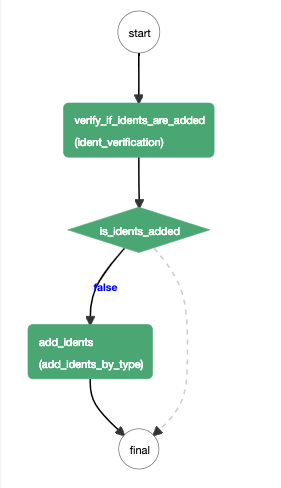
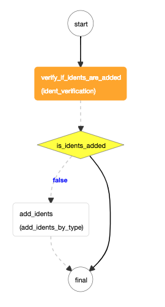
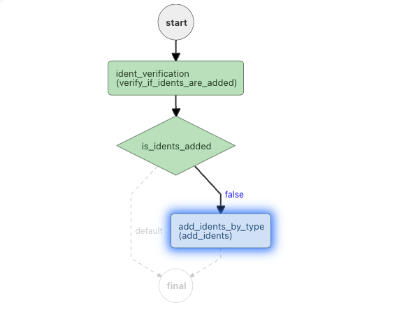

## Hands on mode
Please feel free to follow along using any of these resources:

- Using cURL.
- Postman or similar REST client.

## Creating a Workflow

Let's create a simple workflow that adds Netflix Idents to videos. We'll be mocking the adding Idents part and focusing on actually executing this process flow.

!!!info "What are Netflix Idents?" 
    Netflix Idents are those 4 second videos with Netflix logo, which appears at the beginning and end of shows.
    Learn more about them [here](https://partnerhelp.netflixstudios.com/hc/en-us/articles/115004750187-Master-QC-Identifying-and-Implementing-the-Netflix-Ident-). You might have also noticed they're different for Animation and several other genres.

!!!warning "Disclaimer"
    Obviously, this is not how Netflix adds Idents. Those Workflows are indeed very complex. But, it should give you an idea about how Conductor can be used to implement similar features.

The workflow in this lab will look like this:



This workflow contains the following:

* Worker Task `verify_if_idents_are_added` to verify if Idents are already added.
* [Decision Task](/configuration/systask/#decision) that takes output from the previous task, and decides whether to schedule the `add_idents` task.
* `add_idents` task which is another worker Task.

### Creating Task definitions

Let's create the [task definition](/configuration/taskdef) for `verify_if_idents_are_added` in JSON. This task will be a *SIMPLE* task which is supposed to be executed by an Idents microservice. We'll be mocking the Idents microservice part.

**Note** that at this point, we don't have to specify whether it is a System task or Worker task. We are only specifying the required configurations for the task, like number of times it should be retried, timeouts etc. We shall start by using `name` parameter for task name.
```json
{
  "name": "verify_if_idents_are_added"
}
```

We'd like this task to be retried 3 times on failure.

```json
{
  "name": "verify_if_idents_are_added",
  "retryCount": 3,
  "retryLogic": "FIXED",
  "retryDelaySeconds": 10
}
```

And to timeout after 300 seconds.  
i.e. if the task doesn't finish execution within this time limit after transitioning to `IN_PROGRESS` state, the Conductor server cancels this task and schedules a new execution of this task in the queue.

```json
{
  "name": "verify_if_idents_are_added",
  "retryCount": 3,
  "retryLogic": "FIXED",
  "retryDelaySeconds": 10,
  "timeoutSeconds": 300,
  "timeoutPolicy": "TIME_OUT_WF"
}
```

And a [responseTimeout](/tasklifecycle/#response-timeout-seconds) of 180 seconds.

```json
{
  "name": "verify_if_idents_are_added",
  "retryCount": 3,
  "retryLogic": "FIXED",
  "retryDelaySeconds": 10,
  "timeoutSeconds": 300,
  "timeoutPolicy": "TIME_OUT_WF",
  "responseTimeoutSeconds": 180
}
```

We can define several other fields defined [here](/configuration/taskdef), but this is a good place to start with.

Similarly, create another task definition: `add_idents`.

```json
{
  "name": "add_idents",
  "retryCount": 3,
  "retryLogic": "FIXED",
  "retryDelaySeconds": 10,
  "timeoutSeconds": 300,
  "timeoutPolicy": "TIME_OUT_WF",
  "responseTimeoutSeconds": 180
}
```

Send a `POST` request to `/metadata/taskdefs` endpoint to register these tasks. You can use Swagger, Postman, CURL or similar tools.

!!!info "Why is the Decision Task not registered?"
    System Tasks that are part of control flow do not need to be registered. However, some system tasks where the retries, rate limiting and other mechanisms are required, like `HTTP` Task, are to be registered though.

!!! Important
    Task and Workflow Definition names are unique. The names we use below might have already been registered. For this lab, add a prefix with your username, `{my_username}_verify_if_idents_are_added` for example. This is definitely not recommended for Production usage though.


**Example**
```
curl -X POST \
  http://localhost:8080/api/metadata/taskdefs \
  -H 'Content-Type: application/json' \
  -d '[
	{
	  "name": "verify_if_idents_are_added",
	  "retryCount": 3,
	  "retryLogic": "FIXED",
	  "retryDelaySeconds": 10,
	  "timeoutSeconds": 300,
	  "timeoutPolicy": "TIME_OUT_WF",
	  "responseTimeoutSeconds": 180,
	  "ownerEmail": "type your email here"
	},
	{
	  "name": "add_idents",
	  "retryCount": 3,
	  "retryLogic": "FIXED",
	  "retryDelaySeconds": 10,
	  "timeoutSeconds": 300,
	  "timeoutPolicy": "TIME_OUT_WF",
	  "responseTimeoutSeconds": 180,
	  "ownerEmail": "type your email here"
	}
]'
```

### Creating Workflow Definition

Creating Workflow definition is almost similar. We shall use the Task definitions created above. Note that same Task definitions can be used in multiple workflows, or for multipe times in same Workflow (that's where `taskReferenceName` is useful).

A workflow without any tasks looks like this:
```json
{
    "name": "add_netflix_identation",
    "description": "Adds Netflix Identation to video files.",
    "version": 1,
    "schemaVersion": 2,
    "tasks": []
}
```

Add the first task that this workflow has to execute. All the tasks must be added to the `tasks` array.

```json
{
    "name": "add_netflix_identation",
    "description": "Adds Netflix Identation to video files.",
    "version": 1,
    "schemaVersion": 2,
    "tasks": [
        {
    		"name": "verify_if_idents_are_added",
		    "taskReferenceName": "ident_verification",
		    "inputParameters": {
		        "contentId": "${workflow.input.contentId}"
		    },
		    "type": "SIMPLE"
    	}
    ]
}
```

**Wiring Input/Outputs**

Notice how we were using `${workflow.input.contentId}` to pass inputs to this task. Conductor can wire inputs between workflow and tasks, and between tasks.  
i.e The task `verify_if_idents_are_added` is wired to accept inputs from the workflow input using JSONPath expression `${workflow.input.param}`.

Learn more about wiring inputs and outputs [here](/configuration/workflowdef/#wiring-inputs-and-outputs).

Let's define `decisionCases` now. Checkout the Decision task structure [here](/configuration/systask/#decision).

A Decision task is specified by `type:"DECISION"`, `caseValueParam` and `decisionCases` which lists all the branches of Decision task. This is similar to a `switch..case` but written in Conductor JSON DSL.

Adding the decision task:
```json
{
    "name": "add_netflix_identation",
    "description": "Adds Netflix Identation to video files.",
    "version": 2,
    "schemaVersion": 2,
    "tasks": [
    	{
    		"name": "verify_if_idents_are_added",
		    "taskReferenceName": "ident_verification",
		    "inputParameters": {
		        "contentId": "${workflow.input.contentId}"
		    },
		    "type": "SIMPLE"
    	},
        {
            "name": "decide_task",
            "taskReferenceName": "is_idents_added",
            "inputParameters": {
                "case_value_param": "${ident_verification.output.is_idents_added}"
            },
            "type": "DECISION",
            "caseValueParam": "case_value_param",
            "decisionCases": {
                
            }
        }
    ]
}
```

Each decision branch could have multiple tasks, so it has to be defined as an array.
```json
{
    "name": "add_netflix_identation",
    "description": "Adds Netflix Identation to video files.",
    "version": 2,
    "schemaVersion": 2,
    "tasks": [
    	{
    		"name": "verify_if_idents_are_added",
		    "taskReferenceName": "ident_verification",
		    "inputParameters": {
		        "contentId": "${workflow.input.contentId}"
		    },
		    "type": "SIMPLE"
    	},
        {
            "name": "decide_task",
            "taskReferenceName": "is_idents_added",
            "inputParameters": {
                "case_value_param": "${ident_verification.output.is_idents_added}"
            },
            "type": "DECISION",
            "caseValueParam": "case_value_param",
            "decisionCases": {
                "false": [
                    {
                        "name": "add_idents",
                        "taskReferenceName": "add_idents_by_type",
                        "inputParameters": {
                        	"identType": "${workflow.input.identType}",
                        	"contentId": "${workflow.input.contentId}"
                        },
                        "type": "SIMPLE"
                    }
                ]
            }
        }
    ]
}
```

Just like the task definitions, register this workflow definition by sending a POST request to `/workflow` endpoint.

**Example**
```
curl -X POST \
  http://localhost:8080/api/metadata/workflow \
  -H 'Content-Type: application/json' \
  -d '{
    "name": "add_netflix_identation",
    "description": "Adds Netflix Identation to video files.",
    "version": 2,
    "schemaVersion": 2,
    "tasks": [
    	{
    		"name": "verify_if_idents_are_added",
		    "taskReferenceName": "ident_verification",
		    "inputParameters": {
		        "contentId": "${workflow.input.contentId}"
		    },
		    "type": "SIMPLE"
    	},
        {
            "name": "decide_task",
            "taskReferenceName": "is_idents_added",
            "inputParameters": {
                "case_value_param": "${ident_verification.output.is_idents_added}"
            },
            "type": "DECISION",
            "caseValueParam": "case_value_param",
            "decisionCases": {
                "false": [
                    {
                        "name": "add_idents",
                        "taskReferenceName": "add_idents_by_type",
                        "inputParameters": {
                        	"identType": "${workflow.input.identType}",
                        	"contentId": "${workflow.input.contentId}"
                        },
                        "type": "SIMPLE"
                    }
                ]
            }
        }
    ]
}'
```

### Starting the Workflow

Send a `POST` request to `/workflow` with:
```json
{
    "name": "add_netflix_identation",
    "version": 2,
    "correlationId": "my_netflix_identation_workflows",
    "input": {
        "identType": "animation",
	    "contentId": "my_unique_content_id"
    }
}
```

Example:
```
curl -X POST \
  http://localhost:8080/api/workflow/add_netflix_identation \
  -H 'Content-Type: application/json' \
  -d '{
	"identType": "animation",
	"contentId": "my_unique_content_id"
}'
```

Successful POST request should return a workflow Id, which you can use to find the execution in the UI.

### Conductor User Interface

Open the UI and navigate to the RUNNING tab, the Workflow should be in the state as below:



Feel free to explore the various functionalities that the UI exposes. To elaborate on a few:

* Workflow Task modals (Opens on clicking any of the tasks in the workflow), which includes task I/O, logs and task JSON.
* Task Details tab, which shows the sequence of task execution, status, start/end time, and link to worker details which executed the task.
* Input/Output tab shows workflow input and output.


### Poll for Worker task

Now that `verify_if_idents_are_added` task is in `SCHEDULED` state, it is the worker's turn to fetch the task, execute it and update Conductor with final status of the task.

Ideally, the workers implementing the [Client](/gettingstarted/client/#worker) interface would do this process, executing the tasks on real microservices. But, let's mock this part.

Send a `GET` request to `/poll` endpoint with your task type.

For example:

```
curl -X GET \
    http://localhost:8080/api/tasks/poll/verify_if_idents_are_added
```


### Return response, add logs

We can respond to Conductor with any of the following states:

* Task has COMPLETED.
* Task has FAILED.
* Call back after seconds [Process the task at a later time].

Considering our Ident Service has verified that the Ident's are not yet added to given Content Id, let's return the task status by sending the below `POST` request to `/tasks` endpoint, with payload:

```json
{
  "workflowInstanceId": "{workflowId}",
  "taskId": "{taskId}",
  "reasonForIncompletion": "",
  "callbackAfterSeconds": 0,
  "workerId": "localhost",
  "status": "COMPLETED",
  "outputData": {
  	"is_idents_added": false
  }
}
```

Example:

```
curl -X POST \
  http://localhost:8080/api/tasks \
  -H 'Content-Type: application/json' \
  -d '{
    "workflowInstanceId": "cb7c5041-aa85-4940-acb4-3bdcfa9f5c5c",
    "taskId": "741f362b-ee9a-47b6-81b5-9bbbd5c4c992",
    "reasonForIncompletion": "",
    "callbackAfterSeconds": 0,
    "workerId": "string",
    "status": "COMPLETED",
    "outputData": {
        "is_idents_added": false
    },
    "logs": [
        {
            "log": "Ident verification successful for title: {some_title_name}, with Id: {some_id}",
            "createdTime": 1550178825
        }	
    ]
  }'
```

!!! Info "Check logs in UI"
    You can find the logs we just sent by clicking the `verify_if_idents_are_added`, upon which a modal should open with `Logs` tab.

### Why is System task executed, but Worker task is Scheduled.

You will notice that Workflow is in the state as below after sending the POST request:



Conductor has executed `is_idents_added` all through it's lifecycle, without us polling, or returning the status of Task. If it is still unclear, `is_idents_added` is a System task, and System tasks are executed by Conductor Server.

But, `add_idents` is a SIMPLE task. So, the complete lifecyle of this task (Poll, Update) should be handled by a worker to continue with W\workflow execution. When Conductor has finished executing all the tasks in given flow, the workflow will reach Terminal state (COMPLETED, FAILED, TIMED_OUT etc.)

## Next steps

You can play around this workflow by failing one of the Tasks, restarting or retrying the Workflow, or by tuning the number of retries, timeoutSeconds etc.
