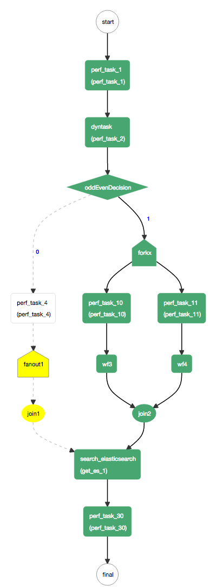

An example kitchensink workflow that demonstrates the usage of all the schema constructs.

###Definition

```json
{
  "name": "kitchensink",
  "description": "kitchensink workflow",
  "version": 1,
  "tasks": [
    {
      "name": "task_1",
      "taskReferenceName": "task_1",
      "inputParameters": {
        "mod": "${workflow.input.mod}",
        "oddEven": "${workflow.input.oddEven}"
      },
      "type": "SIMPLE"
    },
    {
      "name": "event_task",
      "taskReferenceName": "event_0",
      "inputParameters": {
        "mod": "${workflow.input.mod}",
        "oddEven": "${workflow.input.oddEven}"
      },
      "type": "EVENT",
      "sink": "conductor"
    },
    {
      "name": "dyntask",
      "taskReferenceName": "task_2",
      "inputParameters": {
        "taskToExecute": "${workflow.input.task2Name}"
      },
      "type": "DYNAMIC",
      "dynamicTaskNameParam": "taskToExecute"
    },
    {
      "name": "oddEvenDecision",
      "taskReferenceName": "oddEvenDecision",
      "inputParameters": {
        "oddEven": "${task_2.output.oddEven}"
      },
      "type": "DECISION",
      "caseValueParam": "oddEven",
      "decisionCases": {
        "0": [
          {
            "name": "task_4",
            "taskReferenceName": "task_4",
            "inputParameters": {
              "mod": "${task_2.output.mod}",
              "oddEven": "${task_2.output.oddEven}"
            },
            "type": "SIMPLE"
          },
          {
            "name": "dynamic_fanout",
            "taskReferenceName": "fanout1",
            "inputParameters": {
              "dynamicTasks": "${task_4.output.dynamicTasks}",
              "input": "${task_4.output.inputs}"
            },
            "type": "FORK_JOIN_DYNAMIC",
            "dynamicForkTasksParam": "dynamicTasks",
            "dynamicForkTasksInputParamName": "input"
          },
          {
            "name": "dynamic_join",
            "taskReferenceName": "join1",
            "type": "JOIN"
          }
        ],
        "1": [
          {
            "name": "fork_join",
            "taskReferenceName": "forkx",
            "type": "FORK_JOIN",
            "forkTasks": [
              [
                {
                  "name": "task_10",
                  "taskReferenceName": "task_10",
                  "type": "SIMPLE"
                },
                {
                  "name": "sub_workflow_x",
                  "taskReferenceName": "wf3",
                  "inputParameters": {
                    "mod": "${task_1.output.mod}",
                    "oddEven": "${task_1.output.oddEven}"
                  },
                  "type": "SUB_WORKFLOW",
                  "subWorkflowParam": {
                    "name": "sub_flow_1",
                    "version": 1
                  }
                }
              ],
              [
                {
                  "name": "task_11",
                  "taskReferenceName": "task_11",
                  "type": "SIMPLE"
                },
                {
                  "name": "sub_workflow_x",
                  "taskReferenceName": "wf4",
                  "inputParameters": {
                    "mod": "${task_1.output.mod}",
                    "oddEven": "${task_1.output.oddEven}"
                  },
                  "type": "SUB_WORKFLOW",
                  "subWorkflowParam": {
                    "name": "sub_flow_1",
                    "version": 1
                  }
                }
              ]
            ]
          },
          {
            "name": "join",
            "taskReferenceName": "join2",
            "type": "JOIN",
            "joinOn": [
              "wf3",
              "wf4"
            ]
          }
        ]
      }
    },
    {
      "name": "search_elasticsearch",
      "taskReferenceName": "get_es_1",
      "inputParameters": {
        "http_request": {
          "uri": "http://localhost:9200/conductor/_search?size=10",
          "method": "GET"
        }
      },
      "type": "HTTP"
    },
    {
      "name": "task_30",
      "taskReferenceName": "task_30",
      "inputParameters": {
        "statuses": "${get_es_1.output..status}",
        "workflowIds": "${get_es_1.output..workflowId}"
      },
      "type": "SIMPLE"
    }
  ],
  "outputParameters": {
    "statues": "${get_es_1.output..status}",
    "workflowIds": "${get_es_1.output..workflowId}"
  },
  "ownerEmail": "example@email.com",
  "schemaVersion": 2
}
```
### Visual Flow


### Running Kitchensink Workflow
1. Start the server as documented [here](/server).  Use ```-DloadSample=true``` java system property when launching the server.  This will create a kitchensink workflow, related task definitions and kick off an instance of kitchensink workflow.
2. Once the workflow has started, the first task remains in the ```SCHEDULED``` state.  This is because no workers are currently polling for the task.
3. We will use the REST endpoints directly to poll for tasks and updating the status.

#### Start workflow execution
Start the execution of the kitchensink workflow by posting the following:

```shell
curl -X POST --header 'Content-Type: application/json' --header 'Accept: text/plain' 'http://localhost:8080/api/workflow/kitchensink' -d '
{
	"task2Name": "task_5" 
}
'
```
The response is a text string identifying the workflow instance id.

#### Poll for the first task:
  
```shell
curl http://localhost:8080/api/tasks/poll/task_1
```
   
   The response should look something like:
   
```json
{
    "taskType": "task_1",
    "status": "IN_PROGRESS",
    "inputData": {
        "mod": null,
        "oddEven": null
    },
    "referenceTaskName": "task_1",
    "retryCount": 0,
    "seq": 1,
    "pollCount": 1,
    "taskDefName": "task_1",
    "scheduledTime": 1486580932471,
    "startTime": 1486580933869,
    "endTime": 0,
    "updateTime": 1486580933902,
    "startDelayInSeconds": 0,
    "retried": false,
    "callbackFromWorker": true,
    "responseTimeoutSeconds": 3600,
    "workflowInstanceId": "b0d1a935-3d74-46fd-92b2-0ca1e388659f",
    "taskId": "b9eea7dd-3fbd-46b9-a9ff-b00279459476",
    "callbackAfterSeconds": 0,
    "polledTime": 1486580933902,
    "queueWaitTime": 1398
}
```
#### Update the task status
* Note the values for ```taskId``` and ```workflowInstanceId``` fields from the poll response
* Update the status of the task as ```COMPLETED``` as below:

```json
curl -H 'Content-Type:application/json' -H 'Accept:application/json' -X POST http://localhost:8080/api/tasks/ -d '
{
	"taskId": "b9eea7dd-3fbd-46b9-a9ff-b00279459476",
	"workflowInstanceId": "b0d1a935-3d74-46fd-92b2-0ca1e388659f",
	"status": "COMPLETED",
	"outputData": {
	    "mod": 5,
	    "taskToExecute": "task_1",
	    "oddEven": 0,
	    "dynamicTasks": [
	        {
	            "name": "task_1",
	            "taskReferenceName": "task_1_1",
	            "type": "SIMPLE"
	        },
	        {
	            "name": "sub_workflow_4",
	            "taskReferenceName": "wf_dyn",
	            "type": "SUB_WORKFLOW",
	            "subWorkflowParam": {
	                "name": "sub_flow_1"
	            }
	        }
	    ],
	    "inputs": {
	        "task_1_1": {},
	        "wf_dyn": {}
	    }
	}
}'
```
This will mark the task_1 as completed and schedule ```task_5``` as the next task.  
Repeat the same process for the subsequently scheduled tasks until the completion.
