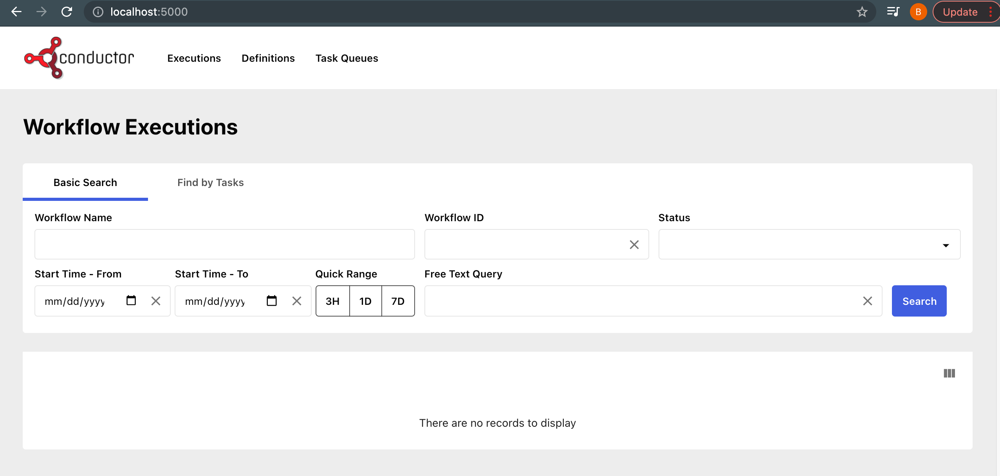

# Running Conductor Locally

## Download and Run
```shell
export CONDUCTOR_VER=3.3.4
export REPO_URL=https://repo1.maven.org/maven2/com/netflix/conductor/conductor-server
curl $REPO_URL/$CONDUCTOR_VER/conductor-server-$CONDUCTOR_VER-boot.jar \
--output conductor-server-$CONDUCTOR_VER-boot.jar; java -jar conductor-server-$CONDUCTOR_VER-boot.jar 
```
Navigate to the swagger URL: [http://localhost:8080/swagger-ui/index.html?configUrl=/api-docs/swagger-config](http://localhost:8080/swagger-ui/index.html?configUrl=/api-docs/swagger-config)

## Build and Run

In this article we will explore how you can set up Netflix Conductor on your local machine for trying out some of its
features.

### Prerequisites
1. JDK 11 or greater
2. (Optional) Docker if you want to run tests.  You can install docker from https://docs.docker.com/desktop/
3. Node for building and running UI.  Install from [https://nodejs.org/en/download/package-manager/](https://nodejs.org/en/download/package-manager/)
4. Yarn for building and running UI.  [https://classic.yarnpkg.com/en/docs/install](https://classic.yarnpkg.com/en/docs/install).

### Steps to build Conductor server

#### 1. Checkout the code
Clone conductor code from the repo: https://github.com/Netflix/conductor

```shell
$ git clone https://github.com/Netflix/conductor.git
```
#### 2. Build and run Server


> **NOTE for Mac users**: If you are using a new Mac with an Apple Silicon Chip, you must make a small change to ```conductor/grpc/build.gradle``` - adding "osx-x86_64" to two lines:
```
protobuf {
    protoc {
        artifact = "com.google.protobuf:protoc:${revProtoBuf}:osx-x86_64"
    }
    plugins {
        grpc {
            artifact = "io.grpc:protoc-gen-grpc-java:${revGrpc}:osx-x86_64"
        }
    }
...
} 
```

```shell
$ cd conductor
conductor $ cd server
server $ ../gradlew bootRun
```

Navigate to the swagger API docs:
[http://localhost:8080/swagger-ui/index.html?configUrl=/api-docs/swagger-config](http://localhost:8080/swagger-ui/index.html?configUrl=/api-docs/swagger-config)


## Build and Run UI

Conductor UI allows you to visualize the workflows.  UI is built and run using node.

```shell
$ cd conductor/ui
ui $ yarn install
```

```shell
ui $ yarn run start
```

Launch UI [http://localhost:5000](http://localhost:5000)



## Summary
1. All the data is stored in memory, so any workflows created or excuted will be wiped out once the server is terminated.
2. Indexing is disabled, so search functionality in UI will not work and will result an empty set.
3. See how to install Conductor using [Docker](running-locally-docker.md) with persistence and indexing.