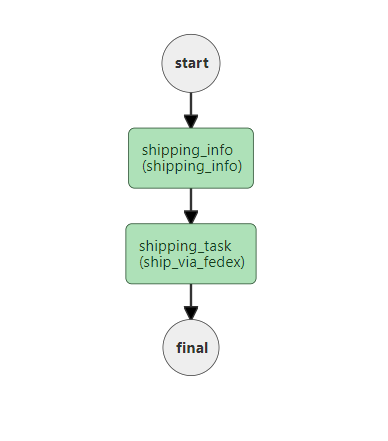

# Dynamic
```json
"type" : "DYNAMIC"
```

The Dynamic task (`DYNAMIC`) is used to execute a registered task dynamically at run-time. It is similar to a function pointer in programming, and can be used for when the decision to execute which task will only be made after the workflow has begun.

The Dynamic task accepts as input the name of a task, which can be a system task or a Worker task (`SIMPLE`) registered on Conductor.


## Task parameters

To configure the Dynamic task, provide a `dynamicTaskNameParam` at the top level of the task configuration, as well as a matching parameter in `inputParameters` based on the `dynamicTaskNameParam`.

For example, if `dynamicTaskNameParam` is "taskToExecute", the task name to execute is specified in `taskToExecute` in `inputParameters`.

| Parameter          | Type                | Description                                       | Required / Optional  |
| ------------------ | ------------------- | ------------------------------------------------- | -------------------- |
| dynamicTaskNameParam | String | The parameter name for `inputParameters` whose value is used to schedule the task. For example, "taskToExecute". | Required. |
| inputParameters.taskToExecute | String | The name of the task that will be executed. | Required.
| 

You can also pass any other input for the Dynamic task into `inputParameters`.

## JSON configuration

Here is the task configuration for a Dynamic task.

```json
{
  "name": "dynamic",
  "taskReferenceName": "dynamic_ref",
  "inputParameters": {
    "taskToExecute": "${workflow.input.dynamicTaskName}" // name of the task to execute
  },
  "type": "DYNAMIC",
  "dynamicTaskNameParam": "taskToExecute" // input parameter key that will contain the task name to execute
}
```

# Output

During execution, the Dynamic task is replaced with whatever task that is called at runtime. The output of the Dynamic task will be whatever the output of the called task is.


## Execution

At runtime, if an incorrect task name is provided and the task does not exist, the workflow will fail with the error "Invalid task specified. Cannot find task by name in the task definitions."

Likewise, if null reference is provided for the task name, the workflow will fail with the
error "Cannot map a dynamic task based on the parameter and input. Parameter= taskToExecute, input= {taskToExecute=null}".


## Examples

In this example workflow, shipments are made with different couriers depending on the shipping address. 

The decision can only be made during runtime when the address is received, and the subsequent shipping task could be either `ship_via_fedex` or `ship_via_ups`. A Dynamic task can be used in this workflow so that the shipping task can be decided in real time.

A preceding `shipping_info` generates an output to decide what task to run in the Dynamic task.

Here is the workflow definition:

```json
{
  "name": "Shipping_Flow",
  "description": "Ships smartly based on the shipping address",
  "version": 1,
  "tasks": [
    {
      "name": "shipping_info",
      "taskReferenceName": "shipping_info_ref",
      "inputParameters": {},
      "type": "SIMPLE"
    },
    {
      "name": "shipping_task",
      "taskReferenceName": "shipping_task_ref",
      "inputParameters": {
        "taskToExecute": "${shipping_info.output.shipping_service}"
      },
      "type": "DYNAMIC",
      "dynamicTaskNameParam": "taskToExecute"
    }
  ],
  "inputParameters": [],
	"outputParameters": {},
  "restartable": true,
  "ownerEmail":"abc@example.com",
  "workflowStatusListenerEnabled": true,
  "schemaVersion": 2
}
```

Here is the corresponding workflow diagram:


The shipping service is decided based on the postal code. If the postal code starts with 9, `ship_via_fedex` is executed:



If the postal code starts with any other number, `ship_via_ups` is executed:

