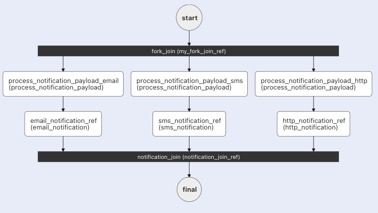

# Fork
```json
"type" : "FORK_JOIN"
```

Also known as a static fork, a Fork task (`FORK_JOIN`) is used to run task sequences in parallel, including [Sub Workflow](sub-workflow-task.md) tasks.

The Fork task must be followed by a [Join](join-task.md) that waits on the forked tasks to finish before moving to the next task. This Join task collects the outputs from each forked tasks.

## Task parameters
  
Use these parameters in top level of the Fork task configuration.

| Parameter          | Type                | Description                                       | Required / Optional  |
| ------------------ | ------------------- | ------------------------------------------------- | -------------------- |
| forkTasks         | List[List[Task]] | A list of tasks lists to be invoked in parallel (`[[...], [...]]`). <br/><br/> Each item in the outer list represents a fork that will be invoked in parallel, while each inner list contains the task configurations for a particular fork. The tasks defined within each sublist can be sequential or even more nested forks. | Required. |

The [Join](join-task.md) task must run after the forked tasks. Configure the Join task as well to complete the fork-join operations.

## JSON configuration

This is the task configuration for a Fork task.

```json
{
  "name": "fork",
  "taskReferenceName": "fork_ref",
  "inputParameters": {},
  "type": "FORK_JOIN",
  "forkTasks": [
    [ // fork branch
      {
        // task configuration
      },
      {
        // task configuration
      }
    ],
    [ // another fork branch 
      {
        // task configuration
      },
      {
        // task configuration
      }
    ]
  ]
}
```

## Output

The Fork task has no output. It is used in conjunction with the [JOIN](join-task.md) task, which aggregates the outputs from the parallelized forks.

## Examples

In this example workflow, three notifications are sent: email, SMS, and HTTP. Since none of these tasks depend on each other, they can be run in parallel with a Fork task. The workflow diagram looks like this:



Here's the JSON configuration for the Fork task, along with its corresponding Join task:

```json
[
  {
    "name": "fork_join",
    "taskReferenceName": "my_fork_join_ref",
    "type": "FORK_JOIN",
    "forkTasks": [
      [
        {
          "name": "process_notification_payload",
          "taskReferenceName": "process_notification_payload_email",
          "type": "SIMPLE"
        },
        {
          "name": "email_notification",
          "taskReferenceName": "email_notification_ref",
          "type": "SIMPLE"
        }
      ],
      [
        {
          "name": "process_notification_payload",
          "taskReferenceName": "process_notification_payload_sms",
          "type": "SIMPLE"
        },
        {
          "name": "sms_notification",
          "taskReferenceName": "sms_notification_ref",
          "type": "SIMPLE"
        }
      ],
      [
        {
          "name": "process_notification_payload",
          "taskReferenceName": "process_notification_payload_http",
          "type": "SIMPLE"
        },
        {
          "name": "http_notification",
          "taskReferenceName": "http_notification_ref",
          "type": "SIMPLE"
        }
      ]
    ]
  },
  {
    "name": "notification_join",
    "taskReferenceName": "notification_join_ref",
    "type": "JOIN",
    "joinOn": [
      "email_notification_ref",
      "sms_notification_ref"
    ]
  }
]
```

Refer to the [Join](join-task.md) task for more details on the Join aspect of the Fork.