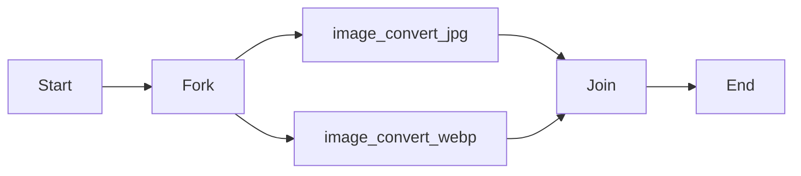
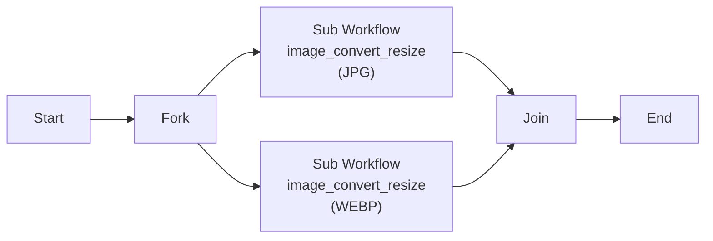

# Sub Workflow
```json
"type" : "SUB_WORKFLOW"
```

The Sub Workflow task executes another workflow within the current workflow. This allows you to nest and reuse common workflows across multiple workflows. 


Unlike the [Start Workflow](start-workflow-task.md) task, the Sub Workflow task provides synchronous execution and the executed sub-workflow will contain a reference to its parent workflow.

The Sub Workflow task can also be used to overcome the limitations of other tasks:

- Use it in a [Do While](do-while-task.md) task to achieve nested Do While loops.
- Use it in a [Dynamic Fork](dynamic-fork-task.md) task to execute more than one task in each fork.


## Task parameters

Use these parameters inside `subWorkflowParam` in the Sub Workflow task configuration.

| Parameter | Type | Description | Required / Optional |
| --------- | ---- | ----------- | ------------------- |
| subWorkflowParam.name | String | Name of the workflow to be executed. Must match a pre-registered workflow definition when no inline `workflowDefinition` is supplied. | Required. |
| subWorkflowParam.version | Integer | The version of the workflow to be executed. If unspecified, the latest version will be used. Ignored when an inline `workflowDefinition` is supplied. | Optional. |
| subWorkflowParam.workflowDefinition | Object _or_ String | Inline workflow definition to execute without prior registration. Accepts two forms: **(1) object** — a full `WorkflowDef` JSON object embedded directly in the task definition; **(2) String expression** — a `${ref.output.field}` expression resolved at runtime to a `WorkflowDef`-shaped Map produced by an earlier task (e.g. a planner agent). See [Inline workflow definition](#inline-workflow-definition) below. | Optional. |
| subWorkflowParam.taskToDomain | Map[String, String] | Allows scheduling the sub-workflow's tasks to specific domain mappings. Refer to [Task Domains](../../../api/taskdomains.md) for how to configure `taskToDomain`. | Optional. |
| inputParameters | Map[String, Any] | Contains the sub-workflow's input parameters, if any. | Optional. |

## Task configuration

Here is the task configuration for a Sub Workflow task.

```json
{
  "name": "sub_workflow",
  "taskReferenceName": "sub_workflow_ref",
  "inputParameters": {
    "someParameter": "someValue"
  },
  "type": "SUB_WORKFLOW",
  "subWorkflowParam": {
    "name": "my_workflow",
    "version": 1
  }
}
```

## Inline workflow definition

`subWorkflowParam.workflowDefinition` allows you to execute a sub-workflow without registering it in the metadata store first. This supports two usage patterns.

### Static inline definition

Embed a complete `WorkflowDef` object directly inside the task definition. Conductor passes it straight through to the sub-workflow executor.

```json
{
  "name": "exec_plan",
  "taskReferenceName": "exec",
  "type": "SUB_WORKFLOW",
  "inputParameters": {
    "threshold": "${workflow.input.threshold}"
  },
  "subWorkflowParam": {
    "name": "my_inline_workflow",
    "version": 1,
    "workflowDefinition": {
      "name": "my_inline_workflow",
      "version": 1,
      "schemaVersion": 2,
      "tasks": [
        {
          "name": "some_task",
          "taskReferenceName": "t1",
          "type": "SIMPLE",
          "inputParameters": {
            "p1": "${workflow.input.threshold}"
          }
        }
      ],
      "outputParameters": {
        "result": "${t1.output.result}"
      }
    }
  }
}
```

### Dynamic inline definition (String expression)

Set `workflowDefinition` to a `${ref.output.field}` expression. Conductor resolves the expression at task-scheduling time and uses the resulting `WorkflowDef`-shaped Map as the sub-workflow definition. No HTTP registration is required — the workflow is started directly from the Map.

This pattern is useful when an earlier task (such as a planner agent or an LLM step) generates the execution plan at runtime:

```json
{
  "name": "exec_plan",
  "taskReferenceName": "exec",
  "type": "SUB_WORKFLOW",
  "inputParameters": {
    "threshold": "${workflow.input.threshold}",
    "iterations": "${workflow.input.iterations}"
  },
  "subWorkflowParam": {
    "name": "dynamic_plan_wf",
    "version": 1,
    "workflowDefinition": "${planner.output.workflow_def}"
  }
}
```

The task referenced by the expression (`planner` in this example) must output a Map that matches the `WorkflowDef` schema — the same JSON structure you would `POST` to `/api/metadata/workflow`. Conductor converts the Map to a `WorkflowDef` via its internal ObjectMapper and starts it as a sub-workflow.

A typical parent workflow using this pattern:

```json
{
  "name": "parent_wf",
  "version": 1,
  "tasks": [
    {
      "name": "planner_task",
      "taskReferenceName": "planner",
      "type": "SIMPLE",
      "inputParameters": {
        "goal": "${workflow.input.goal}"
      }
    },
    {
      "name": "exec_plan",
      "taskReferenceName": "exec",
      "type": "SUB_WORKFLOW",
      "inputParameters": {
        "threshold": "${workflow.input.threshold}",
        "iterations": "${workflow.input.iterations}"
      },
      "subWorkflowParam": {
        "name": "dynamic_plan_wf",
        "version": 1,
        "workflowDefinition": "${planner.output.workflow_def}"
      }
    }
  ]
}
```

The `planner_task` worker returns a `workflow_def` key in its output containing the full `WorkflowDef` Map (tasks, inputParameters, outputParameters, etc.). The `exec` SUB_WORKFLOW task resolves the expression and executes that definition inline — no prior call to the metadata API needed.

## Output

The Sub Workflow task will return the following parameters.

| Name             | Type         | Description                                                   |
| ---------------- | ------------ | ------------------------------------------------------------- |
| subWorkflowId | String | The workflow execution ID of the sub-workflow. |

In addition, the task output will also contain the sub-workflow's outputs.


## Execution

During execution, the Sub Workflow task will be marked as COMPLETED only upon the completion of the spawned workflow. If the sub-workflow fails or terminates, the Sub Workflow task will be marked as FAILED and retried if configured. 

If the Sub Workflow task is defined as optional in the parent workflow definition, the Sub Workflow task will not be retried if sub-workflow fails or terminates. In addition, even if the sub-workflow is retried/rerun/restarted after reaching to a terminal status, the parent workflow task status will remain as it is.


## Examples

In this example workflow, a Fork task containing two tasks is used to simultaneously create two images from one image:


```mermaid
graph LR
    A[Start] --> B[Fork]
    B --> C[image_convert_jpg]
    B --> D[image_convert_webp]
    C --> E[Join]
    D --> E
    E --> F[End]
```

The left fork will create a JPG file, and the right fork a WEBP file. Maintaining this workflow might be cumbersome, as changes made to one of the fork tasks do not automatically propagate the other. Rather than using two tasks, we can define a single, reusable `image_convert_resize` workflow that can be called as a sub-workflow in both forks:


```json

{
	"name": "image_convert_resize_subworkflow1",
	"description": "Image Processing Workflow",
	"version": 1,
	"tasks": [{
			"name": "image_convert_resize_multipleformat_fork",
			"taskReferenceName": "image_convert_resize_multipleformat_ref",
			"inputParameters": {},
			"type": "FORK_JOIN",
			"decisionCases": {},
			"defaultCase": [],
			"forkTasks": [
				[{
					"name": "image_convert_resize_sub",
					"taskReferenceName": "subworkflow_jpg_ref",
					"inputParameters": {
						"fileLocation": "${workflow.input.fileLocation}",
						"recipeParameters": {
							"outputSize": {
								"width": "${workflow.input.recipeParameters.outputSize.width}",
								"height": "${workflow.input.recipeParameters.outputSize.height}"
							},
							"outputFormat": "jpg"
						}
					},
					"type": "SUB_WORKFLOW",
					"subWorkflowParam": {
						"name": "image_convert_resize",
						"version": 1
					}
				}],
				[{
						"name": "image_convert_resize_sub",
						"taskReferenceName": "subworkflow_webp_ref",
						"inputParameters": {
							"fileLocation": "${workflow.input.fileLocation}",
							"recipeParameters": {
								"outputSize": {
									"width": "${workflow.input.recipeParameters.outputSize.width}",
									"height": "${workflow.input.recipeParameters.outputSize.height}"
								},
								"outputFormat": "webp"
							}
						},
						"type": "SUB_WORKFLOW",
						"subWorkflowParam": {
							"name": "image_convert_resize",
							"version": 1
						}
					}

				]
			]
		},
		{
			"name": "image_convert_resize_multipleformat_join",
			"taskReferenceName": "image_convert_resize_multipleformat_join_ref",
			"inputParameters": {},
			"type": "JOIN",
			"decisionCases": {},
			"defaultCase": [],
			"forkTasks": [],
			"startDelay": 0,
			"joinOn": [
				"subworkflow_jpg_ref",
				"upload_toS3_webp_ref"
			],
			"optional": false,
			"defaultExclusiveJoinTask": [],
			"asyncComplete": false,
			"loopOver": []
		}
	],
	"inputParameters": [],
	"outputParameters": {
		"fileLocationJpg": "${subworkflow_jpg_ref.output.fileLocation}",
		"fileLocationWebp": "${subworkflow_webp_ref.output.fileLocation}"
	},
	"schemaVersion": 2,
	"restartable": true,
	"workflowStatusListenerEnabled": true,
	"ownerEmail": "conductor@example.com",
	"timeoutPolicy": "ALERT_ONLY",
	"timeoutSeconds": 0,
	"variables": {},
	"inputTemplate": {}
}
```

Here is the workflow flow:


```mermaid
graph LR
    A[Start] --> B[Fork]
    B --> C["Sub Workflow<br/>image_convert_resize<br/>(JPG)"]
    B --> D["Sub Workflow<br/>image_convert_resize<br/>(WEBP)"]
    C --> E[Join]
    D --> E
    E --> F[End]
```

Now that the tasks are abstracted into a sub-workflow, any changes to the sub-workflow will automatically apply to both forks.