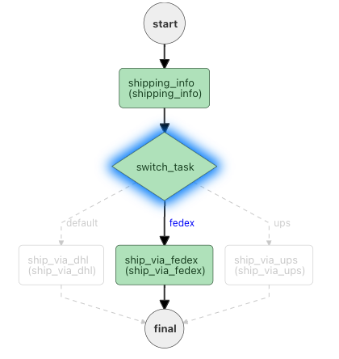

# Switch
```json
"type" : "SWITCH"
```

The Switch task (`SWITCH`) is used for conditional branching logic. It represents _if...then...else_ or _switch...case_ statements in programming, which is useful for executing one of many task sequences based on pre-defined conditions.

At runtime, the Switch task evaluates an expression and matches the expression's output with the name of the switch cases defined in the task configuration. The workflow then executes the tasks in the matching branch. If there is matching branch found, the default branch will be executed.

The Switch task supports two types of evaluators:

* `value-param`—A reference to the task input parameter key.
* `javascript`—A complex JavaScript expression.

## Task parameters

Use these parameters in top level of the Switch task configuration.

| Parameter          | Type                | Description                                       | Required / Optional  |
| ------------------ | ------------------- | ------------------------------------------------- | -------------------- |
| evaluatorType | String (enum)            | The type of the evaluator used. Supported types: <ul><li>`value-param`—Evaluates the input parameter referenced in `expression`.</li><li>`javascript`—Evaluates the JavaScript script in `expression`and computes the value.</li></ul>                                                                                 | Required. |
| expression    | String                   | The expression evaluated by the Switch task. The expression format depends on the evaluator type: <ul><li>For `value-param`, the expression should be a parameter key provided in `inputParameters`.</li><li>`javascript`, the expression should be a JavaScript expression.</li></ul>                                                                                  | Required. |
| decisionCases | Map[String, List[task]] | A map of the possible switch cases and their tasks. The keys are the possible values that can result from the evaluation of `expression`, while the values are the lists of task configurations that will be executed.                   | Required. |
| defaultCase   | List[Task]              | The default switch case, containing the list of tasks to be executed if no matching switch case is found in `decisionCases`.                                                                     | Required. |
| inputParameters   | Map[String, Any]            | The input parameters for the task. <br/> <br/> **Note:** If `evaluatorType` is `value-param`, `inputParameters` must be populated with the key specified in `expression`.                                                                      | Optional. |


## JSON configuration

Here is the task configuration for a Switch task.

### Using `value-param`
```json
{
  "name": "switch",
  "taskReferenceName": "switch_ref",
  "inputParameters": {
    "switchCaseValue": "${workflow.input}"
  },
  "type": "SWITCH",
  "decisionCases": {
    "caseName1": [
      {
        // task configuration
      }
    ],
    "caseName2": [
      {
        // task configuration
      },
      {
        // task configuration
      }
    ]
  },
  "defaultCase": [
    {// task configuration}
  ],
  "evaluatorType": "value-param",
  "expression": "switchCaseValue"
}
```

### Using `javascript`

```json
{
  "name": "switch",
  "taskReferenceName": "switch_ref",
  "inputParameters": {
    "switchCaseValue": "${workflow.input.num}"
  },
  "type": "SWITCH",
  "decisionCases": {
    "apples": [
      {
        // task configuration
      }
    ],
    "tomatoes":  [
      {
        // task configuration
      }
    ],
    "oranges":  [
      {
        // task configuration
      }
    ]
  },
  "defaultCase": [],
  "evaluatorType": "graaljs",
  "expression": "(function () {\n    switch ($.switchCaseValue) {\n      case \"1\":\n        return \"apple\";\n      case \"2\":\n        return \"tomatoes\";\n      case \"3\":\n        return \"oranges\"\n    }\n  }())"
}
```


## Output

The Switch task will return the following parameters.

| Name             | Type         | Description                                                   |
| ---------------- | ------------ | ------------------------------------------------------------- |
| evaluationResult | List[String] | A list of values representing the list of cases that matched. |
| selectedCase | String | The evaluation result of the Switch task. |


## Examples

Here are some examples for using the Switch task.

### Using `value-param` 

In this example workflow, a package with be shipped by a specific shipping provider, based on the given workflow input. Here is the Switch task configuration, using the `value-param` evaluatorType:

```json
{
  "name": "switch",
  "taskReferenceName": "switch_ref",
  "inputParameters": {
    "switchCaseValue": "${workflow.input.service}"
  },
  "type": "SWITCH",
  "evaluatorType": "value-param",
  "expression": "switchCaseValue",
  "defaultCase": [
    {
      ...
    }
  ],
  "decisionCases": {
    "fedex": [
      {
        ...
      }
    ],
    "ups": [
      {
        ...
      }
    ]
  }
}
```

In the Switch task above, the value of the task input `switchCaseValue` is used to determine the selected case. The evaluator type is `value-param` and the expression is a direct reference to the name of the input parameter. 

If the value of `switchCaseValue` is `fedex`, then the `fedex` branch containing the `ship_via_fedex`task will be executed as shown below.



Likewise, if the input is `ups`, then the `ship_via_ups` task will be executed. If none of the cases match, then the default path will be executed.

### Using `javascript` 

In this example, the switch cases are selected using the `javascript` evaluatorType:

```json
{
  "name": "switch",
  "taskReferenceName": "switch_ref",
  "inputParameters": {
    "shipping": "${workflow.input.service}"
  },
  "type": "SWITCH",
  "evaluatorType": "javascript",
  "expression": "$.shipping == 'fedex' ? 'fedex' : 'ups'",
  "defaultCase": [
    {
      ...
    }
  ],
  "decisionCases": {
    "fedex": [
      {
        ...
      }
    ],
    "ups": [
      {
        ...
      }
    ]
  }
}
```

Inside the task's JavaScript-based expression, the task's input parameter is referenced using "$.shipping".