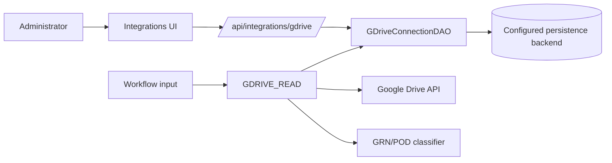

# Google Drive Connection Management and Document Ingestion

This page documents the advanced Google Drive connection architecture used to separate administrative credentials from workflow runtime inputs. It also describes the dynamic document-ingestion pattern for workflows that read multiple Drive folders or files before passing the resulting file manifest to downstream classification workers.

The source-backed implementation in this repository currently includes:

- REST endpoints under `/api/integrations/gdrive`.
- A `GDriveConnectionDAO` interface in `core`.
- persistence implementations for in-memory, PostgreSQL, MySQL, SQLite, and Redis.
- the `GDRIVE_READ` system task.
- Google Drive integration views in both `ui` and `ui-next`.
- the GRN/POD worker package, whose classifier can consume Drive metadata from `GDRIVE_READ` and materialize files locally before Gemini processing.

Where this page describes target enterprise behavior that is not yet fully implemented, the text calls that out explicitly.

## Architecture Goals

The integration follows the same operational principle as connection objects in systems such as Apache Airflow: credentials are registered once by an administrator and referenced later by ID. Workflow definitions and workflow execution payloads should carry only non-secret routing parameters.

The design goals are:

- isolate OAuth client and token material from workflow definitions, run payloads, execution history, and logs;
- expose a stable `connectionId` reference for workflows and workers;
- allow runtime file selection to be polymorphic, using optional arrays of folder IDs and file IDs;
- keep persistence pluggable through a DAO interface in `core`;
- allow workers to resolve credentials at execution time without accepting raw secrets from workflow callers;
- make connection lifecycle operations visible and auditable in an administrative UI.

## Component Model



| Layer | Responsibility | Source reference |
| --- | --- | --- |
| UI | Create, list, select, and delete Google Drive connections. Mask client secrets in the form. | `ui/src/pages/integrations/GDriveIntegrations.jsx`, `ui-next/src/pages/integrations/Integrations.tsx` |
| REST | Validate request payloads, normalize `connectionId`, resolve stored OAuth token JSON, and expose load/list/delete operations. | `rest/src/main/java/com/netflix/conductor/rest/controllers/IntegrationsResource.java` |
| DAO | Define the connection storage contract independent of the backing database. | `core/src/main/java/org/conductoross/conductor/dao/GDriveConnectionDAO.java` |
| Persistence | Store `connectionId`, `accountName`, OAuth token JSON, and timestamps. | `*-persistence/src/main/java/**/GDriveConnectionDAO.java` |
| System task | Resolve `connectionId`, normalize folder/file inputs, call Google Drive, and emit a file manifest. | `core/src/main/java/com/netflix/conductor/core/execution/tasks/GDriveRead.java` |
| Integration service | Normalize IDs, refresh OAuth access tokens, call Drive APIs, de-duplicate results, and apply MIME filters. | `common/src/main/java/org/conductoross/conductor/common/integrations/gdrive/GDriveIntegrationService.java` |
| Classifier | Accept file manifests, materialize missing local files from Drive IDs, classify documents, and expose structured classification output. | `GRN_POD_Reconciliation/worker.py` |

## Credential Lifecycle

### Registration

The administrative UI should collect only infrastructure credentials and metadata required to establish the connection:

| Field | Type | Notes |
| --- | --- | --- |
| `client_id` | String | Google OAuth client ID. |
| `client_secret` | Password | Masked in the UI. Do not write it to logs or workflow input. |
| `accountName` | String | Human-readable administrative label. |
| `connectionId` | String | Stable runtime reference, such as `gdrive-<uuidv4>`. |

Current source behavior: the UI generates `gdrive-<uuid>` client-side when a new Google Drive connection is created, and the REST endpoint requires the submitted `connectionId`. The backend validates the supplied value with the pattern `[A-Za-z0-9._-]+`.

Target enterprise behavior: move UUID generation to the backend so the create endpoint can accept credential material, generate a non-sequential `gdrive-<uuidv4>` identifier, encrypt or otherwise protect the stored secret material, validate the connection against Google, fetch account identity metadata, and return a secret-free connection response.

### Storage Boundary

Stored connection rows are administrative state, not workflow input. The connection object contains:

- `connectionId`;
- `accountName`;
- normalized OAuth token JSON;
- creation timestamp;
- update timestamp.

The REST response intentionally omits OAuth token JSON. That keeps connection listing and connection lookup responses safe for normal administrative views.

For production deployments, store connections in a durable backend such as PostgreSQL or MySQL. SQLite and in-memory storage are appropriate only for local development or tests.

### Validation And Account Identity

At registration time, the backend should validate that the OAuth material can produce an access token. If account identity metadata is required in the UI, fetch it during validation and store only non-secret identity fields, such as display name or email address, alongside the connection.

Current source behavior: `accountName` is supplied by the caller or defaults to `connectionId`. The current DTO does not include a verified Google account identity field.

### Listing

The management console should display a table of active connections:

| Column | Source |
| --- | --- |
| Connection ID | `connectionId` |
| Account identity | Current source uses `accountName`; target implementation can use validated Google account metadata. |
| Created | `createdAt` |
| Updated | `updatedAt` |

The current `ui-next` connection response type only renders `connectionId` and `accountName`. The backend response already exposes `createdAt` and `updatedAt`, so the UI can be extended to display registration and last-update dates without changing the REST contract.

### Revocation And Deletion

Deleting a connection calls:

```text
DELETE /api/integrations/gdrive/connections/{connectionId}
```

The operation removes the stored secret material from the configured Conductor persistence backend. A hardened production flow can add upstream OAuth token revocation before deleting the local connection row.

## Runtime Input Abstraction

Workflows should not accept OAuth tokens, client secrets, or folder-specific credential objects. Runtime inputs should carry only the connection reference and optional file-selection parameters:

| Input | Type | Required | Meaning |
| --- | --- | --- | --- |
| `gdriveConnectionId` | String | No | Stored connection reference. If omitted, the current `GDRIVE_READ` implementation can use the most recently updated stored connection. |
| `driveFolderIds` | Array[String] | No | Folders to enumerate. Values can be raw folder IDs or supported Drive URLs. |
| `driveFileIds` | Array[String] | No | Direct files to read. Values can be raw file IDs or supported Drive URLs. |

The system task maps those workflow-level fields to task-level inputs:

| Workflow field | `GDRIVE_READ` field |
| --- | --- |
| `gdriveConnectionId` | `connectionId` |
| `driveFolderIds` | `folderIds` |
| `driveFileIds` | `fileIds` |

Legacy compatibility still exists for `folderId`, `driveFolderId`, `driveFolderIds`, `driveFileIds`, and `oauthTokenJson`. New workflow definitions should prefer `connectionId`, `folderIds`, and `fileIds`.

## Ingestion Path Rules

`GDRIVE_READ` normalizes and executes folder and file selection as independent optional inputs.

| Condition | Behavior |
| --- | --- |
| `fileIds` populated | Read each direct file metadata record first. |
| `folderIds` populated | Query each folder for non-trashed child files. |
| both populated | Process both sets and de-duplicate files by Drive file ID. |
| both omitted or empty | Read non-trashed files visible to the account, capped by `maxFiles`. |

The integration currently reads file metadata, not file bytes. Downstream workers that need bytes must materialize the files themselves. The GRN/POD classifier already supports this pattern: if an incoming document has a Drive `id` or `driveFileId` but no existing `localPath`, it downloads or exports the file before invoking Gemini.

## Workflow Definition Blueprint

The following definition captures the intended two-stage orchestration model from the architecture prompt: resolve a Google Drive connection, emit an ingestion manifest, and pass that manifest to a classifier.

<!-- TODO: verify fallback expression support against the target Conductor/Orkes runtime before registering this exact definition. The OSS documentation in this repository documents `${workflow.input...}` and `${workflow.variables...}` references, but does not document the `?:` fallback operator. -->

```json
{
  "name": "gdrive_ingest_and_classify_pipeline",
  "description": "Enterprise multi-document ingestion and deterministic categorization pipeline with automated fallback credential routing.",
  "version": 2,
  "schemaVersion": 2,
  "restartable": true,
  "workflowStatusListenerEnabled": false,
  "ownerEmail": "devops-integrations@enterprise.io",
  "timeoutPolicy": "ALERT_ONLY",
  "timeoutSeconds": 0,
  "variables": {
    "fallbackConnectionId": "gdrive-e7f865ca-aec4-4a6c-907a-b120f51766cd"
  },
  "inputParameters": [
    "gdriveConnectionId",
    "driveFolderIds",
    "driveFileIds"
  ],
  "tasks": [
    {
      "name": "read_g_drive",
      "taskReferenceName": "gdrive_read_worker_ref",
      "type": "GDRIVE_READ",
      "inputParameters": {
        "connectionId": "${workflow.input.gdriveConnectionId ?: workflow.variables.fallbackConnectionId}",
        "folderIds": "${workflow.input.driveFolderIds}",
        "fileIds": "${workflow.input.driveFileIds}",
        "maxFiles": 100
      },
      "optional": false,
      "asyncComplete": false,
      "permissive": false
    },
    {
      "name": "grn_pod_classify_document",
      "taskReferenceName": "document_classifier_ref",
      "type": "SIMPLE",
      "inputParameters": {
        "payload": "${gdrive_read_worker_ref.output.files}"
      },
      "optional": false,
      "asyncComplete": false,
      "permissive": false
    }
  ],
  "outputParameters": {
    "ingestedManifest": "${gdrive_read_worker_ref.output.files}",
    "classificationMatrix": "${document_classifier_ref.output.classifiedData}"
  },
  "inputTemplate": {},
  "enforceSchema": true,
  "metadata": {
    "layer": "Data-Ingestion-Tier",
    "compliance": "SOC2-Scoped"
  },
  "maskedFields": [
    "*.connectionId"
  ]
}
```

### Source-Compatible Variant

The GRN/POD worker in this repository currently expects the classifier input key to be `documents` and returns `classifiedDocuments`. Use this source-compatible variant when registering against the current worker without changing its task contract:

```json
{
  "name": "gdrive_ingest_and_classify_pipeline",
  "description": "Multi-document Google Drive ingestion and GRN/POD classification pipeline.",
  "version": 2,
  "schemaVersion": 2,
  "restartable": true,
  "workflowStatusListenerEnabled": false,
  "ownerEmail": "devops-integrations@enterprise.io",
  "timeoutPolicy": "ALERT_ONLY",
  "timeoutSeconds": 0,
  "inputParameters": [
    "gdriveConnectionId",
    "driveFolderIds",
    "driveFileIds"
  ],
  "inputTemplate": {
    "gdriveConnectionId": "gdrive-e7f865ca-aec4-4a6c-907a-b120f51766cd",
    "driveFolderIds": [],
    "driveFileIds": []
  },
  "tasks": [
    {
      "name": "read_g_drive",
      "taskReferenceName": "gdrive_read_worker_ref",
      "type": "GDRIVE_READ",
      "inputParameters": {
        "connectionId": "${workflow.input.gdriveConnectionId}",
        "folderIds": "${workflow.input.driveFolderIds}",
        "fileIds": "${workflow.input.driveFileIds}",
        "maxFiles": 100
      },
      "optional": false,
      "asyncComplete": false
    },
    {
      "name": "grn_pod_classify_document",
      "taskReferenceName": "document_classifier_ref",
      "type": "SIMPLE",
      "inputParameters": {
        "documents": "${gdrive_read_worker_ref.output.files}"
      },
      "optional": false,
      "asyncComplete": false
    }
  ],
  "outputParameters": {
    "ingestedManifest": "${gdrive_read_worker_ref.output.files}",
    "classificationMatrix": "${document_classifier_ref.output.classifiedDocuments}"
  },
  "metadata": {
    "layer": "Data-Ingestion-Tier",
    "compliance": "SOC2-Scoped"
  },
  "maskedFields": [
    "*.connectionId"
  ]
}
```

## Worker Verification Matrix

### `GDRIVE_READ`

| Verification area | Expected behavior |
| --- | --- |
| Connection lookup | Resolve `connectionId` through `GDriveConnectionDAO`. Unknown IDs fail with `FAILED_WITH_TERMINAL_ERROR`. |
| Secret isolation | Load OAuth token JSON from the stored connection. Do not require raw OAuth token JSON in new workflow definitions. |
| OAuth refresh | If an access token is absent or a Drive call returns `401`, refresh once when refresh credentials are available. |
| Folder input | Normalize each folder ID or folder URL and query files directly under that folder. |
| File input | Normalize each file ID or file URL and fetch metadata for the direct file. |
| Mixed input | Process direct files and folder files as distinct sources, then de-duplicate by file ID. |
| Optional input expressions | Ignore unresolved optional list expressions such as `${workflow.input.driveFolderIds}` when the runtime input is omitted. |
| Limits | Default `maxFiles` to `100`; cap values above the Drive API page-size limit of `1000`. |
| Output | Emit `connectionId`, `folderId`, `folderIds`, `fileIds`, `files`, and `count`. |

### Classifier

| Verification area | Expected behavior |
| --- | --- |
| State transfer | Accept file manifests from `${gdrive_read_worker_ref.output.files}`. |
| Current input key | Current repository worker expects `documents`. A `payload` contract requires a worker update or an adapter task. |
| File materialization | If metadata does not include an existing `localPath`, download or export the Drive file using its `id` or `driveFileId`. |
| Classification taxonomy | Emit `GRN`, `POD`, or `UNKNOWN`; normalize signed or stamped delivery evidence as POD unless explicit GRN fields are present. |
| Current output key | Current repository worker returns `classifiedDocuments`; a `classifiedData` contract requires a worker update or output remapping. |

## Security Controls

- Do not place `client_secret`, OAuth tokens, service-account JSON, or refresh tokens in workflow definitions, workflow inputs, examples, logs, or screenshots.
- Treat `/api/integrations/gdrive/**` as an administrative API surface. Apply the same authentication and authorization controls used for other management APIs.
- Mask connection references in workflow definitions when supported by the target runtime. Connection IDs are not secret material, but masking reduces accidental disclosure of infrastructure topology.
- Back up and restore the connection store as operational configuration. Rotate Google OAuth client secrets or refresh tokens if a database backup is exposed.
- Prefer backend-generated `connectionId` values in production so callers cannot choose predictable identifiers.
- Keep credential DAO interfaces in `core` and place persistence-specific behavior only in persistence modules.

## Implementation Checklist

Use this checklist when hardening the current implementation toward the full enterprise target:

| Item | Current status | Required action |
| --- | --- | --- |
| Dedicated connection management tab | Present in the integrations UI. | Add created/updated date rendering and account identity metadata when available. |
| Secret field masking | Present for `clientSecret`. | Remove or restrict raw token JSON import in hardened admin-only flows. |
| UUID-style connection IDs | UI-generated today. | Move generation to the backend for authoritative non-sequential IDs. |
| Connection storage interface | Present as `GDriveConnectionDAO`. | Add encryption-at-rest or secret-manager integration behind persistence implementations. |
| Revocation/delete | Local delete endpoint present. | Add upstream Google token revocation if required by the deployment security model. |
| Array-based folder/file inputs | Present. | Continue deprecating single `folderId` and `driveFolderId` in new docs and UI defaults. |
| Workflow fallback | Current task can use the latest stored connection when no ID is passed. | Verify target expression fallback support before using `${a ?: b}` in registered workflow JSON. |
| Classifier handoff | Current worker accepts `documents` and returns `classifiedDocuments`. | Rename or adapt if the enterprise contract requires `payload` and `classifiedData`. |
