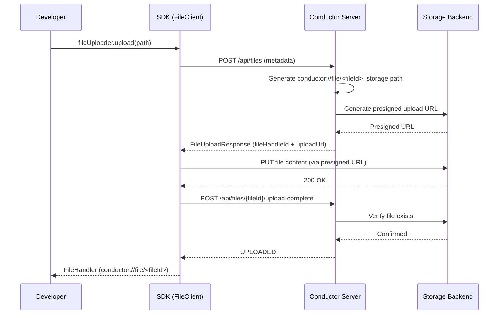
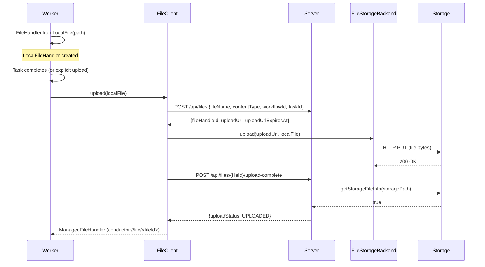
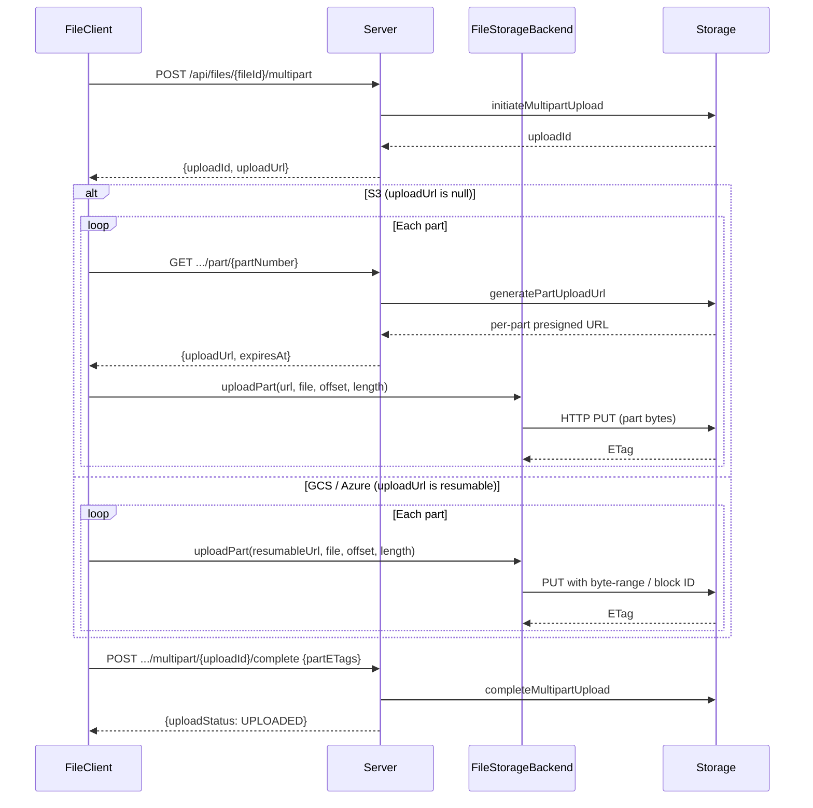
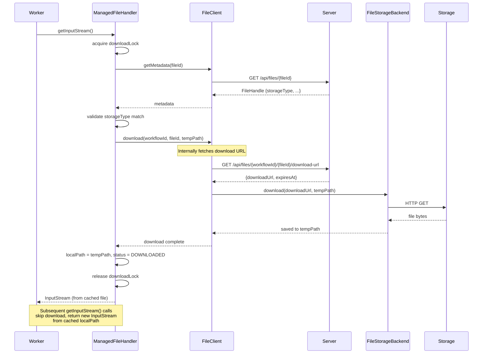
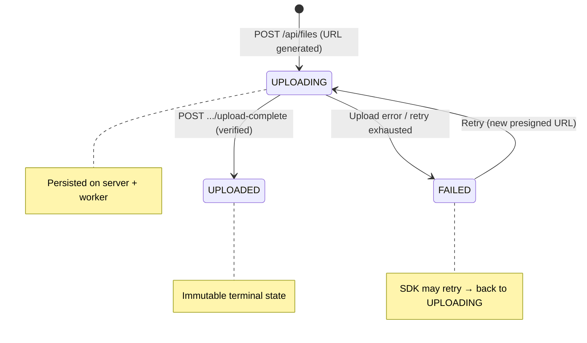
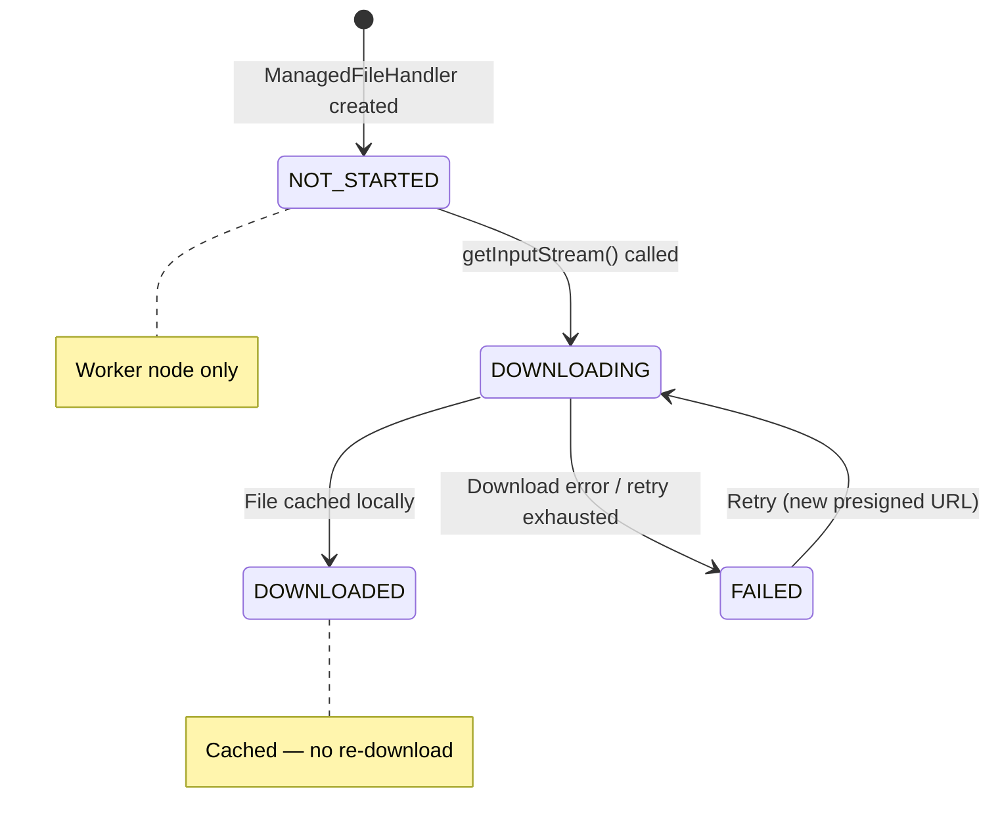
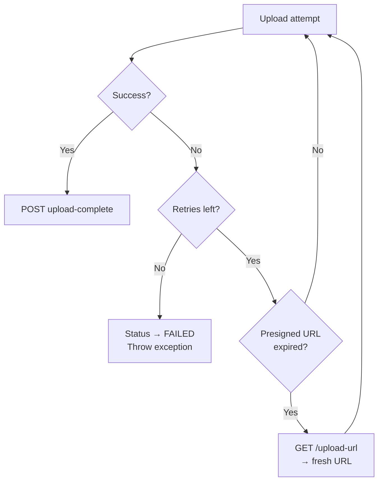
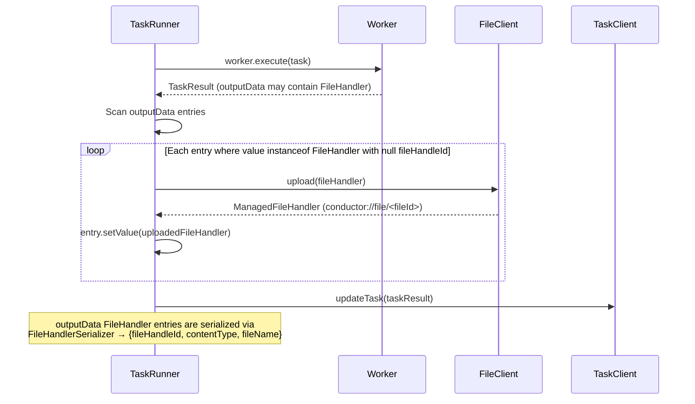
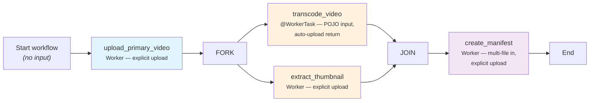
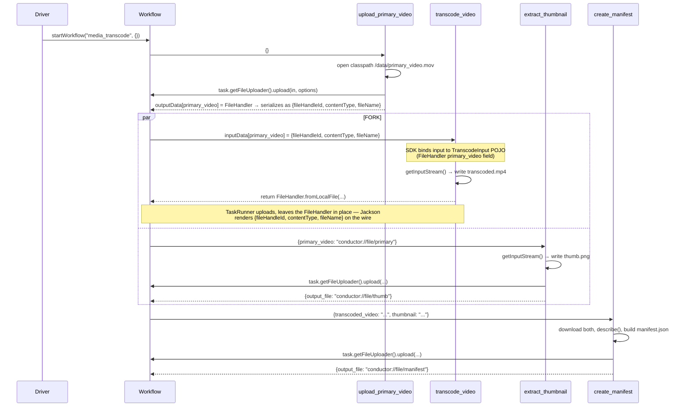

# Design Doc: File Storage for Conductor OSS

Server + Java SDK design in one document. Based on [spec.md](spec.md).

---

# Table of Contents

1. [API Contract & Data Model](#api-contract--data-model)
    - [REST API Endpoints](#rest-api-endpoints)
        - [POST /api/files — Create File](#post-apifiles--create-file)
        - [GET /api/files/{fileId}/upload-url](#get-apifilesfileidupload-url--get-upload-url)
        - [POST /api/files/{fileId}/upload-complete](#post-apifilesfileidupload-complete--confirm-upload)
        - [GET /api/files/{workflowId}/{fileId}/download-url](#get-apifilesworkflowidffileiddownload-url--get-download-url)
        - [GET /api/files/{fileId} — Get File Metadata](#get-apifilesfileid--get-file-metadata)
        - [POST /api/files/{fileId}/multipart](#post-apifilesfileidmultipart--initiate-multipart-upload)
        - [GET .../part/{partNumber} — Get Part Upload URL (S3 only)](#get-apifilesfileidmultipartuploadidpartpartnumber--get-part-upload-url-s3-only)
        - [POST .../multipart/{uploadId}/complete](#post-apifilesfileidmultipartuploadidcomplete--complete-multipart-upload)
    - [DTOs](#dtos)
        - [FileUploadRequest](#fileuploadrequest)
        - [FileUploadResponse](#fileuploadresponse)
        - [FileHandle](#filehandle)
        - [FileUploadUrlResponse](#fileuploadurlresponse)
        - [FileDownloadUrlResponse](#filedownloadurlresponse)
        - [FileUploadCompleteResponse](#fileuploaddcompleteresponse)
        - [MultipartInitResponse](#multipartinitresponse)
        - [MultipartCompleteRequest](#multipartcompleterequest)
        - [FileIdToFileHandleIdConverter](#fileidtofilehandleidconverter)
    - [Enums](#enums)
        - [StorageType](#storagetype)
        - [FileUploadStatus](#fileuploadstatus)
        - [FileDownloadStatus](#filedownloadstatus)
    - [Server Interfaces](#server-interfaces)
        - [FileStorage](#filestorage)
        - [StorageFileInfo](#storagefileinfo)
        - [FileStorageService](#filestorageservice)
        - [WorkflowFamilyResolver](#workflowfamilyresolver)
        - [WorkflowFamilyResolverImpl](#workflowfamilyresolverimpl)
        - [FileMetadataDAO](#filemetadatadao)
    - [FileModel](#filemodel)
    - [Database Schema](#database-schema)
        - [Postgres — V15](#postgres--v15__file_metadatasql)
        - [MySQL — V9](#mysql--v9__file_metadatasql)
        - [SQLite — V3](#sqlite--v3__file_metadatasql)
    - [Configuration Properties](#configuration-properties)
        - [FileStorageProperties](#filestorageproperties)
        - [S3FileStorageProperties](#s3filestorageproperties)
        - [AzureBlobFileStorageProperties](#azureblobfilestorageproperties)
        - [GcsFileStorageProperties](#gcsfilestorageproperties)
        - [LocalFileStorageProperties](#localfilestorageproperties)
        - [FileClientProperties](#fileclientproperties)
    - [SDK Interfaces](#sdk-interfaces)
        - [FileHandler](#filehandler)
        - [FileUploader](#fileuploader)
        - [FileStorageBackend](#filestoragebackend)
    - [SDK Internal Classes](#sdk-internal-classes)
        - [FileClient](#fileclient)
        - [WorkflowFileClient](#workflowfileclient)
        - [FileUploadOptions](#fileuploadoptions)
        - [FileStorageException](#filestorageexception)
        - [LocalFileHandler](#localfilehandler)
        - [ManagedFileHandler](#managedfilehandler)
2. [Design Diagrams](#design-diagrams)
    - [Storage Handshaking](#storage-handshaking--server--sdk--storage-backend)
    - [File Upload — Single Part](#file-upload--single-part)
    - [File Upload — Multipart (S3 vs GCS/Azure)](#file-upload--multipart-s3-vs-gcsazure)
    - [File Download](#file-download)
    - [Upload Status State Machine](#upload-status-state-machine)
    - [Download Status State Machine](#download-status-state-machine)
    - [Retry on Upload Failure](#retry-on-upload-failure)
    - [Automatic Upload — TaskRunner](#automatic-upload--taskrunner)
3. [What-If Scenario Answers](#what-if-scenario-answers)
    - [1. Crash during file upload](#1-crash-during-file-upload)
    - [2. Temp file missing from disk](#2-temp-file-missing-from-disk)
    - [3. File never fully uploaded](#3-file-never-fully-uploaded)
    - [4. File handler reuse on same worker](#4-file-handler-reuse-on-same-worker)
    - [5. File access across workflow boundaries](#5-file-access-across-workflow-boundaries)
    - [6. Presigned URL expires during multipart upload](#6-presigned-url-expires-during-multipart-upload)
    - [7. Storage backend mismatch](#7-storage-backend-mismatch)
    - [8. Concurrent uploads to same file ID](#8-concurrent-uploads-to-same-file-id)
    - [9. Worker restart mid-download](#9-worker-restart-mid-download)
    - [10. File size exceeds limit after partial upload](#10-file-size-exceeds-limit-after-partial-upload)
4. [Server Implementation](#server-implementation)
    - [Converters (Server)](#converters-server)
        - [FileModelConverter](#filemodelconverter)
    - [FileStorageServiceImpl](#filestorageserviceimpl)
    - [Exception Handling](#exception-handling)
    - [FileResource Controller](#fileresource-controller)
    - [Backend Implementations](#backend-implementations)
        - [S3FileStorage](#s3filestorage)
        - [AzureBlobFileStorage](#azureblobfilestorage)
        - [GcsFileStorage](#gcsfilestorage)
        - [LocalFileStorage](#localfilestorage)
    - [DAO Implementations](#dao-implementations)
        - [PostgresFileMetadataDAO](#postgresfilemetadatadao)
        - [MySQLFileMetadataDAO](#mysqlfilemetadatadao)
        - [SqliteFileMetadataDAO](#sqlitefilemetadatadao)
        - [RedisFileMetadataDAO](#redisfilemetadatadao)
        - [CassandraFileMetadataDAO](#cassandrafilemetadatadao)
    - [Background Audit](#background-audit)
5. [Java SDK Implementation](#java-sdk-implementation)
    - [Converters (SDK)](#converters-sdk)
        - [FileHandlerConverter](#filehandlerconverter)
    - [Upload Flow — FileClient.upload(String workflowId, Path, FileUploadOptions)](#upload-flow--fileclientuploadstring-workflowid-path-fileuploadoptions)
    - [Multipart Upload — FileClient](#multipart-upload--fileclient)
    - [Annotation Integration — AnnotatedWorker Changes](#annotation-integration--annotatedworker-changes)
        - [Input: getInputValue()](#input-getinputvalue)
        - [Output: setValue()](#output-setvalue)
    - [Automatic Upload — TaskRunner Changes](#automatic-upload--taskrunner-changes)
    - [OrkesClients Integration](#orkesclients-integration)
    - [Spring Auto-Configuration](#spring-auto-configuration)
6. [Testing & Verification](#testing--verification)
    - [Stubs](#stubs)
        - [StubFileStorage](#stubfilestorage)
        - [StubFileMetadataDAO](#stubfilemetadatadao)
        - [StubFileStorageBackend](#stubfilestoragebackend)
    - [Test Placement](#test-placement)
    - [E2E Verification — Kubernetes + MinIO](#e2e-verification--kubernetes--minio)
        - [Architecture](#architecture)
        - [K8s Manifests](#k8s-manifests)
        - [Server Configuration](#server-configuration)
        - [Ports](#ports)
        - [Running E2E Tests](#running-e2e-tests)
        - [E2E Test Cases](#e2e-test-cases)
        - [Verification Order](#verification-order)
7. [Developer Experience](#developer-experience)
    - [Scenario: Media Transcode](#scenario-media-transcode)
    - [Workflow Definition](#workflow-definition)
    - [Execution Input](#execution-input)
    - [Execution Output](#execution-output)
    - [Workers](#workers)
        - [upload_primary_video — Worker, explicit upload from classpath](#upload_primary_video--worker-explicit-upload-from-classpath)
        - [transcode_video — Annotated bean, POJO input, auto-upload return](#transcode_video--annotated-bean-pojo-input-auto-upload-return)
        - [extract_thumbnail — Worker, explicit upload, string output](#extract_thumbnail--worker-explicit-upload-string-output)
        - [create_manifest — Worker, multi-file in, with describe() helper](#create_manifest--worker-multi-file-in-with-describe-helper)
    - [Bootstrapping](#bootstrapping)
    - [FileHandler Interface — What the Developer Sees](#filehandler-interface--what-the-developer-sees)
    - [FileUploader Interface — What the Developer Sees](#fileuploader-interface--what-the-developer-sees)

---

# API Contract & Data Model

## REST API Endpoints

Base path: `/api/files`

> **ID nomenclature:** JSON payloads use `fileHandleId` — the full reference string `conductor://file/<fileId>`. URL path parameters use `{fileId}` — the bare identifier (no prefix). Conversion between the two is handled by `FileIdToFileHandleIdConverter`.

### POST /api/files — Create File

Creates file metadata record and returns presigned upload URL.

**Request:**

```
POST /api/files
Content-Type: application/json

{
    "fileName": "report.pdf",
    "contentType": "application/pdf",
    "workflowId": "wf-uuid",
    "taskId": "task-uuid"
}
```

| Field | Type | Required | Description |
|-------|------|----------|-------------|
| `fileName` | String | No | Original file name |
| `contentType` | String | No | MIME type |
| `workflowId` | String | Yes | Workflow ID — required, must not be blank |
| `taskId` | String | No | Task ID (when file is task output) |

**Response: 201 Created**

```json
{
    "fileHandleId": "conductor://file/d6a4e5f7-8b9c-4a1d-b2e3-f4a5b6c7d8e9",
    "fileName": "report.pdf",
    "contentType": "application/pdf",
    "storageType": "S3",
    "uploadStatus": "UPLOADING",
    "uploadUrl": "https://s3.amazonaws.com/bucket/conductor/wf-uuid/d6a4e5f7-...?X-Amz-...",
    "uploadUrlExpiresAt": 1760522460000,
    "createdAt": 1760522400000
}
```

**Errors:**

Errors flow through the existing `ApplicationExceptionMapper` → `ErrorResponse` (status, message, instance, retryable). No file-storage-specific error codes; the HTTP status is the contract:

| Status | Exception | Condition |
|--------|-----------|-----------|
| 400 | `IllegalArgumentException` | Missing/blank `workflowId` |

**Server logic:**
1. Generate fileId (random identifier) → `conductor://file/<fileId>`
2. Generate storage path: `conductor/<workflowId>/<fileId>`
3. Persist `FileModel` with status UPLOADING via `FileMetadataDAO`
4. Generate presigned upload URL via `FileStorage.generateUploadUrl()`
5. Return `FileUploadResponse`

---

### GET /api/files/{fileId}/upload-url — Get Upload URL

Returns a presigned upload URL. Used on retry when original URL from create has expired.

**Response: 200 OK**

```json
{
    "fileHandleId": "conductor://file/d6a4e5f7-...",
    "uploadUrl": "https://s3.../presigned-put-url",
    "expiresAt": 1760522460000
}
```

**Errors:**

| Status | Exception | Condition |
|--------|-----------|-----------|
| 404 | `NotFoundException` | File ID does not exist |

**Server logic:**
1. Look up `FileModel` by fileId
2. Generate fresh URL via `FileStorage.generateUploadUrl()`, return

---

### POST /api/files/{fileId}/upload-complete — Confirm Upload

Confirms that the file has been uploaded to the storage backend. Server verifies the file exists on storage,
reads content hash and actual size from storage provider, persists both.

**Response: 200 OK**

```json
{
    "fileHandleId": "conductor://file/d6a4e5f7-...",
    "uploadStatus": "UPLOADED",
    "contentHash": "d41d8cd98f00b204e9800998ecf8427e"
}
```

**Errors:**

| Status | Exception | Condition |
|--------|-----------|-----------|
| 404 | `NotFoundException` | File ID does not exist |
| 409 | `ConflictException` | File already in UPLOADED status |
| 500 | `NonTransientException` | File not found on storage backend |

**Server logic:**
1. Look up `FileModel` by fileId
2. If status is already `UPLOADED` → 409
3. Single call: `FileStorage.getStorageFileInfo(storagePath)` — verifies file exists, reads hash + size
4. If not exists → 500
5. Persist via `FileMetadataDAO.updateUploadComplete(fileId, UPLOADED, contentHash, contentSize)`
6. Return `FileUploadCompleteResponse` (includes `contentHash`)

---

### GET /api/files/{workflowId}/{fileId}/download-url — Get Download URL

Returns a presigned download URL.

**Response: 200 OK**

```json
{
    "fileHandleId": "conductor://file/d6a4e5f7-...",
    "downloadUrl": "https://s3.../presigned-get-url",
    "expiresAt": 1760522460000
}
```

**Errors:**

| Status | Exception | Condition |
|--------|-----------|-----------|
| 404 | `NotFoundException` | File ID does not exist |
| 400 | `IllegalArgumentException` | File status is not UPLOADED |
| 403 | `AccessForbiddenException` | Caller's `workflowId` is not in the file's workflow family |

**Server logic:**
1. Look up `FileModel` — verify status is UPLOADED
2. If file has no `workflowId` → 403
3. Resolve workflow family via `WorkflowFamilyResolver.getFamily(callerWorkflowId)`; if file's `workflowId` not in family → 403
4. Generate fresh URL via `FileStorage.generateDownloadUrl()`, return

---

### GET /api/files/{fileId} — Get File Metadata

Returns full file metadata.

**Response: 200 OK**

```json
{
    "fileHandleId": "conductor://file/d6a4e5f7-...",
    "fileName": "report.pdf",
    "contentType": "application/pdf",
    "contentHash": "d41d8cd98f00b204e9800998ecf8427e",
    "storageType": "S3",
    "uploadStatus": "UPLOADED",
    "workflowId": "wf-uuid",
    "taskId": "task-uuid",
    "createdAt": 1760522400000,
    "updatedAt": 1760522430000
}
```

`storagePath` is server-internal — never exposed.

**Errors:**

| Status | Exception | Condition |
|--------|-----------|-----------|
| 404 | `NotFoundException` | File ID does not exist |

---

### POST /api/files/{fileId}/multipart — Initiate Multipart Upload

Initiates a multipart upload on the storage backend.

**Response: 200 OK**

```json
{
    "fileHandleId": "conductor://file/d6a4e5f7-...",
    "uploadId": "abc123-multipart-upload-id",
    "uploadUrl": null
}
```

| Field | Description |
|-------|-------------|
| `uploadId` | Backend-specific multipart upload ID |
| `uploadUrl` | Resumable URL for GCS/Azure. Null for S3 (uses per-part URLs). |

Part size is chosen client-side from `conductor.file-client.multipart-part-size` (default 10 MiB) — the server does not return one.

**Server logic:**
1. Look up `FileModel` — verify status is UPLOADING
2. Call `FileStorage.initiateMultipartUpload()` → returns upload ID
3. For GCS/Azure: generate resumable URL
4. Return `MultipartInitResponse`

---

### GET /api/files/{fileId}/multipart/{uploadId}/part/{partNumber} — Get Part Upload URL (S3 only)

Returns a presigned URL for uploading a single part. Only used by S3 backend — GCS/Azure reuse the resumable URL
from initiate.

**Response: 200 OK**

```json
{
    "fileHandleId": "conductor://file/d6a4e5f7-...",
    "uploadUrl": "https://s3.../presigned-part-url",
    "expiresAt": 1760522460000
}
```

**Server logic:**
1. Call `FileStorage.generatePartUploadUrl(storagePath, uploadId, partNumber, expiration)`
2. Return `FileUploadUrlResponse`

---

### POST /api/files/{fileId}/multipart/{uploadId}/complete — Complete Multipart Upload

Finalizes a multipart upload after all parts have been uploaded.

**Request:**

```json
{
    "partETags": ["etag1", "etag2", "etag3"]
}
```

**Response: 200 OK**

```json
{
    "fileHandleId": "conductor://file/d6a4e5f7-...",
    "uploadStatus": "UPLOADED",
    "contentHash": "d41d8cd98f00b204e9800998ecf8427e"
}
```

**Server logic:**
1. Call `FileStorage.completeMultipartUpload(storagePath, uploadId, partETags)`
2. Call `FileStorage.getStorageFileInfo(storagePath)` — verify file exists, read content hash + actual size
3. If not exists → 500 (`NonTransientException`)
4. Persist `storageContentHash` + `storageContentSize` via `FileMetadataDAO.updateUploadComplete()`
5. Return `FileUploadCompleteResponse` (includes `contentHash`)

---

## DTOs

Server side: `org.conductoross.conductor.model.file` (in `file-storage-conductor/common`).
SDK side (mirrored): `org.conductoross.conductor.client.model.file` (in `file-storage-java-sdk/conductor-client`).

All DTOs are plain Java classes with explicit getters/setters (no Lombok), explicit `toString()`, `equals()`, `hashCode()` via `Objects.hash()`/`Objects.equals()`. No proto annotations. Defined independently on the server side (`file-storage-conductor/common`) and mirrored on the SDK side (`file-storage-java-sdk/conductor-client`) under `org.conductoross.conductor.client.model.file`.

### FileUploadRequest

```java
package org.conductoross.conductor.model.file;

public class FileUploadRequest {

    private String fileName;

    private String contentType;

    @NotBlank(message = "workflowId is required")
    private String workflowId;

    private String taskId;

    public String getFileName() { return fileName; }
    public void setFileName(String fileName) { this.fileName = fileName; }

    public String getContentType() { return contentType; }
    public void setContentType(String contentType) { this.contentType = contentType; }

    public String getWorkflowId() { return workflowId; }
    public void setWorkflowId(String workflowId) { this.workflowId = workflowId; }

    public String getTaskId() { return taskId; }
    public void setTaskId(String taskId) { this.taskId = taskId; }

    @Override
    public String toString() {
        return "FileUploadRequest{fileName='" + fileName + "', contentType='" + contentType + "'}";
    }

    @Override
    public boolean equals(Object o) {
        if (this == o) return true;
        if (!(o instanceof FileUploadRequest that)) return false;
        return Objects.equals(fileName, that.fileName)
                && Objects.equals(contentType, that.contentType);
    }

    @Override
    public int hashCode() {
        return Objects.hash(fileName, contentType);
    }
}
```

`workflowId` is required (`@NotBlank`); `FileStorageServiceImpl.createFile()` also re-asserts the guard before persisting.

### FileUploadResponse

```java
package org.conductoross.conductor.model.file;

public class FileUploadResponse {

    private String fileHandleId;
    private String fileName;
    private String contentType;
    private StorageType storageType;
    private FileUploadStatus uploadStatus;
    private String uploadUrl;
    private long uploadUrlExpiresAt;
    private long createdAt;

    // getters and setters for all fields

    @Override
    public String toString() {
        return "FileUploadResponse{fileHandleId='" + fileHandleId + "', uploadStatus=" + uploadStatus + "}";
    }
}
```

### FileHandle

Server-to-client DTO for file metadata. Does not expose `storagePath`.

```java
package org.conductoross.conductor.model.file;

public class FileHandle {

    private String fileHandleId;
    private String fileName;
    private String contentType;
    private String contentHash;         // from storage provider — null until upload confirmed
    private StorageType storageType;
    private FileUploadStatus uploadStatus;
    private String workflowId;
    private String taskId;
    private long createdAt;
    private long updatedAt;

    // getters and setters for all fields

    @Override
    public String toString() {
        return "FileHandle{fileHandleId='" + fileHandleId + "', fileName='" + fileName
                + "', uploadStatus=" + uploadStatus + "}";
    }
}
```

The SDK-side mirror (`org.conductoross.conductor.client.model.file.FileHandle`) keeps a `long fileSize` field for now — populated from the local file at upload time on `ManagedFileHandler` instances built from `FileUploadResponse` (see `FileHandlerConverter.toManagedFileHandler`). The server does not return it.

### FileUploadUrlResponse

```java
package org.conductoross.conductor.model.file;

public class FileUploadUrlResponse {

    private String fileHandleId;
    private String uploadUrl;
    private long expiresAt;

    // getters and setters

    @Override
    public String toString() {
        return "FileUploadUrlResponse{fileHandleId='" + fileHandleId + "', expiresAt=" + expiresAt + "}";
    }
}
```

### FileDownloadUrlResponse

```java
package org.conductoross.conductor.model.file;

public class FileDownloadUrlResponse {

    private String fileHandleId;
    private String downloadUrl;
    private long expiresAt;

    // getters and setters
}
```

### FileUploadCompleteResponse

```java
package org.conductoross.conductor.model.file;

public class FileUploadCompleteResponse {

    private String fileHandleId;
    private FileUploadStatus uploadStatus;
    private String contentHash;         // from storage provider — null for local backend

    // getters and setters
}
```

### MultipartInitResponse

```java
package org.conductoross.conductor.model.file;

public class MultipartInitResponse {

    private String fileHandleId;
    private String uploadId;
    private String uploadUrl;       // resumable URL for GCS/Azure; null for S3

    // getters and setters
}
```

Part size is not returned by the server — clients chunk the file using their own `multipart-part-size` config.

### MultipartCompleteRequest

```java
package org.conductoross.conductor.model.file;

import java.util.List;

public class MultipartCompleteRequest {

    private List<String> partETags;

    // getter and setter
}
```

### FileIdToFileHandleIdConverter

Bidirectional helper between the bare identifier (`fileId`) used in URL path params and the prefixed handle (`fileHandleId`) used in JSON payloads.

```java
package org.conductoross.conductor.model.file;

public final class FileIdToFileHandleIdConverter {

    public static final String PREFIX = "conductor://file/";

    private FileIdToFileHandleIdConverter() {}

    public static String toFileHandleId(String fileId) {
        return fileId.startsWith(PREFIX) ? fileId : PREFIX + fileId;
    }

    public static String toFileId(String value) {
        return value.startsWith(PREFIX) ? value.substring(PREFIX.length()) : value;
    }

    public static boolean isFileHandleId(Object value) {
        return value instanceof String s && s.startsWith(PREFIX);
    }
}
```

Server-only. The SDK does not mirror this class — equivalent helpers (`toFileId`, `toFileHandleId`, `isFileHandleId`, `extractFileHandleId`, plus the `PREFIX` constant) live as static methods on the `FileHandler` interface so worker-facing code only needs the one type.

---

## Enums

### StorageType

Defined on both sides independently (no shared common module). Server: `org.conductoross.conductor.model.file`. SDK: `org.conductoross.conductor.client.model.file`.

```java
package org.conductoross.conductor.model.file;

public enum StorageType {
    S3,
    AZURE_BLOB,
    GCS,
    LOCAL
}
```

### FileUploadStatus

Defined on both sides independently. Server: `org.conductoross.conductor.model.file`. SDK: `org.conductoross.conductor.client.model.file`.

```java
package org.conductoross.conductor.model.file;

public enum FileUploadStatus {
    PENDING,
    UPLOADING,
    UPLOADED,
    FAILED
}
```

`PENDING` is defined for future use (e.g. pre-initialized records); the runtime flow enters `UPLOADING` on file creation.

### FileDownloadStatus

SDK-side only. In `conductor-client` module.

```java
package org.conductoross.conductor.sdk.file;

public enum FileDownloadStatus {
    NOT_STARTED,
    DOWNLOADING,
    DOWNLOADED,
    FAILED
}
```

---

## Server Interfaces

### FileStorage

`core` module — `org.conductoross.conductor.core.storage`

```java
package org.conductoross.conductor.core.storage;

import java.time.Duration;
import java.util.List;

import org.conductoross.conductor.model.file.StorageType;

/**
 * Abstracts storage backend operations for file storage.
 * One implementation per backend (S3, Azure Blob, GCS, Local).
 */
public interface FileStorage {

    /** Returns the storage type this implementation handles. */
    StorageType getStorageType();

    /**
     * Generate a presigned upload URL (or equivalent) for the given storage path.
     *
     * @param storagePath internal storage key
     * @param expiration URL TTL
     * @return presigned URL string, or direct API path for local backend
     */
    String generateUploadUrl(String storagePath, Duration expiration);

    /**
     * Generate a presigned download URL (or equivalent) for the given storage path.
     *
     * @param storagePath internal storage key
     * @param expiration URL TTL
     * @return presigned URL string, or direct API path for local backend
     */
    String generateDownloadUrl(String storagePath, Duration expiration);

    /**
     * Verify that the file exists at the given path and the upload is complete.
     *
     * @param storagePath internal storage key
     * @return true if file exists and is complete
     */
    /**
     * Verify upload and return storage metadata in a single call to the storage backend.
     * Returns null if file does not exist at the given path.
     */
    StorageFileInfo getStorageFileInfo(String storagePath);

    /**
     * Initiate a multipart upload. Returns a backend-specific upload ID.
     *
     * @param storagePath internal storage key
     * @return upload ID
     */
    String initiateMultipartUpload(String storagePath);

    /**
     * Generate a presigned URL for uploading a single part (S3).
     * GCS/Azure use resumable URLs and do not call this method.
     *
     * @param storagePath internal storage key
     * @param uploadId multipart upload ID from {@link #initiateMultipartUpload}
     * @param partNumber 1-based part number
     * @param expiration URL TTL
     * @return presigned URL for this part
     */
    String generatePartUploadUrl(String storagePath, String uploadId, int partNumber,
            Duration expiration);

    /**
     * Complete a multipart upload after all parts have been uploaded.
     *
     * @param storagePath internal storage key
     * @param uploadId multipart upload ID
     * @param partETags ordered list of ETags returned by each part upload
     */
    void completeMultipartUpload(String storagePath, String uploadId, List<String> partETags);
}
```

### StorageFileInfo

Server-internal value object. `core` module — `org.conductoross.conductor.core.storage`

```java
package org.conductoross.conductor.core.storage;

public class StorageFileInfo {

    private boolean exists;
    private String contentHash;     // raw from storage provider — null for local backend
    private long contentSize;       // actual bytes on storage

    // getters and setters
}
```

### FileStorageService

`core` module — `org.conductoross.conductor.core.storage`

```java
package org.conductoross.conductor.core.storage;

import java.util.List;

import org.springframework.validation.annotation.Validated;

import org.conductoross.conductor.model.file.*;

import jakarta.validation.Valid;
import jakarta.validation.constraints.NotEmpty;
import jakarta.validation.constraints.NotNull;

@Validated
public interface FileStorageService {

    FileUploadResponse createFile(
            @NotNull(message = "FileUploadRequest cannot be null") @Valid
                    FileUploadRequest request);

    FileUploadUrlResponse getUploadUrl(
            @NotEmpty(message = "fileId cannot be empty") String fileId);

    FileUploadCompleteResponse confirmUpload(
            @NotEmpty(message = "fileId cannot be empty") String fileId);

    FileDownloadUrlResponse getDownloadUrl(
            @NotEmpty(message = "fileId cannot be empty") String fileId,
            @NotNull String workflowId);

    FileHandle getFileMetadata(
            @NotEmpty(message = "fileId cannot be empty") String fileId);

    MultipartInitResponse initiateMultipartUpload(
            @NotEmpty(message = "fileId cannot be empty") String fileId);

    FileUploadUrlResponse getPartUploadUrl(
            @NotEmpty(message = "fileId cannot be empty") String fileId,
            @NotEmpty(message = "uploadId cannot be empty") String uploadId,
            int partNumber);

    FileUploadCompleteResponse completeMultipartUpload(
            @NotEmpty(message = "fileId cannot be empty") String fileId,
            @NotEmpty(message = "uploadId cannot be empty") String uploadId,
            @NotNull List<String> partETags);
}
```

### FileMetadataDAO

`core` module — `org.conductoross.conductor.dao`

```java
package org.conductoross.conductor.dao;

import java.util.List;

import org.conductoross.conductor.model.file.FileUploadStatus;
import org.conductoross.conductor.model.FileModel;

/** Data access layer for file metadata persistence. */
public interface FileMetadataDAO {

    /**
     * Create a new file metadata record.
     *
     * @param fileModel file metadata to persist
     */
    void createFileMetadata(FileModel fileModel);

    /**
     * Get file metadata by file ID.
     *
     * @param fileId bare file identifier (no prefix)
     * @return file metadata, or null if not found
     */
    FileModel getFileMetadata(String fileId);

    /**
     * Update the upload status of a file.
     *
     * @param fileId file ID
     * @param status new upload status
     */
    void updateUploadStatus(String fileId, FileUploadStatus status);

    /**
     * Update file metadata on upload completion — sets status, content hash, and actual size
     * from the storage provider in a single DAO call.
     *
     * @param fileId file ID
     * @param status new upload status (UPLOADED)
     * @param contentHash hash from storage provider (null for local backend)
     * @param contentSize actual bytes on storage
     */
    void updateUploadComplete(String fileId, FileUploadStatus status, String contentHash,
            long contentSize);

    /**
     * Get all files associated with a workflow.
     *
     * @param workflowId workflow instance ID
     * @return list of file metadata
     */
    List<FileModel> getFilesByWorkflowId(String workflowId);

    /**
     * Get all files associated with a task.
     *
     * @param taskId task instance ID
     * @return list of file metadata
     */
    List<FileModel> getFilesByTaskId(String taskId);
}
```

### WorkflowFamilyResolver

`core` module — `org.conductoross.conductor.core.storage`

```java
package org.conductoross.conductor.core.storage;

import java.util.Set;

/**
 * Resolves the full family tree of a workflow: self, all ancestors (parentWorkflowId chain), and
 * all descendants (recursive children), with no depth limit.
 */
public interface WorkflowFamilyResolver {

    /**
     * Returns all workflow IDs in the family of the given workflowId. Returns an empty set if the
     * workflowId is null or not found.
     */
    Set<String> getFamily(String workflowId);
}
```

### WorkflowFamilyResolverImpl

`core` module — `org.conductoross.conductor.core.storage`

```java
@Component
@ConditionalOnProperty(name = "conductor.file-storage.enabled", havingValue = "true")
public class WorkflowFamilyResolverImpl implements WorkflowFamilyResolver {

    private final ExecutionDAO executionDAO;

    public WorkflowFamilyResolverImpl(ExecutionDAO executionDAO) {
        this.executionDAO = executionDAO;
    }

    @Override
    public Set<String> getFamily(String workflowId) {
        Set<String> family = new HashSet<>();
        if (workflowId == null) return family;
        family.add(workflowId);
        collectAncestors(workflowId, family);
        collectDescendants(workflowId, family);
        return family;
    }

    /** Walks the parent chain. Stops at the first missing record — its parent pointer is gone. */
    private void collectAncestors(String workflowId, Set<String> visited) {
        WorkflowModel workflow = executionDAO.getWorkflow(workflowId, false);
        if (workflow == null) return;
        String parentId = workflow.getParentWorkflowId();
        if (StringUtils.isNotBlank(parentId) && visited.add(parentId)) {
            collectAncestors(parentId, visited);
        }
    }

    /**
     * Walks SUB_WORKFLOW children. Loads the workflow with includeTasks=true and follows
     * TaskModel.getSubWorkflowId() — this works on every backend (no cross-workflow query needed).
     */
    private void collectDescendants(String workflowId, Set<String> visited) {
        WorkflowModel workflow = executionDAO.getWorkflow(workflowId, true);
        if (workflow == null) return;
        for (TaskModel task : workflow.getTasks()) {
            String childId = task.getSubWorkflowId();
            if (StringUtils.isNotBlank(childId) && visited.add(childId)) {
                collectDescendants(childId, visited);
            }
        }
    }
}
```

Self is added before any DAO lookup so an archived workflow never loses access to files it owns. Descendants are discovered by walking SUB_WORKFLOW tasks rather than via a parent-id query — that traversal works on every backend, including Cassandra.

---

## FileModel

`core` module — `org.conductoross.conductor.model`

```java
package org.conductoross.conductor.model;

import java.time.Instant;

import org.conductoross.conductor.model.file.FileUploadStatus;
import org.conductoross.conductor.model.file.StorageType;

public class FileModel {

    private String fileId;
    private String fileName;
    private String contentType;
    private String storageContentHash;  // hash from storage provider — set on upload-complete, null for local
    private long storageContentSize;    // actual size from storage provider — set on upload-complete
    private StorageType storageType;
    private String storagePath;         // server-internal — never exposed in API
    private FileUploadStatus uploadStatus;
    private String workflowId;
    private String taskId;
    private Instant createdAt;
    private Instant updatedAt;

    // getters and setters for all fields

    @Override
    public String toString() {
        return "FileModel{fileId='" + fileId + "', fileName='" + fileName
                + "', uploadStatus=" + uploadStatus + "}";
    }
}
```

---

## Database Schema

### Postgres — `V15__file_metadata.sql`

```sql
CREATE TABLE IF NOT EXISTS file_metadata (
    file_id                 VARCHAR(255)  NOT NULL PRIMARY KEY,
    file_name               VARCHAR(1024) NOT NULL,
    content_type            VARCHAR(255)  NOT NULL,
    storage_content_hash    VARCHAR(255),
    storage_content_size    BIGINT,
    storage_type            VARCHAR(50)   NOT NULL,
    storage_path            VARCHAR(2048) NOT NULL,
    upload_status           VARCHAR(50)   NOT NULL DEFAULT 'UPLOADING',
    workflow_id             VARCHAR(255)  NOT NULL,
    task_id                 VARCHAR(255),
    created_at              TIMESTAMP     NOT NULL DEFAULT CURRENT_TIMESTAMP,
    updated_at              TIMESTAMP     NOT NULL DEFAULT CURRENT_TIMESTAMP
);

CREATE INDEX IF NOT EXISTS idx_file_metadata_workflow_id   ON file_metadata (workflow_id);
CREATE INDEX IF NOT EXISTS idx_file_metadata_task_id       ON file_metadata (task_id);
CREATE INDEX IF NOT EXISTS idx_file_metadata_upload_status ON file_metadata (upload_status);
```

Location: `postgres-persistence/src/main/resources/db/migration_postgres/V15__file_metadata.sql`

### MySQL — `V9__file_metadata.sql`

```sql
CREATE TABLE IF NOT EXISTS file_metadata (
    file_id                 VARCHAR(255)  NOT NULL,
    file_name               VARCHAR(1024) NOT NULL,
    content_type            VARCHAR(255)  NOT NULL,
    storage_content_hash    VARCHAR(255),
    storage_content_size    BIGINT,
    storage_type            VARCHAR(50)   NOT NULL,
    storage_path            VARCHAR(2048) NOT NULL,
    upload_status           VARCHAR(50)   NOT NULL DEFAULT 'UPLOADING',
    workflow_id             VARCHAR(255)  NOT NULL,
    task_id                 VARCHAR(255),
    created_at              TIMESTAMP     NOT NULL DEFAULT CURRENT_TIMESTAMP,
    updated_at              TIMESTAMP     NOT NULL DEFAULT CURRENT_TIMESTAMP ON UPDATE CURRENT_TIMESTAMP,
    PRIMARY KEY (file_id)
) ENGINE=InnoDB DEFAULT CHARSET=utf8mb4;

CREATE INDEX idx_file_metadata_workflow_id    ON file_metadata (workflow_id);
CREATE INDEX idx_file_metadata_task_id        ON file_metadata (task_id);
CREATE INDEX idx_file_metadata_upload_status  ON file_metadata (upload_status);
```

Location: `mysql-persistence/src/main/resources/db/migration/V9__file_metadata.sql`

MySQL difference: `ON UPDATE CURRENT_TIMESTAMP` for `updated_at`, `ENGINE=InnoDB`, explicit `PRIMARY KEY` clause.

### SQLite — `V3__file_metadata.sql`

```sql
CREATE TABLE IF NOT EXISTS file_metadata (
    file_id                 VARCHAR(255)  NOT NULL PRIMARY KEY,
    file_name               VARCHAR(1024) NOT NULL,
    content_type            VARCHAR(255)  NOT NULL,
    storage_content_hash    VARCHAR(255),
    storage_content_size    BIGINT,
    storage_type            VARCHAR(50)   NOT NULL,
    storage_path            VARCHAR(2048) NOT NULL,
    upload_status           VARCHAR(50)   NOT NULL DEFAULT 'UPLOADING',
    workflow_id             VARCHAR(255)  NOT NULL,
    task_id                 VARCHAR(255),
    created_at              TIMESTAMP     NOT NULL DEFAULT CURRENT_TIMESTAMP,
    updated_at              TIMESTAMP     NOT NULL DEFAULT CURRENT_TIMESTAMP
);

CREATE INDEX IF NOT EXISTS idx_file_metadata_workflow_id   ON file_metadata (workflow_id);
CREATE INDEX IF NOT EXISTS idx_file_metadata_task_id       ON file_metadata (task_id);
CREATE INDEX IF NOT EXISTS idx_file_metadata_upload_status ON file_metadata (upload_status);
```

Location: `sqlite-persistence/src/main/resources/db/migration_sqlite/V3__file_metadata.sql`

SQLite difference: no `ON UPDATE` clause (application updates `updated_at`); no explicit charset.

---

## Configuration Properties

### FileStorageProperties

`core` module — `org.conductoross.conductor.core.storage`

```java
package org.conductoross.conductor.core.storage;

import java.time.Duration;
import java.time.temporal.ChronoUnit;

import org.springframework.boot.context.properties.ConfigurationProperties;
import org.springframework.boot.convert.DurationUnit;
import org.springframework.util.unit.DataSize;

@ConfigurationProperties("conductor.file-storage")
public class FileStorageProperties {

    /** Feature flag — entire file storage feature gated on this. Disabled by default. */
    private boolean enabled = false;

    /** Storage backend type: local, s3, azure-blob, gcs */
    private String type = "local";

    /** Presigned URL TTL */
    @DurationUnit(ChronoUnit.SECONDS)
    private Duration signedUrlExpiration = Duration.ofSeconds(60);

    public boolean isEnabled() { return enabled; }
    public void setEnabled(boolean enabled) { this.enabled = enabled; }

    public String getType() { return type; }
    public void setType(String type) { this.type = type; }

    public Duration getSignedUrlExpiration() { return signedUrlExpiration; }
    public void setSignedUrlExpiration(Duration signedUrlExpiration) {
        this.signedUrlExpiration = signedUrlExpiration;
    }
}
```

No `maxFileSize` or `defaultWorkflowId` in this iteration — file-size validation and shared-file bypass are deferred. Add them only when there is a concrete need.

### S3FileStorageProperties

`awss3-storage` module — `com.netflix.conductor.s3.config`

```java
@ConfigurationProperties("conductor.file-storage.s3")
public class S3FileStorageProperties {

    private String bucketName;

    private String region = "us-east-1";

    // getters and setters
}
```

### AzureBlobFileStorageProperties

`azureblob-storage` module

```java
@ConfigurationProperties("conductor.file-storage.azure-blob")
public class AzureBlobFileStorageProperties {

    private String containerName;

    private String connectionString;

    // getters and setters
}
```

### GcsFileStorageProperties

`gcs-storage` module (new)

```java
@ConfigurationProperties("conductor.file-storage.gcs")
public class GcsFileStorageProperties {

    private String bucketName;

    private String projectId;

    // getters and setters
}
```

### LocalFileStorageProperties

`local-file-storage` module (new)

```java
@ConfigurationProperties("conductor.file-storage.local")
public class LocalFileStorageProperties {

    private String directory = "./conductor-files";

    // getter and setter
}
```

### FileClientProperties

SDK-side config. `conductor-client` — `org.conductoross.conductor.client`.

```java
package org.conductoross.conductor.client;

import java.nio.file.Path;

public class FileClientProperties {

    /** Upload/download retry count */
    private int retryCount = 3;

    /** Local cache directory for downloaded files — defaults to java.io.tmpdir/conductor/files-cache */
    private String localCacheDirectory =
            Path.of(System.getProperty("java.io.tmpdir"), "conductor", "files-cache").toString();

    /** Multipart upload part size in bytes (default: 10 MiB — S3 minimum). */
    private long multipartPartSize = 10L * 1024 * 1024;

    // getters and setters
}
```

Multipart is opt-in per upload via `FileUploadOptions.setMultipart(true)`; when enabled, the file is chunked into `multipartPartSize`-byte parts. Unlike the server-side `FileStorageProperties`, the SDK does not have a `type` field — storage type selection happens automatically: `FileClient` looks up the registered backend by the `StorageType` returned in `FileUploadResponse`.

---

## SDK Interfaces

All in `conductor-client` module.

### FileHandler

`org.conductoross.conductor.sdk.file`

Developer-facing. Only interface the developer interacts with for file references.

```java
package org.conductoross.conductor.sdk.file;

import java.io.InputStream;
import java.nio.file.Path;

/**
 * Developer-facing file reference. Abstracts storage backend completely.
 *
 * <p>Use {@link #fromLocalFile(Path)} to wrap a local file for upload.
 * Use {@link #getInputStream()} to read file content (lazy download on first call).
 */
public interface FileHandler {

    /**
     * Returns the file handle in {@code conductor://file/<fileId>} format.
     * Returns null for local files that have not been uploaded yet.
     */
    String getFileHandleId();

    /**
     * Returns an InputStream to read the file content.
     *
     * <p>First call triggers download from storage backend (lazy).
     * Subsequent calls return a new InputStream from the cached local file.
     * Blocks if a download is already in progress. Applies retry on failure.
     *
     * @throws FileStorageException if download fails after retries
     */
    InputStream getInputStream();

    String getFileName();

    String getContentType();

    long getFileSize();

    /**
     * Wrap a local file for upload. No network call — no file ID assigned yet.
     * Content type defaults to {@code application/octet-stream}.
     */
    static FileHandler fromLocalFile(Path path) {
        return new LocalFileHandler(path, "application/octet-stream");
    }

    /** Wrap a local file with explicit content type. */
    static FileHandler fromLocalFile(Path path, String contentType) {
        return new LocalFileHandler(path, contentType);
    }
}
```

### FileUploader

`org.conductoross.conductor.sdk.file`

Developer-facing upload API.

```java
package org.conductoross.conductor.sdk.file;

import java.io.InputStream;
import java.nio.file.Path;

/**
 * Developer-facing upload API. Implemented by {@link WorkflowFileClient}, which binds
 * {@code workflowId} at construction — callers do not pass it per-call.
 * Obtain via {@code WorkflowFileClient} or Spring injection.
 */
public interface FileUploader {

    FileHandler upload(Path localFile);

    FileHandler upload(InputStream inputStream);

    /** Upload from a local file with the given options. */
    FileHandler upload(Path localFile, FileUploadOptions options);

    /** Upload from an {@link InputStream} with the given options. */
    FileHandler upload(InputStream inputStream, FileUploadOptions options);
}
```

### FileStorageBackend

`org.conductoross.conductor.sdk.file`

Actual file transfer to/from storage. One implementation per backend.

```java
package org.conductoross.conductor.sdk.file;

import java.io.InputStream;
import java.nio.file.Path;

import org.conductoross.conductor.client.model.file.StorageType;

/**
 * Handles actual file transfer to/from storage backends.
 * SDK-side counterpart to the server's {@code FileStorage} interface.
 */
public interface FileStorageBackend {

    /** Returns the storage type this backend handles. */
    StorageType getStorageType();

    /** Upload entire file to the given presigned URL. */
    void upload(String url, Path localFile);

    /** Upload from InputStream to the given presigned URL. */
    void upload(String url, InputStream inputStream, long contentLength);

    /** Download file from the given presigned URL to local destination. */
    void download(String url, Path destination);

    /**
     * Upload a single part for multipart upload. Returns the part's ETag.
     *
     * @param url presigned URL for this part (S3) or resumable URL (GCS/Azure)
     * @param localFile source file
     * @param offset byte offset into the source file
     * @param length number of bytes to upload for this part
     * @return ETag string for the uploaded part
     */
    String uploadPart(String url, Path localFile, long offset, long length);

    /** Whether this backend supports multipart upload. Defaults to true. */
    default boolean hasMultipartSupport() { return true; }
}
```

### FileHandlerSerializer / FileHandlerDeserializer

`conductor-client` — `org.conductoross.conductor.sdk.file`

Jackson serializer + deserializer registered on the `FileHandler` interface via `@JsonSerialize(using = FileHandlerSerializer.class)` / `@JsonDeserialize(using = FileHandlerDeserializer.class)`. Together they fix the on-the-wire JSON shape for any `FileHandler` value — workers and the framework never have to think about it.

- **Serializer** — emits a fixed three-field object: `{ "fileHandleId": "conductor://file/<fileId>", "contentType": "...", "fileName": "..." }`. Used everywhere a `FileHandler` ends up in `outputData` (whether the developer puts it there directly or `TaskRunner` upgrades a `LocalFileHandler` after auto-upload).
- **Deserializer** — accepts either the three-field object or a bare `conductor://file/<fileId>` string and returns a `ManagedFileHandler` bound to the active `WorkflowFileClient`. The client is read out of the `DeserializationContext` attribute `FileHandlerDeserializer.WORKFLOW_FILE_CLIENT_ATTR`, which `AnnotatedWorker` populates before deserializing POJO inputs (see `AnnotatedWorker.getInputValue()` below).

`task.getInputFileHandler(key)` and `@InputParam FileHandler` accept either form; a worker that wants to emit the bare string can do so by writing `uploaded.getFileHandleId()` into `outputData` directly.

---

## SDK Internal Classes

### FileClient

`conductor-client` — `org.conductoross.conductor.client`

Does NOT implement `FileUploader` — callers should use `WorkflowFileClient`, which binds a `workflowId` and
delegates here. Composes `ConductorClient` + a `Map<StorageType, FileStorageBackend>` populated with the
four built-in backends (`LOCAL`, `S3`, `AZURE_BLOB`, `GCS`) and any extras registered via the builder; on
upload, the server-reported storage type must be in the map or the client fails fast.
Follows existing client pattern (`TaskClient`, `WorkflowClient`) — constructor takes `ConductorClient`, makes
REST calls via `client.execute(ConductorClientRequest)`.

```java
package org.conductoross.conductor.client;

import java.io.InputStream;
import java.nio.file.Path;
import java.util.List;
import java.util.Map;

import com.netflix.conductor.client.http.ConductorClient;
import org.conductoross.conductor.client.model.file.*;
import org.conductoross.conductor.sdk.file.*;

/**
 * Client for the Conductor file-storage REST API.
 *
 * <p>Does NOT implement {@link FileUploader} — callers should use {@link WorkflowFileClient},
 * which binds a {@code workflowId} and delegates here. Composes a {@code ConductorClient} for
 * REST calls and a {@code Map<StorageType, FileStorageBackend>} for byte transfer.
 *
 * <p>REST paths use the bare {@code fileId} as path variables; JSON bodies carry the prefixed
 * {@code fileHandleId}.
 */
public class FileClient {

    private final ConductorClient client;
    private final FileClientProperties properties;
    private final Map<StorageType, FileStorageBackend> fileStorageBackendsByStorageType;

    /** Defaults: standard FileClientProperties + all four built-in backends (LOCAL/S3/AZURE_BLOB/GCS). */
    public FileClient(ConductorClient client) {
        this(client, new FileClientProperties(), null);
    }

    /**
     * @param properties                       {@code null} to use defaults
     * @param fileStorageBackendsByStorageType {@code null} to use the built-in backends
     */
    public FileClient(ConductorClient client, FileClientProperties properties,
            Map<StorageType, FileStorageBackend> fileStorageBackendsByStorageType) {
        this.client = client;
        this.properties = properties == null ? new FileClientProperties() : properties;
        this.fileStorageBackendsByStorageType = fileStorageBackendsByStorageType != null
                ? fileStorageBackendsByStorageType
                : createDefaultFileStorageBackends();
    }

    // --- Developer-facing uploads (workflowId required) ---

    /**
     * Uploads a local file. {@code workflowId} is required.
     *
     * @throws FileStorageException if workflowId is null, backend is missing, or upload fails
     */
    public FileHandler upload(String workflowId, Path localFile, FileUploadOptions options) { /* ... */ }

    public FileHandler upload(String workflowId, InputStream inputStream, FileUploadOptions options) { /* ... */ }

    public FileHandler upload(String workflowId, Path localFile) { /* ... */ }

    public FileHandler upload(String workflowId, InputStream inputStream) { /* ... */ }

    // --- SDK-internal (used by WorkflowFileClient / ManagedFileHandler) ---

    /** Downloads to {@code destination}; fetches a fresh presigned URL on each call. */
    public void download(String workflowId, String fileHandleId, StorageType storageType, Path destination) { /* ... */ }

    /** Fetches the {@link FileHandle} metadata via {@code GET /api/files/{fileId}}. */
    public FileHandle getMetadata(String fileHandleId) { /* ... */ }

    public int getRetryCount() { return properties.getRetryCount(); }

    public String getCacheDirectory() { return properties.getLocalCacheDirectory(); }

    // --- Private helpers ---

    private FileUploadResponse createFileOnServer(FileUploadRequest request) { /* ... */ }

    /** {@code GET /api/files/{workflowId}/{fileId}/download-url} */
    private FileDownloadUrlResponse getDownloadUrl(String workflowId, String fileHandleId) { /* ... */ }

    private void confirmUpload(String fileHandleId) { /* ... */ }

    private MultipartInitResponse initiateMultipartUpload(String fileHandleId) { /* ... */ }

    private String getPartUploadUrl(String fileHandleId, String uploadId, int partNumber) { /* ... */ }

    private void completeMultipartUpload(String fileHandleId, String uploadId, List<String> partETags) { /* ... */ }

    private void uploadMultipart(String fileHandleId, StorageType storageType, Path localFile) { /* ... */ }

    private static Map<StorageType, FileStorageBackend> createDefaultFileStorageBackends() { /* LOCAL, S3, AZURE_BLOB, GCS */ }

    // --- Builder ---

    public static Builder builder(ConductorClient client) { return new Builder(client); }

    public static class Builder {
        private final ConductorClient client;
        private FileClientProperties properties;
        private final Map<StorageType, FileStorageBackend> backends = new java.util.EnumMap<>(StorageType.class);

        private Builder(ConductorClient client) { this.client = client; }

        public Builder properties(FileClientProperties properties) {
            this.properties = properties;
            return this;
        }

        public Builder addStorageBackend(FileStorageBackend backend) {
            this.backends.put(backend.getStorageType(), backend);
            return this;
        }

        public FileClient build() {
            Map<StorageType, FileStorageBackend> resolved = new java.util.EnumMap<>(createDefaultFileStorageBackends());
            resolved.putAll(backends);
            return new FileClient(client, properties, Map.copyOf(resolved));
        }
    }
}
```

### WorkflowFileClient

`conductor-client` — `org.conductoross.conductor.sdk.file`

Decorator for `FileClient` that binds a `workflowId` at construction, exposing the
`FileUploader` interface without requiring callers to pass `workflowId` on each call.
Created by `FileClient.upload()` after a successful upload (so `ManagedFileHandler` can
download files scoped to the same workflow), and by `AnnotatedWorker` when injecting file
access into workers.

```java
package org.conductoross.conductor.sdk.file;

import java.io.InputStream;
import java.nio.file.Path;

import org.conductoross.conductor.client.FileClient;
import org.conductoross.conductor.client.model.file.FileHandle;
import org.conductoross.conductor.client.model.file.StorageType;

public class WorkflowFileClient implements FileUploader {

    private final FileClient delegate;
    private final String workflowId;

    public WorkflowFileClient(FileClient delegate, String workflowId) {
        this.delegate = delegate;
        this.workflowId = workflowId;
    }

    @Override public FileHandler upload(Path localFile, FileUploadOptions options) {
        return delegate.upload(workflowId, localFile, options);
    }

    @Override public FileHandler upload(InputStream inputStream, FileUploadOptions options) {
        return delegate.upload(workflowId, inputStream, options);
    }

    @Override public FileHandler upload(Path localFile) {
        return delegate.upload(workflowId, localFile);
    }

    @Override public FileHandler upload(InputStream inputStream) {
        return delegate.upload(workflowId, inputStream);
    }

    public void download(String fileHandleId, StorageType storageType, Path destination) {
        delegate.download(workflowId, fileHandleId, storageType, destination);
    }

    public FileHandle getMetadata(String fileHandleId) {
        return delegate.getMetadata(fileHandleId);
    }

    public int getRetryCount() { return delegate.getRetryCount(); }

    public String getCacheDirectory() { return delegate.getCacheDirectory(); }
}
```

### FileUploadOptions

`conductor-client` — `org.conductoross.conductor.sdk.file`

Optional metadata for a file upload. `workflowId` is passed as the explicit first argument
on `FileClient.upload()` — this type carries everything else. When uploading inside a worker,
`taskId` is auto-filled from the active `TaskContext` if not set here. Set `multipart=true` to
force a multipart upload when the backend supports it; otherwise the SDK uploads in a single PUT.

```java
package org.conductoross.conductor.sdk.file;

public class FileUploadOptions {

    private String taskId;
    private String fileName;
    private String contentType;
    private boolean multipart;

    // fluent setters + getters
    public FileUploadOptions setTaskId(String taskId) { this.taskId = taskId; return this; }
    public FileUploadOptions setFileName(String fileName) { this.fileName = fileName; return this; }
    public FileUploadOptions setContentType(String contentType) { this.contentType = contentType; return this; }
    public FileUploadOptions setMultipart(boolean multipart) { this.multipart = multipart; return this; }

    // getters ...
}
```

All fields default to `null`/`false` — `FileClient.upload()` fills in `fileName` from the path,
`contentType` from `"application/octet-stream"`, and `taskId` from the active `TaskContext` when
the caller does not set them.

### FileStorageException

`conductor-client` — `org.conductoross.conductor.sdk.file`

SDK-side unchecked exception for all file storage errors.

```java
package org.conductoross.conductor.sdk.file;

public class FileStorageException extends RuntimeException {

    public FileStorageException(String message) { super(message); }

    public FileStorageException(String message, Throwable cause) { super(message, cause); }
}
```

### LocalFileHandler

`conductor-client` — `org.conductoross.conductor.sdk.file`

```java
package org.conductoross.conductor.sdk.file;

import java.io.*;
import java.nio.file.*;

/**
 * Wraps a local file before upload. No file handle ID, no network calls.
 * Created by {@link FileHandler#fromLocalFile(Path)}.
 */
public class LocalFileHandler implements FileHandler {

    private final Path path;
    private final String contentType;

    LocalFileHandler(Path path, String contentType) {
        this.path = path;
        this.contentType = contentType;
    }

    @Override
    public String getFileHandleId() { return null; }

    @Override
    public InputStream getInputStream() {
        try {
            return Files.newInputStream(path);
        } catch (IOException e) {
            throw new FileStorageException("Failed to open local file: " + path, e);
        }
    }

    @Override
    public String getFileName() { return path.getFileName().toString(); }

    @Override
    public String getContentType() { return contentType; }

    @Override
    public long getFileSize() {
        try {
            return Files.size(path);
        } catch (IOException e) {
            throw new FileStorageException("Failed to get file size: " + path, e);
        }
    }

    public Path getPath() { return path; }
}
```

The class is `public` (so `TaskRunner` in another package can cast and call `getPath()`); the constructor stays package-private — callers create instances only through `FileHandler.fromLocalFile(Path)`.

### ManagedFileHandler

`conductor-client` — `org.conductoross.conductor.sdk.file`

```java
package org.conductoross.conductor.sdk.file;

import java.io.*;
import java.nio.file.*;
import java.util.concurrent.locks.ReentrantLock;

import org.conductoross.conductor.client.model.file.*;

/**
 * SDK-internal FileHandler for files with a server-assigned conductor://file/<fileId>.
 * Handles lazy download, local file caching, and retry. Thread-safe via ReentrantLock.
 *
 * <p>Class is public so it can be constructed from sibling packages (e.g. AnnotatedWorker,
 * FileHandlerConverter); package-private setters are used by the converter to populate metadata
 * without a server round-trip when the handler is built straight after upload.
 */
public class ManagedFileHandler implements FileHandler {

    private final String fileHandleId;
    private String fileName;
    private String contentType;
    private long fileSize;
    private StorageType storageType;
    private Path localPath;
    private FileDownloadStatus downloadStatus = FileDownloadStatus.NOT_STARTED;
    private final WorkflowFileClient workflowFileClient;
    private final ReentrantLock downloadLock = new ReentrantLock();

    ManagedFileHandler(String fileHandleId, WorkflowFileClient workflowFileClient) {
        this.fileHandleId = fileHandleId;
        this.workflowFileClient = workflowFileClient;
    }

    @Override
    public String getFileHandleId() { return fileHandleId; }

    @Override
    public InputStream getInputStream() {
        ensureDownloaded();
        try {
            return Files.newInputStream(localPath);
        } catch (IOException e) {
            throw new FileStorageException("Failed to open cached file: " + localPath, e);
        }
    }

    @Override
    public String getFileName() { ensureMetadataLoaded(); return fileName; }

    @Override
    public String getContentType() { ensureMetadataLoaded(); return contentType; }

    @Override
    public long getFileSize() { ensureMetadataLoaded(); return fileSize; }

    /** Lazy metadata fetch — only calls server on first access. */
    private void ensureMetadataLoaded() {
        if (fileName == null) {
            FileHandle metadata = workflowFileClient.getMetadata(fileHandleId);
            this.fileName = metadata.getFileName();
            this.contentType = metadata.getContentType();
            this.fileSize = metadata.getFileSize();
            this.storageType = metadata.getStorageType();
        }
    }

    /** Lazy download — first call downloads and caches; subsequent calls return cached file. */
    private void ensureDownloaded() {
        if (downloadStatus == FileDownloadStatus.DOWNLOADED && localPath != null
                && Files.exists(localPath)) {
            return;
        }

        downloadLock.lock();
        try {
            if (downloadStatus == FileDownloadStatus.DOWNLOADED && localPath != null
                    && Files.exists(localPath)) {
                return;
            }
            downloadStatus = FileDownloadStatus.DOWNLOADING;
            ensureMetadataLoaded();

            Path destination = getCachePath();
            if (Files.exists(destination)) {
                this.localPath = destination;
                this.downloadStatus = FileDownloadStatus.DOWNLOADED;
                return;
            }

            int maxRetries = workflowFileClient.getRetryCount();
            for (int attempt = 1; attempt <= maxRetries; attempt++) {
                try {
                    workflowFileClient.download(fileHandleId, storageType, destination);
                    this.localPath = destination;
                    this.downloadStatus = FileDownloadStatus.DOWNLOADED;
                    return;
                } catch (Exception e) {
                    if (attempt == maxRetries) throw e;
                }
            }
        } catch (Exception e) {
            this.downloadStatus = FileDownloadStatus.FAILED;
            throw new FileStorageException("Download failed for " + fileHandleId, e);
        } finally {
            downloadLock.unlock();
        }
    }

    private Path getCachePath() {
        // Predictable path based on file ID — enables cross-task reuse on same worker node
        // Format: <cacheDir>/<fileId>_<fileName>
        // fileId extracted by stripping the conductor://file/ prefix
        String fileId = FileHandler.toFileId(fileHandleId);
        return Path.of(workflowFileClient.getCacheDirectory(), fileId + "_" + fileName);
    }

    // Package-private setters used by FileHandlerConverter to populate metadata immediately
    // after upload, skipping the lazy server fetch.
    void setFileName(String fileName) { this.fileName = fileName; }
    void setContentType(String contentType) { this.contentType = contentType; }
    void setFileSize(long fileSize) { this.fileSize = fileSize; }
    void setStorageType(StorageType storageType) { this.storageType = storageType; }
    void setLocalPath(Path localPath) { this.localPath = localPath; }
}
```

---

# Design Diagrams

## Storage Handshaking — Server ↔ SDK ↔ Storage Backend



## File Upload — Single Part



## File Upload — Multipart (S3 vs GCS/Azure)



## File Download



**Multipart download:** No server-side multipart coordination for downloads. `FileStorageBackend.download()`
handles chunked/range-based downloading internally as an implementation detail (e.g. HTTP range requests for
large files). No separate download-part endpoint needed.

## Upload Status State Machine



`PENDING` is defined on the enum for future use (e.g. pre-initialized records); the runtime flow enters
`UPLOADING` on file creation via `POST /api/files`.

## Download Status State Machine



## Retry on Upload Failure



## Automatic Upload — TaskRunner



---

# What-If Scenario Answers

## 1. Crash during file upload

**What happens:** The `conductor://file/<fileId>` and `FileModel` already exist on the server (created by `POST /api/files`).
Status remains UPLOADING. The file may or may not exist on the storage backend (partial upload).

**Detection:** Server has a record with status UPLOADING indefinitely. Background audit detects stale UPLOADING
records after a configurable threshold.

**System behavior:** On task retry, the SDK reuses the same `conductor://file/<fileId>`. It calls `GET /upload-url` to get a
fresh presigned URL and restarts the upload from the beginning. The old partial upload on storage (if any) is
orphaned — the new upload overwrites the same storage path.

**Developer sees:** Transparent retry. If all retries exhausted, task fails with `FileStorageException`.

## 2. Temp file missing from disk

**What happens:** The cached local file (after download) has been deleted by the developer, OS, or disk failure.

**System behavior:** On next `getInputStream()`, `ManagedFileHandler` attempts to open the cached file → fails.
Re-download is triggered: new presigned URL → download to new temp file → update `localPath`.

**Developer sees:** Slight delay on next `getInputStream()` call. Transparent to the developer — the file is
re-downloaded automatically.

## 3. File never fully uploaded

**What happens:** Server has UPLOADING status but upload never completed. No `upload-complete` was called.

**Detection:** Background audit workflow scans for UPLOADING records older than a configurable threshold and marks
them FAILED.

**Downstream task sees:** When a downstream task calls `getInputStream()`, the SDK fetches metadata and sees status
is not UPLOADED → throws `FileStorageException("File not yet uploaded: conductor://file/<fileId>, status=UPLOADING")`.

## 4. File handler reuse on same worker

**What happens:** Same `conductor://file/<fileId>` used by two tasks on the same worker node.

**System behavior:** Each task execution creates its own `ManagedFileHandler` instance. However, the local file
cache uses a predictable path based on the file ID (`<cacheDir>/<fileId>_<fileName>`). If the first task already
downloaded the file, the second task's `ManagedFileHandler` checks if the file exists at the expected cache path →
skips download.

**Developer sees:** Second task gets the file instantly — no network call.

## 5. File access across workflow boundaries

**What happens:** Workflow A uploads a file → `conductor://file/d6a4e5f7`. A worker in Workflow B tries to download it via `GET /api/files/{workflowBId}/{fileId}/download-url`.

**System behavior:** The server checks whether Workflow B is in Workflow A's family — self, ancestors (parent chain), or descendants (walked via SUB_WORKFLOW tasks; works on every backend including Cassandra). If not, `AccessForbiddenException` → 403. If B is a sub-workflow of A (or vice versa), access is granted.

**Developer sees:** 403 if the workflows are unrelated. Pass files between workflows only through parent/child relationships.

## 6. Presigned URL expires during multipart upload

**What happens:** Mid-upload, the presigned URL for a part expires (TTL exceeded).

**System behavior per backend:**
- **S3:** SDK detects 403/expired error. Requests new per-part presigned URL via
  `GET .../multipart/{uploadId}/part/{partNumber}`. Retries the failed part.
- **GCS/Azure:** Resumable session URLs typically have longer TTL (hours). If expired, SDK calls
  `POST .../multipart` to initiate a new multipart upload and restarts.

**Developer sees:** Transparent retry. Configurable retry count (default 3).

## 7. Storage backend mismatch

**What happens:** Server configured for S3, SDK configured for local (or vice versa).

**Detection:** On first download — `ManagedFileHandler.ensureDownloaded()` fetches metadata; `FileClient.download()`
looks up the backend in the SDK's registered storage backends map by the server-reported `StorageType` and
throws if no backend is registered for that type.

**Developer sees:** Immediate `FileStorageException("Server uses S3 but sdk only supports: [LOCAL]")`. Fail fast
with clear error message — no silent data corruption.

## 8. Concurrent uploads to same file ID

**What happens:** Two workers try to upload to the same `conductor://file/<fileId>`. This should not happen in normal workflow
execution (each file ID is generated once).

**System behavior:** First upload completes → `upload-complete` → status UPLOADED. Second upload's
`upload-complete` call → 409 (`ConflictException`). The SDK surfaces the failure as `FileStorageException` so the worker can decide whether to retry or treat the existing handle as authoritative.

**Developer sees:** Failure on the losing worker; the winning worker's `FileHandler` is the canonical reference.

## 9. Worker restart mid-download

**What happens:** Worker crashes during file download. The task is retried on restart.

**System behavior:** On restart, a new `ManagedFileHandler` is created for the same `conductor://file/<fileId>`. The partially
downloaded temp file is incomplete. The new handler creates a fresh temp file, downloads from scratch via a new
presigned URL. The old partial temp file is orphaned (never cleaned up per constraint).

**Developer sees:** Transparent — the retried task downloads the file normally.

## 10. File size exceeds limit after partial upload

**Not enforced in this iteration.** `FileUploadRequest` no longer carries `fileSize` and there is no `maxFileSize` server config — so there is nothing to compare against and no 413 path. Storage-backend caps (S3 5 TB, etc.) still apply and surface as backend errors via `upload-complete` verification, but the server does not police a per-file size limit. Add `maxFileSize` to `FileStorageProperties` and a `FileTooLargeException` only when there is a concrete need.

---

# Server Implementation

## Converters (Server)

`core` module — `org.conductoross.conductor.core.storage.converter`

All object-to-object transformations go through converters — no inline field copying.

### FileModelConverter

```java
package org.conductoross.conductor.core.storage.converter;

import java.time.Instant;

import org.conductoross.conductor.model.file.*;
import org.conductoross.conductor.model.FileModel;

public class FileModelConverter {

    /** FileUploadRequest → FileModel */
    public static FileModel toFileModel(FileUploadRequest request, String fileId,
            String storagePath, StorageType storageType) {
        FileModel model = new FileModel();
        model.setFileId(fileId);
        model.setFileName(request.getFileName());
        model.setContentType(request.getContentType());
        model.setStorageType(storageType);
        model.setStoragePath(storagePath);
        model.setUploadStatus(FileUploadStatus.UPLOADING);
        model.setWorkflowId(request.getWorkflowId());
        model.setTaskId(request.getTaskId());
        model.setCreatedAt(Instant.now());
        model.setUpdatedAt(Instant.now());
        return model;
    }

    /** FileModel → FileHandle (API response DTO) */
    public static FileHandle toFileHandle(FileModel model) {
        FileHandle handle = new FileHandle();
        handle.setFileHandleId(FileIdToFileHandleIdConverter.toFileHandleId(model.getFileId()));
        handle.setFileName(model.getFileName());
        handle.setContentType(model.getContentType());
        handle.setContentHash(model.getStorageContentHash());
        handle.setStorageType(model.getStorageType());
        handle.setUploadStatus(model.getUploadStatus());
        handle.setWorkflowId(model.getWorkflowId());
        handle.setTaskId(model.getTaskId());
        handle.setCreatedAt(model.getCreatedAt().toEpochMilli());
        handle.setUpdatedAt(model.getUpdatedAt().toEpochMilli());
        return handle;
    }

    /** FileModel + upload URL → FileUploadResponse */
    public static FileUploadResponse toFileUploadResponse(FileModel model, String uploadUrl,
            long uploadUrlExpiresAt) {
        FileUploadResponse response = new FileUploadResponse();
        response.setFileHandleId(FileIdToFileHandleIdConverter.toFileHandleId(model.getFileId()));
        response.setFileName(model.getFileName());
        response.setContentType(model.getContentType());
        response.setStorageType(model.getStorageType());
        response.setUploadStatus(model.getUploadStatus());
        response.setUploadUrl(uploadUrl);
        response.setUploadUrlExpiresAt(uploadUrlExpiresAt);
        response.setCreatedAt(model.getCreatedAt().toEpochMilli());
        return response;
    }
}
```

Note: `FileModel` retains `Instant createdAt/updatedAt` internally; the converter maps to epoch millis when populating DTOs. The model stores the bare `fileId`; the converter wraps it as `conductor://file/<fileId>` via `FileIdToFileHandleIdConverter` when filling DTO `fileHandleId` fields. Neither the model nor the response carries `fileSize` — the SDK's `ManagedFileHandler` reads it from the local file at upload time.

## FileStorageServiceImpl

`core` module — `org.conductoross.conductor.core.storage`

```java
package org.conductoross.conductor.core.storage;

import java.time.Instant;
import java.util.*;

import org.springframework.stereotype.Service;

import org.conductoross.conductor.model.file.*;
import org.conductoross.conductor.core.storage.converter.FileModelConverter;
import org.conductoross.conductor.dao.FileMetadataDAO;
import org.conductoross.conductor.model.FileModel;

@Service
@ConditionalOnProperty(name = "conductor.file-storage.enabled", havingValue = "true")
public class FileStorageServiceImpl implements FileStorageService {

    private final FileStorage fileStorage;
    private final FileMetadataDAO fileMetadataDAO;
    private final FileStorageProperties properties;
    private final WorkflowFamilyResolver workflowFamilyResolver;

    public FileStorageServiceImpl(
            FileStorage fileStorage,
            FileMetadataDAO fileMetadataDAO,
            FileStorageProperties properties,
            WorkflowFamilyResolver workflowFamilyResolver) {
        this.fileStorage = fileStorage;
        this.fileMetadataDAO = fileMetadataDAO;
        this.properties = properties;
        this.workflowFamilyResolver = workflowFamilyResolver;
    }

    private static final String STORAGE_PATH = "conductor/%s/%s";

    @Override
    public FileUploadResponse createFile(FileUploadRequest request) {
        if (request.getWorkflowId() == null || request.getWorkflowId().isBlank()) {
            throw new IllegalArgumentException("workflowId is required");
        }

        String fileId = UUID.randomUUID().toString();
        String storagePath = STORAGE_PATH.formatted(request.getWorkflowId(), fileId);

        FileModel model = FileModelConverter.toFileModel(
                request, fileId, storagePath, fileStorage.getStorageType());
        fileMetadataDAO.createFileMetadata(model);

        String uploadUrl = fileStorage.generateUploadUrl(
                storagePath, properties.getSignedUrlExpiration());
        long expiresAt = Instant.now().plus(properties.getSignedUrlExpiration()).toEpochMilli();

        // FileModelConverter wraps the bare fileId as conductor://file/<fileId>
        // on the response via FileIdToFileHandleIdConverter.
        return FileModelConverter.toFileUploadResponse(model, uploadUrl, expiresAt);
    }

    @Override
    public FileHandle getFileMetadata(String fileId) {
        FileModel model = fileMetadataDAO.getFileMetadata(fileId);
        return FileModelConverter.toFileHandle(model);
    }

    // ... remaining methods follow same pattern
}
```

**Key behaviors:**
- `createFile()` — guards `workflowId`, generates fileId, builds storage path `conductor/<workflowId>/<fileId>`, persists `FileModel`, returns presigned upload URL
- `getUploadUrl()` — generates fresh URL on each call
- `confirmUpload()` — rejects with 409 if already `UPLOADED`; otherwise single call to `getStorageFileInfo()`, persists hash + size + status via `updateUploadComplete()`
- `getDownloadUrl()` — verifies status is `UPLOADED`; checks the file has a `workflowId`; resolves the caller's workflow family via `WorkflowFamilyResolver.getFamily(callerWorkflowId)` and throws `AccessForbiddenException` if the file's `workflowId` is not in the family
- `getFileMetadata()` — DAO lookup, converts via `FileModelConverter.toFileHandle()`
- `initiateMultipartUpload()` — delegates to `FileStorage`, returns upload ID and (for GCS/Azure) a resumable URL
- `getPartUploadUrl()` — delegates to `FileStorage.generatePartUploadUrl()`
- `completeMultipartUpload()` — delegates to `FileStorage`, verifies via `getStorageFileInfo()`, persists hash + size + status via `updateUploadComplete()`

**No presigned URL caching** — server generates a fresh URL on every request. Keeps the server stateless and
avoids cache invalidation complexity.

## Exception Handling

Reuses existing Conductor exception hierarchy in `com.netflix.conductor.core.exception`. Exceptions are mapped to HTTP status codes via the existing `ApplicationExceptionMapper` (`@RestControllerAdvice`); no new mapper entries needed.

| Exception | HTTP Status | Usage |
|-----------|-------------|-------|
| `NotFoundException` | 404 | File ID not found |
| `ConflictException` | 409 | File already uploaded (duplicate upload-complete) |
| `IllegalArgumentException` | 400 | Invalid request (missing `workflowId`, file not yet uploaded, etc.) |
| `NonTransientException` | 500 | Storage backend error, verification failed |
| `AccessForbiddenException` | 403 | Caller workflow not in file's workflow family |

`FileStorageServiceImpl` throws these directly — they flow through `ApplicationExceptionMapper` to `ErrorResponse` DTO (status, message, instance, retryable flag). No `@ResponseStatus` on controller methods — the existing `@RestControllerAdvice` handles all error mapping.

There is one file-storage-specific exception class, `org.conductoross.conductor.core.exception.FileStorageException` (extends `NonTransientException`) — used for storage-backend failures such as a missing object after `upload-complete`. It is not the same class as the SDK-side `org.conductoross.conductor.sdk.file.FileStorageException` (which extends `RuntimeException`); the names match by convention only.

```java
package org.conductoross.conductor.core.exception;

import com.netflix.conductor.core.exception.NonTransientException;

public class FileStorageException extends NonTransientException {
    public FileStorageException(String message) { super(message); }
    public FileStorageException(String message, Throwable cause) { super(message, cause); }
}
```

There is no `FileTooLargeException` and no 413 path — file-size validation is deferred (see `FileStorageProperties`).

## FileResource Controller

`rest` module — `org.conductoross.conductor.controllers`

Follows existing controller pattern: constructor injection, `@Operation` annotations, delegates to service.
No `@ResponseStatus` — exceptions flow through `ApplicationExceptionMapper`.
Gated by `@ConditionalOnProperty(name = "conductor.file-storage.enabled", havingValue = "true")` — when
disabled, controller is not registered and all `/api/files` endpoints return 404.

Uses the `FILES` constant from `com.netflix.conductor.rest.config.RequestMappingConstants` (value `/api/files`)
to match the framework's request-mapping convention.

```java
package org.conductoross.conductor.controllers;

import java.util.List;

import org.springframework.http.HttpStatus;
import org.springframework.web.bind.annotation.*;

import org.conductoross.conductor.model.file.*;
import org.conductoross.conductor.core.storage.FileStorageService;

import static com.netflix.conductor.rest.config.RequestMappingConstants.FILES;

import io.swagger.v3.oas.annotations.Operation;

@RestController
@RequestMapping(FILES)
@ConditionalOnProperty(name = "conductor.file-storage.enabled", havingValue = "true")
public class FileResource {

    private final FileStorageService fileStorageService;

    public FileResource(FileStorageService fileStorageService) {
        this.fileStorageService = fileStorageService;
    }

    @PostMapping
    @ResponseStatus(HttpStatus.CREATED)
    @Operation(summary = "Create a file record and get upload URL")
    public FileUploadResponse createFile(@RequestBody FileUploadRequest request) {
        return fileStorageService.createFile(request);
    }

    @GetMapping("/{fileId}/upload-url")
    @Operation(summary = "Get presigned upload URL (retry/renewal)")
    public FileUploadUrlResponse getUploadUrl(@PathVariable String fileId) {
        return fileStorageService.getUploadUrl(fileId);
    }

    @PostMapping("/{fileId}/upload-complete")
    @Operation(summary = "Confirm file upload completion")
    public FileUploadCompleteResponse confirmUpload(@PathVariable String fileId) {
        return fileStorageService.confirmUpload(fileId);
    }

    @GetMapping("/{workflowId}/{fileId}/download-url")
    @Operation(summary = "Get presigned download URL")
    public FileDownloadUrlResponse getDownloadUrl(
            @PathVariable("workflowId") String workflowId, @PathVariable("fileId") String fileId) {
        return fileStorageService.getDownloadUrl(fileId, workflowId);
    }

    @GetMapping("/{fileId}")
    @Operation(summary = "Get file metadata")
    public FileHandle getFileMetadata(@PathVariable String fileId) {
        return fileStorageService.getFileMetadata(fileId);
    }

    @PostMapping("/{fileId}/multipart")
    @Operation(summary = "Initiate multipart upload")
    public MultipartInitResponse initiateMultipartUpload(@PathVariable String fileId) {
        return fileStorageService.initiateMultipartUpload(fileId);
    }

    @GetMapping("/{fileId}/multipart/{uploadId}/part/{partNumber}")
    @Operation(summary = "Get presigned URL for a multipart upload part (S3 only)")
    public FileUploadUrlResponse getPartUploadUrl(
            @PathVariable String fileId,
            @PathVariable String uploadId,
            @PathVariable int partNumber) {
        return fileStorageService.getPartUploadUrl(fileId, uploadId, partNumber);
    }

    @PostMapping("/{fileId}/multipart/{uploadId}/complete")
    @Operation(summary = "Complete multipart upload")
    public FileUploadCompleteResponse completeMultipartUpload(
            @PathVariable String fileId,
            @PathVariable String uploadId,
            @RequestBody MultipartCompleteRequest request) {
        return fileStorageService.completeMultipartUpload(
                fileId, uploadId, request.getPartETags());
    }
}
```

## Backend Implementations

Build system is Gradle. New modules (`gcs-storage`, `local-file-storage`) need:
- `build.gradle` with dependency on `conductor-core`
- Entry in root `settings.gradle`

All backend beans require **both** conditions:
`@ConditionalOnProperty(name = "conductor.file-storage.enabled", havingValue = "true")` and
`@ConditionalOnProperty(name = "conductor.file-storage.type", havingValue = "...")` — no storage beans
created when the feature is disabled.

### S3FileStorage

```java
@ConditionalOnProperty(name = "conductor.file-storage.enabled", havingValue = "true")
@ConditionalOnProperty(name = "conductor.file-storage.type", havingValue = "s3")
```

- `generateUploadUrl()` — `S3Presigner.presignPutObject()` with bucket + key + expiration
- `generateDownloadUrl()` — `S3Presigner.presignGetObject()`
- `getStorageFileInfo()` — `S3Client.headObject()` → returns `StorageFileInfo(exists, ETag, contentLength)`
- `initiateMultipartUpload()` — `S3Client.createMultipartUpload()` → returns upload ID
- `generatePartUploadUrl()` — `S3Presigner.presignUploadPart()` with upload ID + part number
- `completeMultipartUpload()` — `S3Client.completeMultipartUpload()` with part ETags
- Reuses `S3Client` and `S3Presigner` beans (creates own if not present via `@ConditionalOnMissingBean`)

### AzureBlobFileStorage

```java
@ConditionalOnProperty(name = "conductor.file-storage.enabled", havingValue = "true")
@ConditionalOnProperty(name = "conductor.file-storage.type", havingValue = "azure-blob")
```

- `generateUploadUrl()` / `generateDownloadUrl()` — SAS token generation via `BlobServiceClient`
- `initiateMultipartUpload()` — returns container URL with SAS token (resumable). Upload ID is a generated
  correlation key.
- `generatePartUploadUrl()` — returns same SAS URL (Azure uses block IDs, not per-part URLs)
- `completeMultipartUpload()` — `BlockBlobClient.commitBlockList()`

### GcsFileStorage

```java
@ConditionalOnProperty(name = "conductor.file-storage.enabled", havingValue = "true")
@ConditionalOnProperty(name = "conductor.file-storage.type", havingValue = "gcs")
```

New module: `gcs-storage`.

- `generateUploadUrl()` / `generateDownloadUrl()` — signed URLs via `Storage.signUrl()`
- `initiateMultipartUpload()` — initiates resumable upload via GCS JSON API → returns resumable session URI
- `generatePartUploadUrl()` — returns same resumable URI
- `completeMultipartUpload()` — finalizes resumable upload

### LocalFileStorage

```java
@ConditionalOnProperty(name = "conductor.file-storage.enabled", havingValue = "true")
@ConditionalOnProperty(name = "conductor.file-storage.type", havingValue = "local")
```

- `generateUploadUrl()` — returns the local storage path (e.g. `conductor/<workflowId>/<fileId>`). SDK's
  `LocalFileStorageBackend` resolves this against the configured directory and writes directly — server
  never receives file content.
- `generateDownloadUrl()` — returns the local storage path. SDK reads directly from local disk.
- `getStorageFileInfo()` — `Files.exists(path)` → returns a `StorageFileInfo` with `exists=true`, `contentHash=null`, and `contentSize` set from `Files.size(path)`
- Multipart methods — not applicable (local files written directly). `initiateMultipartUpload()` returns a no-op
  upload ID; `completeMultipartUpload()` is a no-op.

## DAO Implementations

Follow existing Conductor DAO pattern: extend base DAO class, use raw SQL with `queryWithTransaction()`,
inject `RetryTemplate` for transient failures, use `ObjectMapper` for JSON serialization.

All DAO beans **additionally** require
`@ConditionalOnProperty(name = "conductor.file-storage.enabled", havingValue = "true")` — no DAO beans
created when the feature is disabled.

### PostgresFileMetadataDAO

Extends `PostgresBaseDAO`. Uses `queryWithTransaction()` for all operations.

```java
package org.conductoross.conductor.postgres.dao;

import com.fasterxml.jackson.databind.ObjectMapper;
import org.conductoross.conductor.dao.FileMetadataDAO;
import org.conductoross.conductor.model.FileModel;
import com.netflix.conductor.postgres.dao.PostgresBaseDAO;

import org.springframework.retry.support.RetryTemplate;
import javax.sql.DataSource;

public class PostgresFileMetadataDAO extends PostgresBaseDAO implements FileMetadataDAO {

    public PostgresFileMetadataDAO(
            RetryTemplate retryTemplate, ObjectMapper objectMapper, DataSource dataSource) {
        super(retryTemplate, objectMapper, dataSource);
    }

    private static final String INSERT_FILE =
            "INSERT INTO file_metadata (file_id, file_name, content_type, "
            + "storage_type, storage_path, upload_status, workflow_id, task_id, "
            + "created_at, updated_at) VALUES (?, ?, ?, ?, ?, ?, ?, ?, ?, ?)";

    private static final String SELECT_FILE_BY_ID =
            "SELECT * FROM file_metadata WHERE file_id = ?";

    private static final String UPDATE_STATUS =
            "UPDATE file_metadata SET upload_status = ?, updated_at = CURRENT_TIMESTAMP "
            + "WHERE file_id = ?";

    private static final String UPDATE_UPLOAD_COMPLETE =
            "UPDATE file_metadata SET upload_status = ?, storage_content_hash = ?, "
            + "storage_content_size = ?, updated_at = CURRENT_TIMESTAMP WHERE file_id = ?";

    @Override
    public void createFileMetadata(FileModel fileModel) {
        queryWithTransaction(INSERT_FILE, q -> q
                .addParameter(fileModel.getFileId())
                .addParameter(fileModel.getFileName())
                // ... remaining parameters
                .executeUpdate());
    }

    @Override
    public FileModel getFileMetadata(String fileId) {
        return queryWithTransaction(SELECT_FILE_BY_ID,
                q -> q.addParameter(fileId)
                      .executeAndFetchFirst(this::toFileModel));
    }

    // ... remaining methods follow same pattern
}
```

### MySQLFileMetadataDAO

Same pattern as Postgres. Extends `MySQLBaseDAO`, identical SQL/JSON patterns. Bean in `MySQLConfiguration`
with `@DependsOn({"flyway", "flywayInitializer"})`.

### SqliteFileMetadataDAO

Single class extending `SqliteBaseDAO` directly (no facade/sub-DAO split — `FileMetadataDAO` is a small,
self-contained surface, so the indirection that `SqliteMetadataDAO` uses for the larger metadata API is
unnecessary here). SQL closely mirrors `PostgresFileMetadataDAO`.

Package: `org.conductoross.conductor.sqlite.dao`. Bean in `SqliteConfiguration` with
`@DependsOn({"flywayForPrimaryDb"})`. Migration:
`sqlite-persistence/src/main/resources/db/migration_sqlite/V3__file_metadata.sql`

### RedisFileMetadataDAO

Package: `com.netflix.conductor.redis.dao` (kept under the existing module's package root).
`@Component` + `@Conditional(AnyRedisCondition.class)` on DAO class directly (not in a Configuration class).
Extends `BaseDynoDAO`.

```java
@Component
@Conditional(AnyRedisCondition.class)
public class RedisFileMetadataDAO extends BaseDynoDAO implements FileMetadataDAO {
    // Hash key: FILE_METADATA — hset(nsKey(FILE_METADATA), fileId, jsonString)
    // Retrieve: hget(nsKey(FILE_METADATA), fileId)
    // By workflow: maintain secondary index set WORKFLOW_FILES:{workflowId}
    // By task: maintain secondary index set TASK_FILES:{taskId}
}
```

No migration — hash keys created on first write. JSON serialization via `toJson()`/`readValue()` from
`BaseDynoDAO`.

### CassandraFileMetadataDAO

Package: `com.netflix.conductor.cassandra.dao` (kept under the existing module's package root).
Extends `CassandraBaseDAO`. Bean in `CassandraConfiguration`.

```java
public class CassandraFileMetadataDAO extends CassandraBaseDAO implements FileMetadataDAO {
    // Table: file_metadata (file_id TEXT PRIMARY KEY, json_data TEXT)
    // Prepared statements compiled at construction
    // Consistency levels from CassandraProperties
}
```

Table creation via CQL — follows existing Cassandra module pattern for schema setup.

## Background Audit

Detects orphaned files — UPLOADING status never completed.

- Scheduled task or background workflow scans `file_metadata` for records with `upload_status = 'UPLOADING'`
  older than a configurable threshold (e.g. 24 hours)
- Marks stale records as FAILED via `FileMetadataDAO.updateUploadStatus()`
- Requires DAO query: `getStaleUploads(Instant olderThan)` — not in initial `FileMetadataDAO` interface,
  added when audit is implemented
- Storage usage tracking: `SELECT SUM(storage_content_size) FROM file_metadata WHERE workflow_id = ?` — query-based, no new interface method needed initially

Not part of initial implementation — captured here for completeness. Spec's Audit & Tracking section
defines the requirement.

---

# Java SDK Implementation

## Converters (SDK)

`conductor-client` — `org.conductoross.conductor.sdk.file` (flat package, not `.converter`)

### FileHandlerConverter

```java
package org.conductoross.conductor.sdk.file;

import java.nio.file.Path;

import org.conductoross.conductor.client.model.file.*;

/** Conversion helpers between the file-storage DTOs and the internal {@link ManagedFileHandler}. */
public class FileHandlerConverter {

    /**
     * Builds a {@link ManagedFileHandler} from a completed upload response. The handler already
     * has its metadata and {@code localPath} populated — no server round-trip needed on first access.
     * {@code fileSize} is taken from the local file (the server response no longer carries it).
     */
    public static ManagedFileHandler toManagedFileHandler(FileUploadResponse response,
            WorkflowFileClient workflowFileClient, Path localPath, long fileSize) {
        ManagedFileHandler handler = new ManagedFileHandler(response.getFileHandleId(), workflowFileClient);
        handler.setFileName(response.getFileName());
        handler.setContentType(response.getContentType());
        handler.setFileSize(fileSize);
        handler.setStorageType(response.getStorageType());
        handler.setLocalPath(localPath);
        return handler;
    }

    /** Builds the {@link FileUploadRequest} payload for {@code POST /api/files}. */
    public static FileUploadRequest toFileUploadRequest(String workflowId, FileUploadOptions options) {
        FileUploadRequest request = new FileUploadRequest();
        request.setFileName(options.getFileName());
        request.setContentType(options.getContentType());
        request.setWorkflowId(workflowId);
        request.setTaskId(options.getTaskId());
        return request;
    }
}
```

## Upload Flow — FileClient.upload(String workflowId, Path, FileUploadOptions)

```java
public FileHandler upload(String workflowId, Path localFile, FileUploadOptions options) {
    if (workflowId == null) {
        throw new FileStorageException("workflowId is required");
    }
    // 1. Fill in missing options from the local file and active TaskContext
    fillDefaults(options, localFile);

    // 2. Convert to FileUploadRequest (includes workflowId)
    FileUploadRequest request = FileHandlerConverter.toFileUploadRequest(workflowId, options);

    // 3. Create file on server
    FileUploadResponse response = createFileOnServer(request);

    // 4. Fail-fast: verify a backend is registered for the server's storage type
    FileStorageBackend storageBackend = fileStorageBackendsByStorageType.get(response.getStorageType());
    if (storageBackend == null) {
        throw new FileStorageException("Server uses " + response.getStorageType()
                + " but SDK only supports: " + fileStorageBackendsByStorageType.keySet());
    }

    // 5. Single-part vs multipart — opt-in via FileUploadOptions, gated by backend support
    if (options.isMultipart() && storageBackend.hasMultipartSupport()) {
        uploadMultipart(response.getFileHandleId(), response.getStorageType(), localFile);
    } else {
        storageBackend.upload(response.getUploadUrl(), localFile);
        confirmUpload(response.getFileHandleId());
    }

    long fileSize = Files.size(localFile);

    // 6. Build ManagedFileHandler scoped to this workflowId for future downloads
    return FileHandlerConverter.toManagedFileHandler(
            response, new WorkflowFileClient(this, workflowId), localFile, fileSize);
}
```

## Multipart Upload — FileClient

```java
private void uploadMultipart(String fileHandleId, StorageType storageType, Path localFile) {
    // 1. Initiate
    MultipartInitResponse init = initiateMultipartUpload(fileHandleId);
    String uploadId = init.getUploadId();
    long partSize = properties.getMultipartPartSize();   // client-side config — server doesn't return one
    long fileSize = Files.size(localFile);
    int totalParts = (int) Math.ceil((double) fileSize / partSize);

    List<String> partETags = new ArrayList<>();
    FileStorageBackend backend = fileStorageBackendsByStorageType.get(storageType);

    // 2. Upload parts — single resumable URL for GCS/Azure, per-part presigned URLs for S3.
    //    The branch is driven by `init.getUploadUrl() != null`, not by an explicit StorageType
    //    check: GCS/Azure return a URL from initiate, S3 returns null.
    for (int part = 1; part <= totalParts; part++) {
        long offset = (long) (part - 1) * partSize;
        long length = Math.min(partSize, fileSize - offset);

        String url = init.getUploadUrl() != null
                ? init.getUploadUrl()                                 // GCS/Azure — reuse
                : getPartUploadUrl(fileHandleId, uploadId, part);     // S3 — per-part

        partETags.add(backend.uploadPart(url, localFile, offset, length));
    }

    // 3. Complete
    completeMultipartUpload(fileHandleId, uploadId, partETags);
}
```

## Annotation Integration — AnnotatedWorker Changes

### Input: getInputValue()

When the parameter type is `FileHandler`, the inbound value can be either the raw `conductor://file/<fileId>` string or the `{fileHandleId, contentType, fileName}` JSON object emitted by `FileHandlerSerializer`. `FileHandler.extractFileHandleId(value)` accepts both shapes:

```java
// In AnnotatedWorker.getInputValue() — add before ObjectMapper deserialization:
if (parameterType == FileHandler.class) {
    Object value = task.getInputData().get(paramName);
    String fileHandleId = FileHandler.extractFileHandleId(value);
    if (FileHandler.isFileHandleId(fileHandleId)) {
        return new ManagedFileHandler(fileHandleId, task.getWorkflowFileClient());
    }
    throw new FileStorageException("Expected " + FileHandler.PREFIX
            + " reference for param '" + paramName + "', got: " + value);
}
```

For nested fields (e.g. a `FileHandler` inside a POJO `@InputParam`), `FileHandlerDeserializer` performs the same resolution during ObjectMapper deserialization, picking up the active `WorkflowFileClient` from the deserialization context.

### Output: setValue()

When return value is `FileHandler`, the impl just stores the handler in output and lets `TaskRunner`
perform the upload-and-replace (see next section):

```java
if (invocationResult instanceof FileHandler fh) {
    OutputParam opAnn = workerMethod.getAnnotatedReturnType().getAnnotation(OutputParam.class);
    String key = opAnn != null ? opAnn.value() : "result";
    result.getOutputData().put(key, fh);
    result.setStatus(TaskResult.Status.COMPLETED);
    return result;
}
```

## Automatic Upload — TaskRunner Changes

`TaskRunner.uploadFilesToFileStorage()` scans `outputData` after the worker returns; for any
`LocalFileHandler` (`fileHandleId == null`) it uploads via `FileClient.upload(...)` and replaces the
entry with the uploaded `FileHandler`. Already-uploaded handlers are left untouched. Both then
serialize to the `{fileHandleId, contentType, fileName}` JSON object via `FileHandlerSerializer`.

```java
@VisibleForTesting
void uploadFilesToFileStorage(TaskResult result, String workflowId, String taskId) {
    if (fileClient == null || result.getOutputData() == null) {
        return;
    }
    for (var entry : result.getOutputData().entrySet()) {
        if (!(entry.getValue() instanceof FileHandler fh)) {
            continue;
        }
        if (fh.getFileHandleId() == null) {
            Path path = ((LocalFileHandler) fh).getPath();
            FileUploadOptions options = new FileUploadOptions()
                    .setContentType(fh.getContentType())
                    .setTaskId(taskId);
            FileHandler uploaded = fileClient.upload(workflowId, path, options);
            entry.setValue(uploaded);
        }
        // Already-uploaded handlers stay in place — Jackson + FileHandlerSerializer renders
        // the {fileHandleId, contentType, fileName} object on the wire.
    }
}
```

Changes across 4 files (~30 lines total):
- `TaskRunner` — scan loop + `FileClient` field (insert alongside existing external payload upload logic in `updateTaskResult()`); per-task it constructs a `WorkflowFileClient` bound to the running workflow and stores it on the `Task` before `worker.execute(task)`
- `TaskRunnerConfigurer` — accept + pass `FileClient`
- `TaskRunnerConfigurer.Builder` — `withFileClient(FileClient)`
- `Task` — `@JsonIgnore private transient WorkflowFileClient workflowFileClient;` + `setWorkflowFileClient(...)` and developer-facing `getFileUploader()` returning the same instance as `FileUploader` (Task uses Lombok `@Data`/`@Builder` — transient field excluded from builder/serialization). Workers read inputs via `task.getInputFileHandler(key)` and uploads via `task.getFileUploader().upload(...)`.

## OrkesClients Integration

`OrkesClients` gets a factory method that returns a plain `FileClient` — there is no `OrkesFileClient` subclass (no Orkes-specific REST surface to wrap). The factory takes no `FileStorageBackend` parameter; `FileClient` registers the four default backends internally.

```java
// In OrkesClients — add factory method (follows getTaskClient(), getWorkflowClient() pattern):
public FileClient getFileClient() {
    return new FileClient(client);
}
```

## Spring Auto-Configuration

Wired in `ConductorClientAutoConfiguration` (in the `conductor-client-spring` module) for the OSS path, and in `OrkesConductorClientAutoConfiguration` for the Orkes path. The impl does not register individual backend beans — `FileClient` constructs default backends (LOCAL/S3/AZURE_BLOB/GCS) internally.

```java
// ConductorClientAutoConfiguration:
@Bean
@ConditionalOnMissingBean
public FileClientProperties fileClientProperties() {
    return new FileClientProperties();
}

@Bean
@ConditionalOnBean(ConductorClient.class)
@ConditionalOnMissingBean
public FileClient fileClient(ConductorClient client, FileClientProperties properties) {
    return new FileClient(client, properties, null); // null → default backends
}
```

```java
// OrkesConductorClientAutoConfiguration:
@Bean
@ConditionalOnBean(ApiClient.class)
@ConditionalOnMissingBean
public FileClient fileClient(ApiClient client) {
    return new FileClient(client);
}
```

---

# Testing & Verification

## Stubs

### StubFileStorage

In-memory `FileStorage` for server unit tests.

```java
public class StubFileStorage implements FileStorage {
    private final Map<String, byte[]> files = new ConcurrentHashMap<>();

    @Override public StorageType getStorageType() { return StorageType.LOCAL; }
    @Override public String generateUploadUrl(String path, Duration exp) { return "stub://" + path; }
    @Override public String generateDownloadUrl(String path, Duration exp) { return "stub://" + path; }
    @Override public StorageFileInfo getStorageFileInfo(String path) {
        if (!files.containsKey(path)) return null;
        byte[] data = files.get(path);
        StorageFileInfo info = new StorageFileInfo();
        info.setExists(true);
        info.setContentSize(data.length);
        return info;
    }
    // multipart methods — simple no-op implementations
}
```

### StubFileMetadataDAO

In-memory DAO for server unit tests.

```java
public class StubFileMetadataDAO implements FileMetadataDAO {
    private final Map<String, FileModel> store = new ConcurrentHashMap<>();

    @Override public void createFileMetadata(FileModel m) { store.put(m.getFileId(), m); }
    @Override public FileModel getFileMetadata(String id) { return store.get(id); }
    // ... remaining methods backed by store
}
```

### StubFileStorageBackend

In-memory `FileStorageBackend` for SDK unit tests.

```java
public class StubFileStorageBackend implements FileStorageBackend {
    private final Map<String, byte[]> uploads = new ConcurrentHashMap<>();

    @Override public StorageType getStorageType() { return StorageType.LOCAL; }
    @Override public void upload(String url, Path file) { uploads.put(url, Files.readAllBytes(file)); }
    @Override public void download(String url, Path dest) { Files.write(dest, uploads.get(url)); }
    @Override public String uploadPart(...) { /* store part bytes, return mock ETag */ }
}
```

## Test Placement

| Test Type | Server Location | SDK Location |
|-----------|----------------|--------------|
| Unit — service, DAO, backends | Per-module `src/test/` | `conductor-client/src/test/` |
| Integration — full flows | `test-harness/src/test/groovy/` | `tests/src/test/` |
| E2E — server + worker + MinIO | `e2e/src/test/java/` | — |

## E2E Verification — Kubernetes + MinIO

**Kubernetes is the primary E2E verification mechanism.** Implementation is not complete until it passes
the E2E tests. Full guide: [e2e-guide.md](e2e-guide.md).

### Architecture

```
                     Kubernetes namespace: conductor-file-storage
┌──────────────────────────────────────────────────────────────────┐
│                                                                  │
│  ┌─────────────────┐   ┌──────────┐   ┌───────┐                │
│  │ Conductor Server │──▶│ Postgres │   │ MinIO │                │
│  │ (file-storage=s3)│   │          │   │ (S3)  │                │
│  └────────┬────────┘   └──────────┘   └───┬───┘                │
│           │    presigned URLs              │                     │
│           │◀──────────────────────────────▶│                     │
│           │                                                      │
└───────────┼──────────────────────────────────────────────────────┘
            │ port-forward :8000→8080
┌───────────┴────────┐
│   E2E Tests        │
│ (Gradle/JUnit)     │
└────────────────────┘
```

### K8s Manifests

All in `deploy/k8s/`:

| File | What |
|------|------|
| `namespace.yaml` | `conductor-file-storage` namespace |
| `postgres.yaml` | Postgres 16 deployment + service |
| `minio.yaml` | MinIO deployment + service (ports 9000, 9001) |
| `minio-bucket-init.yaml` | Job: creates `conductor-files` bucket via `minio/mc` |
| `conductor-config.yaml` | ConfigMap with server properties |
| `conductor-server.yaml` | Server deployment + service, init containers wait for deps |
| `kustomization.yaml` | Kustomize entrypoint |

### Server Configuration

ConfigMap: `deploy/k8s/conductor-config.yaml`

```properties
conductor.db.type=postgres
conductor.file-storage.enabled=true
conductor.file-storage.type=s3
conductor.file-storage.signed-url-expiration=60s
conductor.file-storage.s3.bucket-name=conductor-files
conductor.file-storage.s3.region=us-east-1
aws.s3.endpoint=http://minio:9000
conductor.indexing.enabled=false
```

### Ports

| Service | K8s Port | Port-Forward | Purpose |
|---------|----------|--------------|---------|
| conductor-server | 8080 | 8000 | REST API |
| minio (S3) | 9000 | 9000 | S3-compatible endpoint |
| minio (console) | 9001 | 9001 | Web UI |
| postgres | 5432 | — | Database (cluster-internal) |

### Running E2E Tests

**One command:**

```bash
cd file-storage-conductor
./e2e/run_tests-file-storage.sh
```

**Manual:**

```bash
# 1. Build server image
docker build -t conductor:server -f docker/server/Dockerfile .

# 2. Deploy to K8s
kubectl apply -k deploy/k8s/

# 3. Wait for readiness
kubectl -n conductor-file-storage wait --for=condition=ready pod -l app=conductor-server --timeout=120s

# 4. Port-forward
kubectl -n conductor-file-storage port-forward svc/conductor-server 8000:8080 &

# 5. Run tests
RUN_E2E=true ./gradlew :conductor-e2e:test \
    --tests "io.conductor.e2e.filestorage.*" \
    -DSERVER_ROOT_URI="http://localhost:8000" --no-daemon

# 6. Teardown
kubectl delete namespace conductor-file-storage
```

### E2E Test Cases

`e2e/src/test/java/io/conductor/e2e/filestorage/FileStorageE2ETest.java`:

| Test | Validates |
|------|-----------|
| `testCreateFileReturnsFileId` | POST /api/files → 201, conductor://file/<fileId> |
| `testCreateFileRequiresWorkflowId` | POST /api/files without workflowId → 400 |
| `testGetUploadUrlReturnsFreshUrl` | GET /upload-url → fresh presigned URL |
| `testGetFileMetadata` | GET /api/files/{id} → correct fields |
| `testFileNotFoundReturns404` | GET unknown file → 404 |
| `testInitiateMultipartUpload` | POST /multipart → uploadId (and resumable URL for GCS/Azure) |
| `testDownloadUrlRequiresUploadedStatus` | GET /{workflowId}/{fileId}/download-url before upload → 400 |
| `testDownloadUrlSameWorkflow` | workflow owner can download its own file → 200 |
| `testDownloadUrlChildWorkflow` | child workflow can download parent's file → 200 |
| `testDownloadUrlUnrelatedWorkflow` | unrelated workflow → 403 |
| `testStorageTypeInMetadata` | Metadata includes storageType field |

Uses `Map<String, Object>` responses for compatibility with published SDK jar (DTOs not yet
in the SDK dependency).

### Verification Order

1. **Java SDK** — verify and fix first
2. Other SDKs one at a time after Java SDK is stable

---

# Developer Experience

DX walkthrough based on the canonical
[Media Transcoder example](../../examples/file-storage/media-transcoder).
The full implementation lives there; this section explains the design choices.

---

## Scenario: Media Transcode

Upload primary video → FORK into transcode (720p) + extract thumbnail → JOIN → create manifest.

The primary video upload happens **inside** the workflow as the first task — not in the driver before
`startWorkflow`. The driver only registers the workflow def and starts an empty execution. All four worker
tasks live on the same JVM; the example mixes the `Worker` interface and the `@WorkerTask` annotated bean
pattern to show both.





| Task | Pattern | Upload mode |
|---|---|---|
| `upload_primary_video` | `Worker` interface | Explicit `task.getFileUploader().upload(InputStream, options)` of a classpath resource |
| `transcode_video` | `@WorkerTask` annotated bean, POJO input | Returns `FileHandler.fromLocalFile(...)` — TaskRunner auto-uploads |
| `extract_thumbnail` | `Worker` interface | Explicit upload; output is the `fileHandleId` string |
| `create_manifest` | `Worker` interface | Reads both inputs, prints a `describe(...)` of each handle (incl. small content preview), explicit upload |

Exercises: workflow with no inputs, FileHandler as a POJO field input (annotated path), explicit and
automatic upload in the same workflow, FORK/JOIN, multi-file consumption.

## Workflow Definition

```json
{
    "name": "media_transcode",
    "version": 1,
    "tasks": [
        {
            "name": "upload_primary_video",
            "taskReferenceName": "upload_primary_video_ref",
            "type": "SIMPLE",
            "inputParameters": {}
        },
        {
            "name": "fork_processing",
            "taskReferenceName": "fork_ref",
            "type": "FORK_JOIN",
            "forkTasks": [
                [
                    {
                        "name": "transcode_video",
                        "taskReferenceName": "transcode_ref",
                        "type": "SIMPLE",
                        "inputParameters": {
                            "primary_video": "${upload_primary_video_ref.output.primary_video}",
                            "resolution": "720p"
                        }
                    }
                ],
                [
                    {
                        "name": "extract_thumbnail",
                        "taskReferenceName": "thumbnail_ref",
                        "type": "SIMPLE",
                        "inputParameters": {
                            "primary_video": "${upload_primary_video_ref.output.primary_video}"
                        }
                    }
                ]
            ]
        },
        {
            "name": "join_processing",
            "taskReferenceName": "join_ref",
            "type": "JOIN",
            "joinOn": ["transcode_ref", "thumbnail_ref"]
        },
        {
            "name": "create_manifest",
            "taskReferenceName": "manifest_ref",
            "type": "SIMPLE",
            "inputParameters": {
                "transcoded_video": "${transcode_ref.output.output_file}",
                "thumbnail": "${thumbnail_ref.output.output_file}"
            }
        }
    ],
    "inputParameters": [],
    "outputParameters": {
        "primary_video": "${upload_primary_video_ref.output.primary_video}",
        "manifest": "${manifest_ref.output.output_file}",
        "transcoded_video": "${transcode_ref.output.output_file}",
        "thumbnail": "${thumbnail_ref.output.output_file}"
    }
}
```

All cross-task keys are `snake_case`. The nested `FileHandler` JSON shape (`fileHandleId`, `contentType`,
`fileName`) is camelCase — that is a fixed SDK contract and not per-example configurable.

## Execution Input

```json
{}
```

## Execution Output

`FileHandler` values in task `outputData` are serialized via `FileHandlerSerializer` to the fixed
three-field JSON object `{fileHandleId, contentType, fileName}`. Workers that put a raw `fileHandleId`
string in `outputData` directly (e.g., via `task.getFileUploader().upload(...).getFileHandleId()`) emit
the string form. `Task#getInputFileHandler` and `@InputParam FileHandler` accept either form.

In the canonical example, `upload_primary_video` and `transcode_video` emit the object form
(they put `FileHandler` instances in `outputData` / return one); `extract_thumbnail` and `create_manifest`
emit strings. The workflow output collects whatever shape the contributing task produced.

```json
{
    "primary_video": {
        "fileHandleId": "conductor://file/a1b2c3d4-0000-0000-0000-primary00001",
        "contentType": "video/quicktime",
        "fileName": "primary_video.mov"
    },
    "transcoded_video": {
        "fileHandleId": "conductor://file/b2c3d4e5-0000-0000-0000-720p00000001",
        "contentType": "video/mp4",
        "fileName": "transcoded-720p-xxx.mp4"
    },
    "thumbnail": "conductor://file/c3d4e5f6-0000-0000-0000-thumb0000001",
    "manifest": "conductor://file/d4e5f6a7-0000-0000-0000-manifest0001"
}
```

### Task-Level Input/Output

`TaskRunner.uploadFilesToFileStorage` only auto-uploads `LocalFileHandler` entries (those with a null
`fileHandleId`) and replaces them with the resulting `FileHandler` — it does **not** flatten to a string.
Already-uploaded handlers are left in place. Both then serialize via `FileHandlerSerializer`.

**upload_primary_video_ref:**
```json
// inputData
{}
// outputData
{
    "primary_video": {
        "fileHandleId": "conductor://file/a1b2c3d4-0000-0000-0000-primary00001",
        "contentType": "video/quicktime",
        "fileName": "primary_video.mov"
    }
}
```

**transcode_ref:**
```json
// inputData
{
    "primary_video": {
        "fileHandleId": "conductor://file/a1b2c3d4-0000-0000-0000-primary00001",
        "contentType": "video/quicktime",
        "fileName": "primary_video.mov"
    },
    "resolution": "720p"
}
// outputData
{
    "output_file": {
        "fileHandleId": "conductor://file/b2c3d4e5-0000-0000-0000-720p00000001",
        "contentType": "video/mp4",
        "fileName": "transcoded-720p-xxx.mp4"
    }
}
```

**thumbnail_ref:**
```json
// inputData
{
    "primary_video": {
        "fileHandleId": "conductor://file/a1b2c3d4-0000-0000-0000-primary00001",
        "contentType": "video/quicktime",
        "fileName": "primary_video.mov"
    }
}
// outputData
// String form — worker put `uploaded.getFileHandleId()` directly
{ "output_file": "conductor://file/c3d4e5f6-0000-0000-0000-thumb0000001" }
```

**manifest_ref:**
```json
// inputData
// String form because thumbnail_ref / transcode_ref produced strings, OR
// object form if upstream produced FileHandler — `getInputFileHandler` handles both.
{
    "transcoded_video": { "fileHandleId": "conductor://file/b2c3d4e5-0000-0000-0000-720p00000001", "contentType": "video/mp4", "fileName": "transcoded-720p-xxx.mp4" },
    "thumbnail": "conductor://file/c3d4e5f6-0000-0000-0000-thumb0000001"
}
// outputData
{ "output_file": "conductor://file/d4e5f6a7-0000-0000-0000-manifest0001" }
```

---

## Workers

### upload_primary_video — Worker, explicit upload from classpath

```java
public class UploadPrimaryVideoWorker implements Worker {

    private static final String RESOURCE_PATH = "/data/primary_video.mov";

    @Override public String getTaskDefName() { return "upload_primary_video"; }

    @Override
    public TaskResult execute(Task task) {
        TaskResult result = new TaskResult(task);
        try (InputStream in = UploadPrimaryVideoWorker.class.getResourceAsStream(RESOURCE_PATH)) {
            FileUploadOptions options = new FileUploadOptions()
                    .setFileName("primary_video.mov")
                    .setContentType("video/quicktime");
            FileHandler uploaded = task.getFileUploader().upload(in, options);
            result.getOutputData().put("primary_video", uploaded);
            result.setStatus(TaskResult.Status.COMPLETED);
        } catch (Exception e) {
            result.setStatus(TaskResult.Status.FAILED);
            result.setReasonForIncompletion(e.getMessage());
        }
        return result;
    }
}
```

The output value is a fully-uploaded `FileHandler`. `TaskRunner.uploadFilesToFileStorage` skips re-upload
(the handle id is already non-null) and just swaps the value to the string.

### transcode_video — Annotated bean, POJO input, auto-upload return

Demonstrates `FileHandler` as a POJO field — the SDK's `FileHandlerDeserializer` resolves the inbound
string (or JSON object) into a `ManagedFileHandler` automatically.

```java
public class TranscodeWorker {

    public static class TranscodeInput {
        public FileHandler primary_video;
        public String resolution;
    }

    @WorkerTask("transcode_video")
    public @OutputParam("output_file") FileHandler transcode(TranscodeInput input) throws IOException {
        Path transcoded = Files.createTempFile("transcoded-" + input.resolution + "-", ".mp4");
        try (InputStream in = input.primary_video.getInputStream()) {
            Files.write(transcoded, ("TRANSCODED:" + input.resolution + "\n").getBytes());
            Files.write(transcoded, in.readAllBytes(), StandardOpenOption.APPEND);
        }
        return FileHandler.fromLocalFile(transcoded, "video/mp4");
    }
}
```

POJO field names are snake_case to match workflow JSON keys 1:1 — no `@JsonProperty` needed. Returning a
`LocalFileHandler` triggers the TaskRunner auto-upload path: it uploads, then writes the resulting
`fileHandleId` into `outputData` under `output_file`.

### extract_thumbnail — Worker, explicit upload, string output

```java
public class ThumbnailWorker implements Worker {

    @Override public String getTaskDefName() { return "extract_thumbnail"; }

    @Override
    public TaskResult execute(Task task) {
        TaskResult result = new TaskResult(task);
        FileHandler primary = task.getInputFileHandler("primary_video");

        try (InputStream in = primary.getInputStream()) {
            Path thumbnail = Files.createTempFile("thumb-", ".png");
            Files.write(thumbnail, "PNG_THUMBNAIL_DATA".getBytes());

            FileUploadOptions options = new FileUploadOptions().setContentType("image/png").setTaskId(task.getTaskId());
            FileHandler uploaded = task.getFileUploader().upload(thumbnail, options);
            result.getOutputData().put("output_file", uploaded.getFileHandleId());
            result.setStatus(TaskResult.Status.COMPLETED);
        } catch (Exception e) {
            result.setStatus(TaskResult.Status.FAILED);
            result.setReasonForIncompletion(e.getMessage());
        }
        return result;
    }
}
```

### create_manifest — Worker, multi-file in, with describe() helper

```java
public class ManifestWorker implements Worker {

    @Override public String getTaskDefName() { return "create_manifest"; }

    @Override
    public TaskResult execute(Task task) {
        TaskResult result = new TaskResult(task);
        FileHandler video = task.getInputFileHandler("transcoded_video");
        FileHandler thumb = task.getInputFileHandler("thumbnail");

        try {
            System.out.println("[create_manifest] Inputs:");
            describe(video);
            describe(thumb);

            String manifest = buildManifest(
                    video.getFileHandleId(), video.getFileName(), video.getFileSize(),
                    thumb.getFileHandleId(), thumb.getFileName(), thumb.getFileSize());

            Path manifestFile = Files.createTempFile("manifest-", ".json");
            Files.writeString(manifestFile, manifest);

            FileUploadOptions options = new FileUploadOptions().setContentType("application/json").setTaskId(task.getTaskId());
            FileHandler uploaded = task.getFileUploader().upload(manifestFile, options);
            result.getOutputData().put("output_file", uploaded.getFileHandleId());
            result.setStatus(TaskResult.Status.COMPLETED);
        } catch (Exception e) {
            result.setStatus(TaskResult.Status.FAILED);
            result.setReasonForIncompletion(e.getMessage());
        }
        return result;
    }

    private static void describe(FileHandler fh) throws IOException {
        String content = new String(fh.getInputStream().readAllBytes(), StandardCharsets.UTF_8);
        System.out.println("=================");
        System.out.printf("fileHandleId=%s  fileName=%s  contentType=%s  size=%d bytes%n             content=%s%n",
                fh.getFileHandleId(), fh.getFileName(), fh.getContentType(), fh.getFileSize(), content);
        System.out.println("=================");
    }
}
```

`describe()` shows that the developer can read each handle's metadata + bytes through the same SDK
abstraction — the underlying download is lazy and cached on first `getInputStream()` call.

## Bootstrapping

The driver wires three `Worker` instances and one `AnnotatedWorker` (wrapping the bean's annotated method)
into the same `TaskRunnerConfigurer`. `FileClient` is constructed only to wire into the configurer —
the driver never calls `fileClient.upload(...)` itself.

```java
public class MediaTranscoderApp {
    public static void main(String[] args) throws Exception {
        ConductorClient client = ConductorClient.builder()
                .basePath(System.getenv().getOrDefault("CONDUCTOR_SERVER_URL", "http://localhost:8080/api"))
                .build();

        TaskClient taskClient = new TaskClient(client);
        WorkflowClient workflowClient = new WorkflowClient(client);
        MetadataClient metadataClient = new MetadataClient(client);
        FileClient fileClient = new FileClient(client);

        WorkflowDef workflowDef = registerWorkflowDef(metadataClient);

        // Wrap the annotated bean's method as a Worker.
        TranscodeWorker transcodeBean = new TranscodeWorker();
        AnnotatedWorker transcodeWorker = new AnnotatedWorker(
                "transcode_video",
                TranscodeWorker.class.getMethod("transcode", TranscodeWorker.TranscodeInput.class),
                transcodeBean);

        List<Worker> workers = List.of(
                new UploadPrimaryVideoWorker(),
                transcodeWorker,
                new ThumbnailWorker(),
                new ManifestWorker());

        new TaskRunnerConfigurer.Builder(taskClient, workers)
                .withFileClient(fileClient)  // required for task.getFileUploader() and auto-upload
                .withThreadCount(4)
                .build()
                .init();

        StartWorkflowRequest request = new StartWorkflowRequest();
        request.setName(workflowDef.getName());
        request.setVersion(workflowDef.getVersion());
        request.setInput(Map.of());
        String workflowId = workflowClient.startWorkflow(request);
        // poll for completion …
    }
}
```

---

## FileHandler Interface — What the Developer Sees

```java
FileHandler file = ...;

file.getFileHandleId(); // "conductor://file/d6a4e5f7-..." (null before upload)
file.getFileName();     // "primary_video.mov"
file.getContentType();  // "video/quicktime"
file.getFileSize();     // 104857600

// Lazy download — transparent to developer
try (InputStream in = file.getInputStream()) {
    // read file content
}

// Second call — no re-download, returns new InputStream from cache
try (InputStream in2 = file.getInputStream()) {
    // read again, instant
}
```

## FileUploader Interface — What the Developer Sees

```java
FileUploader uploader = ...;  // WorkflowFileClient behind the interface
                              // accessed inside a worker as task.getFileUploader()

// From local file
FileHandler h1 = uploader.upload(Path.of("/data/output.mp4"));
FileHandler h2 = uploader.upload(Path.of("/data/thumb.png"), new FileUploadOptions().setContentType("image/png"));

// From InputStream
FileHandler h3 = uploader.upload(inputStream);
FileHandler h4 = uploader.upload(inputStream, new FileUploadOptions().setContentType("application/json"));

// Use the file ID in workflow input or task output
String handleId = h1.getFileHandleId();  // "conductor://file/..."
```
