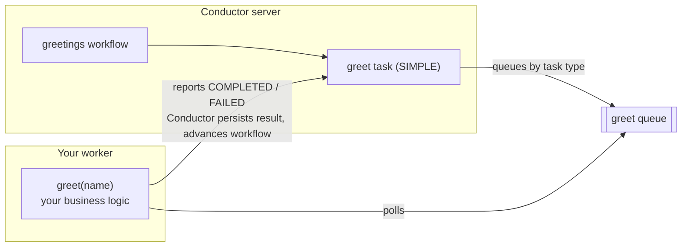

# Your First Workflow & Worker

**Outcome:** a `greetings` workflow that queues a `greet` task and returns `Hello Conductor` from a worker.

**Time:** about 5 minutes.

Complete [Connect to Conductor](connect.md) first. This guide uses the SDK connection variables configured there: `CONDUCTOR_SERVER_URL`, plus `CONDUCTOR_AUTH_KEY` and `CONDUCTOR_AUTH_SECRET` when your server requires them.

## How a worker runs

In this quickstart you build two things: a **workflow** named `greetings` — the durable definition that Conductor executes — and a **worker** — a function in your code that performs one task inside it.

The workflow has a single task of type `SIMPLE`, which means the work is done by your code rather than by one of Conductor's built-in tasks. Every `SIMPLE` task has a task type — here, `greet`. When a running workflow reaches that task, Conductor places it on a queue for that task type. Your worker polls the `greet` queue, runs your business logic, and reports back `COMPLETED` or `FAILED`. Conductor durably persists the result, then advances the workflow to its next task.

Two rules follow from this design:

- The task type must match exactly between the workflow definition and the worker — otherwise the task sits on a queue that nothing polls.
- Workers run as ordinary processes in your own infrastructure and deploy and scale independently of the Conductor server. Conductor guarantees at-least-once delivery, meaning the same task can be delivered again after a failure or timeout — so write workers to be idempotent, where running the same task twice produces the same result.



## Language-specific quickstart

Choose a language to reveal one complete `greet` worker and the matching `greetings` workflow. The examples are adapted from the maintained SDK hello-world worker examples.

<div class="worker-language-picker" markdown="1">
  <label for="worker-language-select">Language</label>
  <select id="worker-language-select" aria-describedby="worker-language-help">
    <option value="python" selected>Python</option>
    <option value="java">Java</option>
    <option value="typescript">TypeScript / JavaScript</option>
    <option value="csharp">C#</option>
    <option value="rust">Rust</option>
  </select>
  <p id="worker-language-help">Choose a language to reveal its install, worker, workflow, and run steps.</p>

  <section class="worker-language-guide" data-worker-language="python" markdown="1">

<p class="worker-language-guide__heading" role="heading" aria-level="3">1. Install Python support</p>

```bash
pip install conductor-python
```

<p class="worker-language-guide__heading" role="heading" aria-level="3">2. Save the worker and workflow app</p>

Save as `quickstart.py`:

```python
from conductor.client.automator.task_handler import TaskHandler
from conductor.client.configuration.configuration import Configuration
from conductor.client.orkes_clients import OrkesClients
from conductor.client.workflow.conductor_workflow import ConductorWorkflow
from conductor.client.worker.worker_task import worker_task


@worker_task(task_definition_name="greet", register_task_def=True)
def greet(name: str) -> dict:
    return {"result": f"Hello {name}"}


def main():
    config = Configuration()
    clients = OrkesClients(configuration=config)
    executor = clients.get_workflow_executor()

    workflow = ConductorWorkflow(name="greetings", version=1, executor=executor)
    greet_task = greet(task_ref_name="greet_ref", name=workflow.input("name"))
    workflow >> greet_task
    workflow.output_parameters({"result": greet_task.output("result")})
    workflow.register(overwrite=True)

    with TaskHandler(configuration=config, scan_for_annotated_workers=True) as handler:
        handler.start_processes()
        run = executor.execute(name="greetings", version=1, workflow_input={"name": "Conductor"})
        print(run.output["result"])


if __name__ == "__main__":
    main()
```

<p class="worker-language-guide__heading" role="heading" aria-level="3">3. Run and verify</p>

```bash
python quickstart.py
# Hello Conductor
```

See the [Python SDK guide](../documentation/clientsdks/python-sdk.md) for worker configuration and production patterns.

  </section>

  <section class="worker-language-guide" data-worker-language="java" hidden markdown="1">

<p class="worker-language-guide__heading" role="heading" aria-level="3">1. Install Java support</p>

Add the SDK dependency to your Gradle project:

```groovy
dependencies {
    implementation 'org.conductoross:conductor-client:5.0.1'
}
```

<p class="worker-language-guide__heading" role="heading" aria-level="3">2. Save the worker and workflow app</p>

Save as `Main.java`:

```java
import com.netflix.conductor.client.automator.TaskRunnerConfigurer;
import com.netflix.conductor.client.http.ConductorClient;
import com.netflix.conductor.client.http.TaskClient;
import com.netflix.conductor.client.http.WorkflowClient;
import com.netflix.conductor.client.worker.Worker;
import com.netflix.conductor.common.metadata.tasks.Task;
import com.netflix.conductor.common.metadata.tasks.TaskResult;
import com.netflix.conductor.sdk.workflow.def.ConductorWorkflow;
import com.netflix.conductor.sdk.workflow.def.tasks.SimpleTask;
import com.netflix.conductor.sdk.workflow.executor.WorkflowExecutor;
import java.util.List;
import java.util.Map;

class GreetWorker implements Worker {
    @Override
    public String getTaskDefName() {
        return "greet";
    }

    @Override
    public TaskResult execute(Task task) {
        String name = (String) task.getInputData().get("name");
        TaskResult result = new TaskResult(task);
        result.setStatus(TaskResult.Status.COMPLETED);
        result.addOutputData("result", "Hello " + name);
        return result;
    }
}

public class Main {
    public static void main(String[] args) {
        String serverUrl = System.getenv().getOrDefault(
                "CONDUCTOR_SERVER_URL", "http://localhost:8080/api");
        ConductorClient client = ConductorClient.builder().basePath(serverUrl).build();
        WorkflowExecutor executor = new WorkflowExecutor(client);

        ConductorWorkflow workflow = new ConductorWorkflow<>(executor);
        workflow.setName("greetings");
        workflow.setVersion(1);
        SimpleTask greetTask = new SimpleTask("greet", "greet_ref");
        greetTask.input("name", "${workflow.input.name}");
        workflow.add(greetTask);
        workflow.registerWorkflow(true, true);

        TaskClient taskClient = new TaskClient(client);
        new TaskRunnerConfigurer.Builder(taskClient, List.of(new GreetWorker()))
                .withThreadCount(10)
                .build()
                .init();

        WorkflowClient workflowClient = new WorkflowClient(client);
        String workflowId = workflowClient.startWorkflow(
                "greetings", 1, "", Map.of("name", "Conductor"));
        System.out.println("Started workflow: " + workflowId);
    }
}
```

<p class="worker-language-guide__heading" role="heading" aria-level="3">3. Run and verify</p>

Run the class with your Gradle application task, then inspect the completed `greet_ref` task in the `greetings` execution. Its output is:

```text
Hello Conductor
```

See the [Java SDK guide](../documentation/clientsdks/java-sdk.md) for complete imports and worker configuration.

  </section>

  <section class="worker-language-guide" data-worker-language="typescript" hidden markdown="1">

<p class="worker-language-guide__heading" role="heading" aria-level="3">1. Install TypeScript / JavaScript support</p>

```bash
npm install @io-orkes/conductor-javascript
```

<p class="worker-language-guide__heading" role="heading" aria-level="3">2. Save the worker and workflow app</p>

Save as `quickstart.ts`:

```typescript
import {
  OrkesClients,
  ConductorWorkflow,
  TaskHandler,
  worker,
  simpleTask,
} from "@io-orkes/conductor-javascript";
import type { Task } from "@io-orkes/conductor-javascript";

@worker({ taskDefName: "greet" })
async function greet(task: Task) {
  return {
    status: "COMPLETED" as const,
    outputData: { result: `Hello ${task.inputData.name}` },
  };
}

async function main() {
  const clients = await OrkesClients.from();
  const executor = clients.getWorkflowClient();
  const workflow = new ConductorWorkflow(executor, "greetings")
    .add(simpleTask("greet_ref", "greet", { name: "${workflow.input.name}" }))
    .outputParameters({ result: "${greet_ref.output.result}" });
  await workflow.register();

  const handler = new TaskHandler({ client: clients.getClient(), scanForDecorated: true });
  await handler.startWorkers();
  const run = await workflow.execute({ name: "Conductor" });
  console.log(run.output?.result);
  await handler.stopWorkers();
}

main();
```

<p class="worker-language-guide__heading" role="heading" aria-level="3">3. Run and verify</p>

```bash
npx ts-node quickstart.ts
# Hello Conductor
```

See the [JavaScript SDK guide](../documentation/clientsdks/js-sdk.md) for TypeScript 5 decorators, worker health, and production configuration.

  </section>

  <section class="worker-language-guide" data-worker-language="csharp" hidden markdown="1">

<p class="worker-language-guide__heading" role="heading" aria-level="3">1. Install C# support</p>

```bash
dotnet add package conductor-csharp
```

<p class="worker-language-guide__heading" role="heading" aria-level="3">2. Save and start the worker</p>

Save as `GreetWorker.cs`:

```csharp
using Conductor.Client.Extensions;
using Conductor.Client.Interfaces;
using Conductor.Client.Models;
using Conductor.Client.Worker;
using Task = Conductor.Client.Models.Task;

public class GreetWorker : IWorkflowTask
{
    public string TaskType => "greet";
    public WorkflowTaskExecutorConfiguration WorkerSettings { get; } = new();

    public async Task<TaskResult> Execute(Task task, CancellationToken token)
    {
        var result = task.Completed();
        result.OutputData = new Dictionary<string, object>
        {
            ["result"] = $"Hello {task.InputData["name"]}"
        };
        return await System.Threading.Tasks.Task.FromResult(result);
    }

    public TaskResult Execute(Task task) => throw new NotImplementedException();
}
```

Start the worker with the SDK's maintained worker-host pattern in `Program.cs`:

```csharp
using Conductor.Client;
using Conductor.Client.Authentication;
using Conductor.Client.Worker;
using Microsoft.Extensions.Logging;

var configuration = new Configuration
{
    BasePath = Environment.GetEnvironmentVariable("CONDUCTOR_SERVER_URL"),
    AuthenticationSettings = new OrkesAuthenticationSettings(
        Environment.GetEnvironmentVariable("CONDUCTOR_AUTH_KEY"),
        Environment.GetEnvironmentVariable("CONDUCTOR_AUTH_SECRET"))
};
var host = WorkflowTaskHost.CreateWorkerHost(
    configuration, LogLevel.Information, new GreetWorker());
await host.StartAsync(CancellationToken.None);
await Task.Delay(Timeout.Infinite);
```

In a second terminal, save this as `greetings.json`, then register and run it:

```json
{
  "name": "greetings",
  "description": "Return a greeting from a C# worker.",
  "version": 1,
  "schemaVersion": 2,
  "tasks": [{
    "name": "greet",
    "taskReferenceName": "greet_ref",
    "type": "SIMPLE",
    "inputParameters": { "name": "${workflow.input.name}" }
  }],
  "outputParameters": { "result": "${greet_ref.output.result}" }
}
```

<p class="worker-language-guide__heading" role="heading" aria-level="3">3. Run and verify</p>

```bash
dotnet run
# In the second terminal:
conductor workflow create greetings.json
conductor workflow start -w greetings -i '{"name":"Conductor"}' --sync
# result: Hello Conductor
```

See the [C# SDK guide](../documentation/clientsdks/csharp-sdk.md) for the maintained examples and SDK reference.

  </section>

  <section class="worker-language-guide" data-worker-language="rust" hidden markdown="1">

<p class="worker-language-guide__heading" role="heading" aria-level="3">1. Create a Rust app and add the SDK</p>

```bash
cargo new greetings-worker
cd greetings-worker
```

In `Cargo.toml`, add the SDK and async runtime under `[dependencies]`:

```toml
[dependencies]
conductor = { version = "0.1", package = "conductor-sdk", features = ["macros"] }
conductor-macros = "0.1"
tokio = { version = "1", features = ["full"] }
```

<p class="worker-language-guide__heading" role="heading" aria-level="3">2. Save the worker and workflow app</p>

Replace `src/main.rs` with:

```rust
use conductor::{
    client::ConductorClient,
    configuration::Configuration,
    models::{StartWorkflowRequest, WorkflowDef, WorkflowTask},
    worker::TaskHandler,
};
use conductor_macros::worker;

#[worker(name = "greet")]
async fn greet(name: String) -> String {
    format!("Hello {}", name)
}

fn greetings_workflow() -> WorkflowDef {
    WorkflowDef::new("greetings")
        .with_version(1)
        .with_task(
            WorkflowTask::simple("greet", "greet_ref")
                .with_input_param("name", "${workflow.input.name}"),
        )
        .with_output_param("result", "${greet_ref.output.result}")
}

#[tokio::main]
async fn main() -> Result<(), Box<dyn std::error::Error>> {
    // Reads CONDUCTOR_SERVER_URL and, when needed, CONDUCTOR_AUTH_* from the environment.
    let config = Configuration::default();
    let client = ConductorClient::new(config.clone())?;

    client
        .metadata_client()
        .register_or_update_workflow_def(&greetings_workflow(), true)
        .await?;

    let mut task_handler = TaskHandler::new(config.clone())?;
    task_handler.add_worker(greet_worker());
    task_handler.start().await?;

    let run = client
        .workflow_client()
        .execute_workflow(
            &StartWorkflowRequest::new("greetings")
                .with_version(1)
                .with_input_value("name", "Conductor"),
            std::time::Duration::from_secs(10),
        )
        .await?;

    println!("result: {:?}", run.output.get("result"));
    task_handler.stop().await?;
    Ok(())
}
```

<p class="worker-language-guide__heading" role="heading" aria-level="3">3. Run and verify</p>

```bash
cargo run
# result: Some("Hello Conductor")
```

See the maintained [Rust SDK quickstart](https://github.com/conductor-oss/rust-sdk#60-second-quickstart) for worker configuration, metrics, and production patterns.

  </section>
</div>

<script>
  (function () {
    var select = document.getElementById("worker-language-select");
    var guides = document.querySelectorAll("[data-worker-language]");

    function showGuide() {
      guides.forEach(function (guide) {
        guide.hidden = guide.dataset.workerLanguage !== select.value;
      });
    }

    select.addEventListener("change", showGuide);
  })();
</script>

## Verify durable execution

1. Open the Conductor UI (`http://localhost:8080` for the local server) and go to **Executions → Workflow** in the left navigation. Click the newest `greetings` execution — the completed `greet_ref` task in the timeline shows `result: Hello Conductor`.
2. Now watch durability at work. Your quickstart app exited after printing, so no worker is running. Start another execution with the CLI alone:

    ```bash
    conductor workflow start -w greetings -i '{"name":"Conductor"}'
    ```

3. Refresh the executions list: the new run is `RUNNING` and `greet_ref` is `SCHEDULED` — durably queued, waiting for a worker. Nothing is lost.
4. Run your quickstart app again. The worker polls, the waiting task completes, and the execution finishes with `result: Hello Conductor`.

**Troubleshooting**

- `greet_ref` stays `SCHEDULED` even with the app running: the worker is not polling the `greet` task type — confirm the worker is running and its task type is exactly `greet`.
- Registration says the definition already exists: bump the version or update the local test definition.
- `greet_ref` is `FAILED`: inspect the task's input, output, and failure reason in the UI, fix the worker, and start a new execution.

## Keep learning

**Next:** [Run your first agent](first-agent.md) — the same durable execution model, applied to an LLM-powered agent.

Prefer no code? [Run a workflow from JSON](first-workflow.md) registers a two-step workflow with the CLI alone. The [SDKs landing page](../documentation/clientsdks/index.md) links to Go, Ruby, Rust, and the language-specific reference material and production guidance for every supported SDK.
